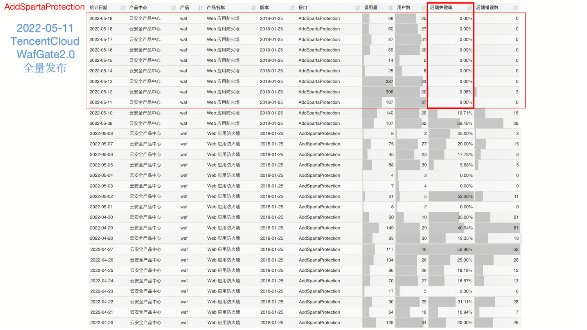
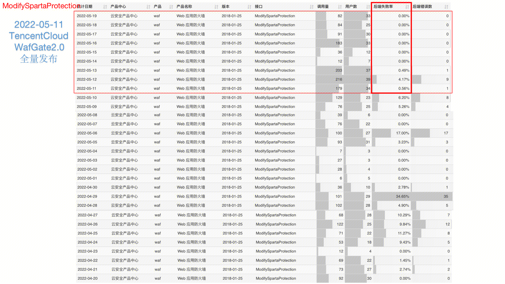
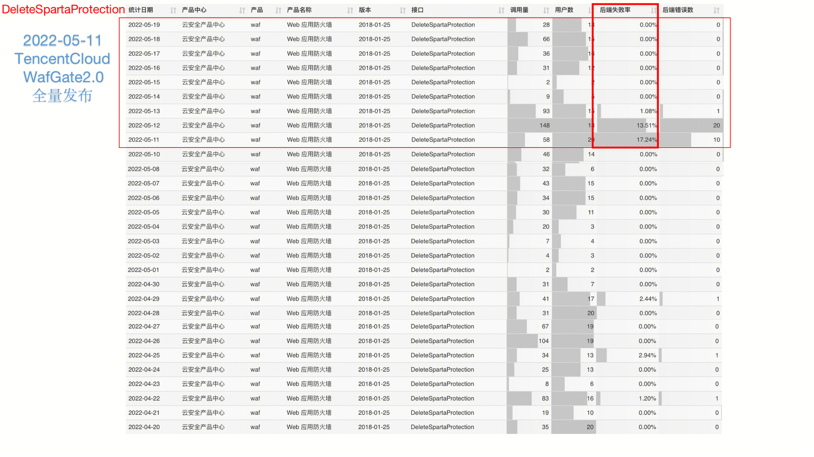

## 什么是重构：
重构是对软件内部的一种调整，目的是在不改变软件可观察行为的前提下，提高可理解性，降低其修改成本。 -- 《重构-改善既有代码的设计》

## 为什么重构：
重构有风险，它必须修改运行中的程序，这可能引入一些不易察觉的错误。那么，为什么我们还要重构呢？
一个优美的程序，我们希望是这样的：

- 1.希望代码容易阅读
- 2.代码逻辑具有单一原则，唯一地点定义，多处引用
- 3.代码具有可拓展性，可重用性
- 4.希望代码尽可能简单表达条件逻辑

重构是这样一个过程：它在一个目前可运行的程序上进行，在不改变程序行为的前提下使其具备上述的美好性质，使我们能够继续保持高速开发，从而增加程序的价值。
重构的目的

- **让软件架构始终保持良好的设计。**改进我们的软件设计，让软件架构向有利的方向发展，能够始终对外提供稳定的服务、从容的面对各种突发的问题。
- **增加可维护性，降低维护成本，对团队和个人都是正向的良性循环，让软件更容易理解。**无论是后人阅读前人写的代码，还是事后回顾自己的代码，都能够快速了解整个逻辑，明确业务，轻松的对系统进行维护。
- **提高研发速度、缩短人力成本。**大家可能深有体会，一个系统在上线初期，向系统中增加功能时，完成速度非常快，但是如果不注重代码质量，后期向系统中添加一个很小的功能可能就需要花上一周或更长的时间。而代码重构是一种有效的保证代码质量的手段，良好的设计是维护软件开发速度的根本。重构可以帮助你更快速的开发软件，因为它阻止系统腐烂变质，甚至还可以提高设计质量。

总之，为了高效率的编程，为了减少bug率，为了提高代码质量；越是复杂的项目，重构的好处就越明显。
重构有助于软件的迭代开发和二次开发。

### WAF
经过[脏数据](https://iwiki.woa.com/pages/viewpage.action?pageId=1312516505) 专项评审，大家一致认为SPP组件的代码存在一些的问题，希望将SPP上的逻辑重构到tRPC-GO上并对代码进行一定的优化。从脏数据专项讨论和代码走查梳理，总结出SPP主要存在的问题以及优化方案：

#### 安全性问题
`DB不友好` ：

- 冗余查询比较多，通过统一查询信息存入内存来精简查询次数。
- 存在复杂查询语句，可以拆分精简逻辑。
- 采用字符串拼接sql存在sql注入的风险，可以使用预编译优化。

`校验不友好` ：

- 部分参数没有校验，例如异常值，空值等都存入数据库了。容易产生脏数据或导致代码异常。需要对每个参数进行必要的校验，校验包括是否存在，是否空值，是否异常值。
- 参数校验没有统一入口，在使用的时候才校验，容易漏掉校验和重复校验。需要提供统一的入口对参数进行校验，提供可信任的参数供后续逻辑使用。
- 获取外部数据后，没有校验。外部数据异常会导致自身程序异常。
#### 开发类问题
 `开发不友好` ：

- 大部分逻辑都在一个函数里面中，导致函数太长不利于阅读和开发。例如校验域名数量上限是否超出限制，例如校验域名是否有效等功能可以抽象为单独的功能，便于以后复用。同时保持代码简洁。
- SPP依赖的C++编译环境搭建困难，只能在指定的机器上编译。SPP框架较老旧，资料不够详细。不方便开发和维护。

#### BUG类问题
 `分布式事务一致性不友好` ：

- 调用外部OSS接口没有重试，接口调用一次失败则全局异常。可以加入重试逻辑。
- 调用外部OSS接口失败时回滚逻辑不彻底，产生脏数据，影响再次调用。回滚逻辑一定要全面，可以通过操作日志记录反向操作来保证全面回滚。或者采用分布式事务的方法保证一致性。·

`并发超卖问题` 

- 并发情况下，可能添加域名超过套餐上限。可以使用触发器来限制解决。

## 如何重构
（以下仅仅列出了关键点，详细细节待补充）
#### 安全性问题
`DB不友好` ：GORM预编译，业务精简查询过程

`校验不友好`：入参：GoValidator  ， 计算结果：业务校验
#### 开发类问题
`开发不友好`：简单的go build ，函数抽象可复用
#### BUG类问题
 `分布式事务一致性不友好`：远程调用成功后再修改本地数据

 `并发超卖问题` ：函数加锁

## 重构效果
### 失败率

