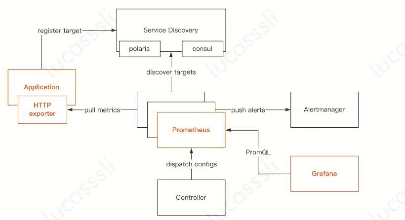
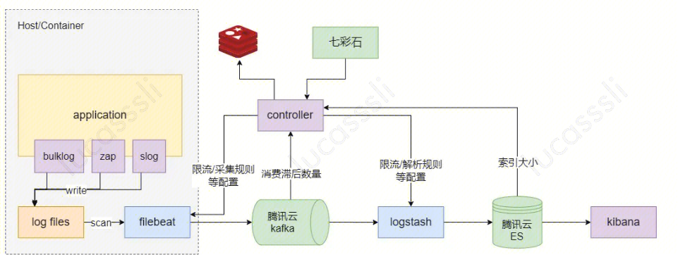
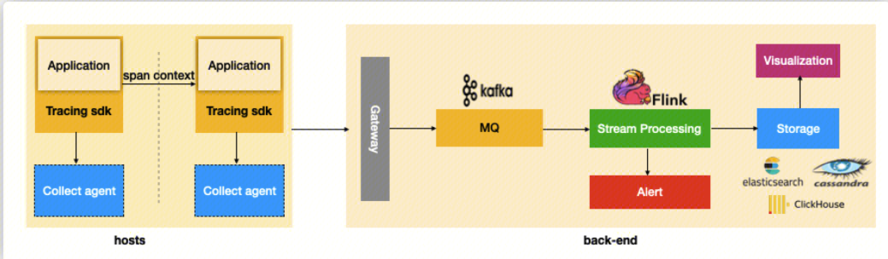
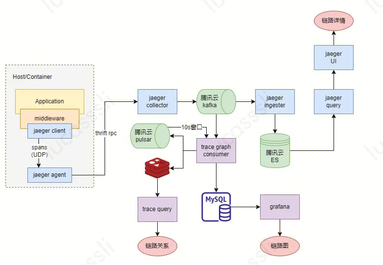
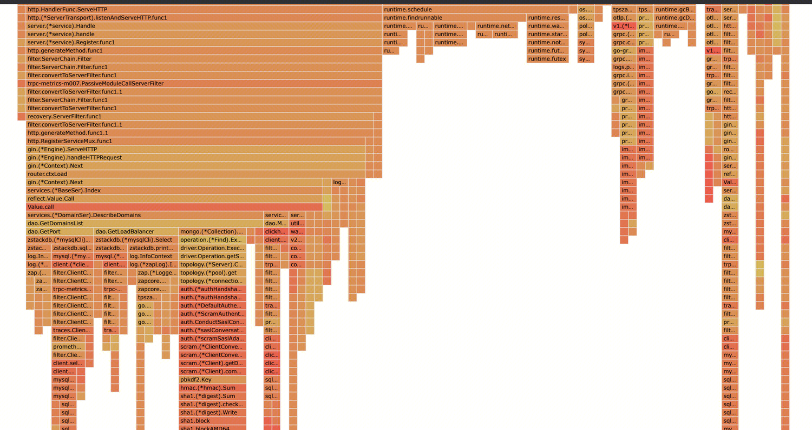
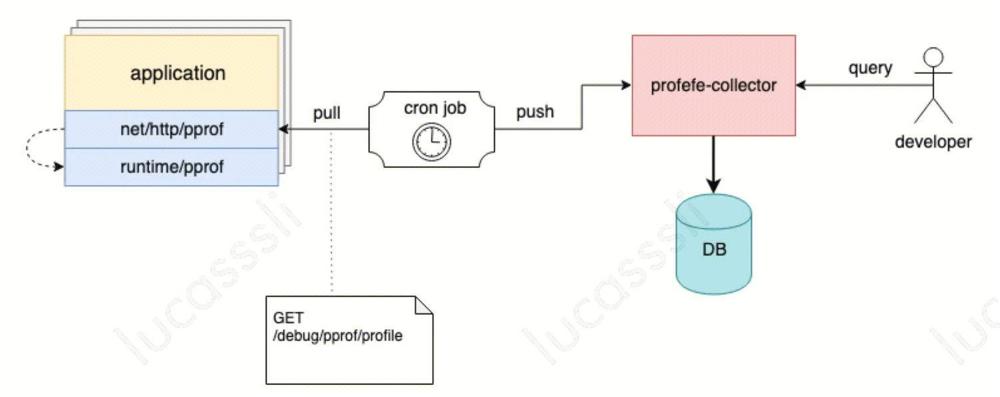

## Metrics
Metrics : 用于记录程序运行时的数据。例如：队列的当前深度可被定义为一个度量值，在元素入队或出队时被更新；HTTP 请求个数可被定义为一个计数器，新请求到来时进行累加。
指标监控能够从宏观上对系统的状态进行度量，借助QPS、成功率、延时、系统资源、业务指标等多维度监控来反映系统整体的健康状况和性能。微服务重点提供以下四个指标：

- **Traffic（QPS）**
- **Latency（延时）**
- **Error（成功率）**
- **Staturation（资源利用率）**

**通用做法：**

https://segmentfault.com/a/1190000040792832

**扩展：**

1. trpc https://iwiki.woa.com/pages/viewpage.action?pageId=1761731015 支持promethus、天机阁、007等插件
2. golang一般程序监控 golang + promethus + grafana https://segmentfault.com/a/1190000040792832
3. WAF集群监控  grafana + clickhouse等 

## Logging
随着业务体量壮大，机器数量庞大，使用SSH检索日志的方式效率低下。我们需要有专门的日志处理平台，从庞大的集群中收集日志并提供集中式的日志检索。
**通用做法：**

- **Filebeat** 作为日志采集和传送器。Filebeat监视服务日志文件并将日志数据发送到Kafka。
- **Kafka** 在Filebeat和Logstash之间做解耦。
- **Logstash** 解析多种日志格式并发送给下游。
- **ElasticSearch** 存储Logstash处理后的数据，并建立索引以便快速检索。
- **Kibana** 是一个基于ElasticSearch查看日志的系统，可以使用查询语法来搜索日志，在查询时制定时间和日期范围或使用正则表达式来查找匹配的字符串。

**扩展：**
1. trpc https://iwiki.woa.com/pages/viewpage.action?pageId=1761731015 支持天机阁远程日志，星云ErrorLog告警
2. WAF日志检索： udp(类似Filebeat角色) -> kafka -> syncer(类似logStash角色) -> Es -> Kibana

## Tracing
Tracing介绍： https://segmentfault.com/a/1190000042031697
**通用Tracing架构：**

1. 在应用端需要通过侵入或者非侵入的方式，注入 Tracing Sdk，以跟踪、生成、传播和上报请求调用链路数据。
链路数据主要包含：

- Name：操作名称，如一个 RPC 方法的名称，一个函数名
- StartTime/EndTime：起始时间和结束时间，操作的生命周期
- ParentSpanId：父级 Span 的 ID
- Attributes：属性，一组 <K,V> 键值对构成的集合
- Event：操作期间发生的事件
- SpanContext：Span 上下文内容，通常用于在 Span 间传播，其核心字段包括 TraceId、SpanId

1. 数据上报到后端时，首先经过 Gateway 做一个鉴权，之后进入 kafka 这样的 MQ 进行消息的缓冲存储；
2. 在数据写入存储层之前，我们可能需要对消息队列中的数据做一些**清洗和分析**的操作，清洗是为了规范和适配不同的数据源上报的数据，分析通常是为了支持更高级的业务功能，比如流量统计、错误分析等，这部分通常采用flink这类的流处理框架来完成；
3. 存储层会是服务端设计选型的一个重点，要考虑数据量级和查询场景的特点来设计选型，通常的选择包括使用 Elasticsearch、Cassandra、或 Clickhouse 这类开源产品；

在第一步生成调用链路数据中，是有通用的协议的。这个协议是OpenTelemetry。
OpenTelemetry 定义了数据采集的标准 api，并提供了一组针对多语言的开箱即用的 sdk 实现工具，这样，应用只需要与 OpenTelemetry 核心 api 包强耦合。

**扩展：**

1. trpc的链路跟踪： opentelemetry + 天机阁
https://iwiki.woa.com/pages/viewpage.action?pageId=1761731015
2. QQ音乐的链路跟踪：

- **jaeger-agent** 作为代理，把jaeger client发送的spans转发到jaeger-collector。
- **jaeger-collector** 接收来自jaeger-agent上报的数据，验证和清洗数据后转发至kafka。
- **jaeger-ingester** 从kafka消费数据，并存储到ElasticSearch。
- **jaeger-query** 封装用于从ElasticSearch中检索traces的APIs。

## Profiles
在 Go 语言中，PProf 是用于可视化和分析性能分析数据的工具，PProf 以 profile.proto 读取分析样本的集合，并生成报告以可视化并帮助分析数据（支持文本和图形报告）。
###  可以做什么

- CPU Profiling：CPU 分析，按照一定的频率采集所监听的应用程序 CPU（含寄存器）的使用情况，可确定应用程序在主动消耗 CPU 周期时花费时间的位置。
- Memory Profiling：内存分析，在应用程序进行堆分配时记录堆栈跟踪，用于监视当前和历史内存使用情况，以及检查内存泄漏。
- Block Profiling：阻塞分析，记录 Goroutine 阻塞等待同步（包括定时器通道）的位置，默认不开启，需要调用  `runtime.SetBlockProfileRate`  进行设置。
- Mutex Profiling：互斥锁分析，报告互斥锁的竞争情况，默认不开启，需要调用  `runtime.SetMutexProfileFraction`  进行设置。
- Goroutine Profiling： Goroutine 分析，可以对当前应用程序正在运行的 Goroutine 进行堆栈跟踪和分析。这项功能在实际排查中会经常用到，因为很多问题出现时的表象就是 Goroutine 暴增，而这时候我们要做的事情之一就是查看应用程序中的 Goroutine 正在做什么事情，因为什么阻塞了，然后再进行下一步。

### 怎么做
1. https://iwiki.woa.com/pages/viewpage.action?pageId=99485663&from=iSearch trpc的admin提供了pprof服务。
2. 在程序中引入net/http/pprof包，通过http的方式下载profile文件，通过go tool profile获得web界面查看。

3. 线上
   
- 线上服务根据负载以及采样决定采集时机，并暴露profile接口。
- conprof定时将profile信息采集并存储。
- conprof提供统一的可视化平台检索和分析。

## Trace
有时候单单使用 pprof 还不一定足够完整观查并解决问题。例如 Goroutine 在执行时会做哪些操作？执行/阻塞了多长时间？在什么时候阻止？在哪里被阻止的？谁又锁/解锁了它们？GC 是怎么影响到 Goroutine 的执行的？这些东西用 pprof 是很难分析出来的， 而`go tool trace`可以。

