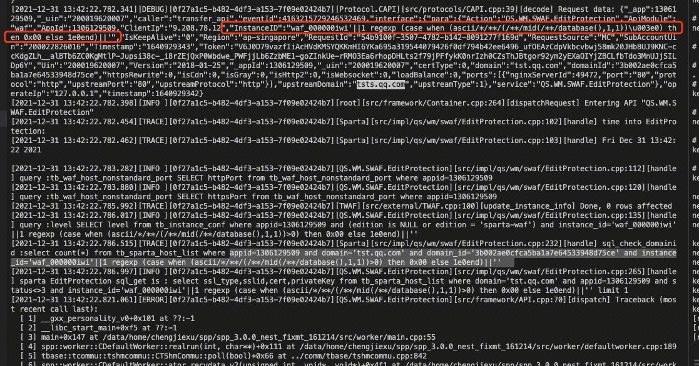
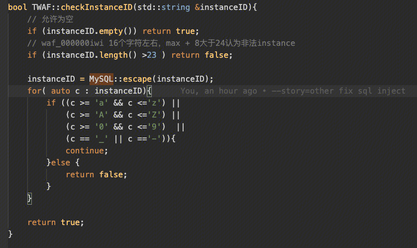
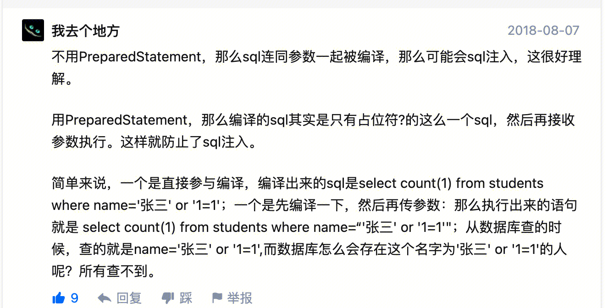

## 国际站sql注入
参数：


instance_id = "waf_000000iwi'||1 regexp (case when (ascii/*/**/(/**/mid(/**/database(),17,1))>0) then 0x00 else 1e0end)||'"

sql：
```sql
update tb_sparta_host_list set https_rewrite=0, upstream_type=1, upstream_domain='tsts.qq.com', is_http2=0,is_websocket=0,       load_balance_type=0 where appid=1306129509 and domain='tst.qq.com' and instance_id='waf_000000iwi'||1 regexp (case when (ascii/*/**/(/**/mid(/**/database(),17,1))>0) then 0x00 else 1e0end)||''
```

## 解决方法
1.自制黑名单：检查参数中，是否存在不符合自己业务特点的字符。但是存在漏检的风险。
2.自制白名单：检查参数，是不是符合自己的业务特点。存在误拦，影响业务的风险。
3.官方公开库：MYSQL::escape



## 防止方法
- 1.永远不要信任用户的输入。对用户的输入进行校验，可以通过正则表达式，或限制长度；对单引号和 双"-"进行转换等。
校验单' : 字符串两边会添加'',参数中存在'可能导致'提前来临，是不符合规范的。
- 2.永远不要使用动态拼装sql，可以使用参数化的sql或者直接使用存储过程进行数据查询存取。
https://www.zhihu.com/question/52869762

- 3.永远不要使用管理员权限的数据库连接，为每个应用使用单独的权限有限的数据库连接。
- 4.不要把机密信息直接存放，加密或者hash掉密码和敏感的信息。
- 5.应用的异常信息应该给出尽可能少的提示，最好使用自定义的错误信息对原始错误信息进行包装


