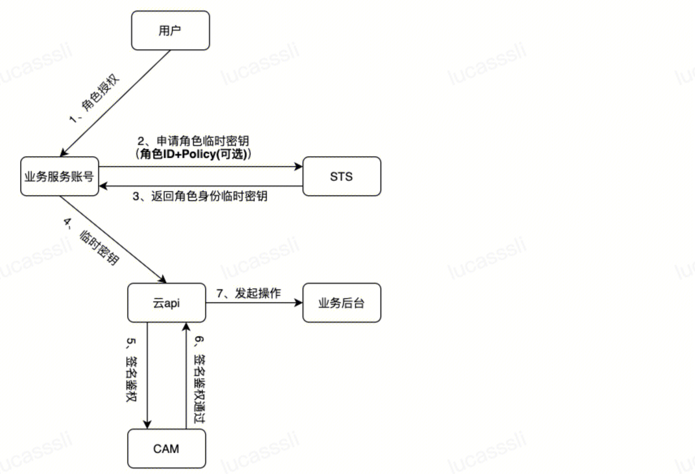
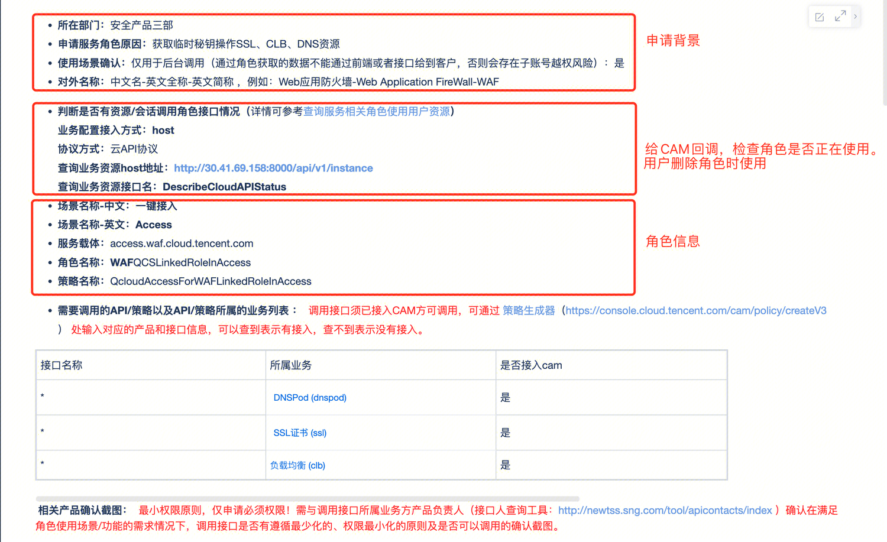
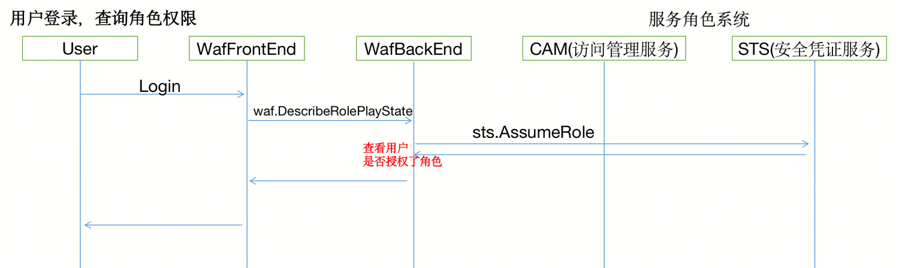
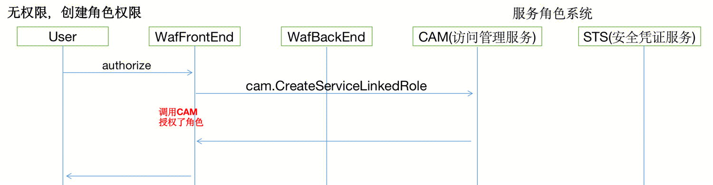
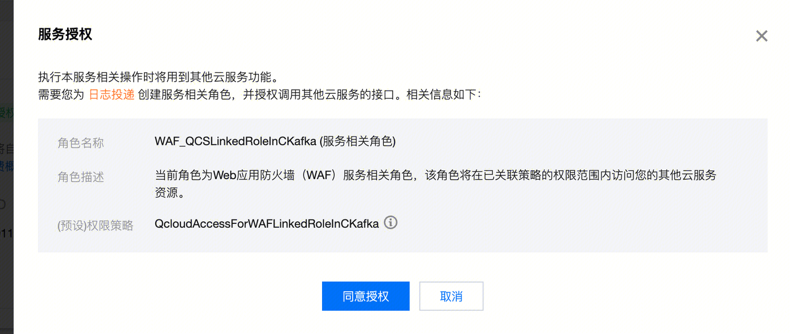
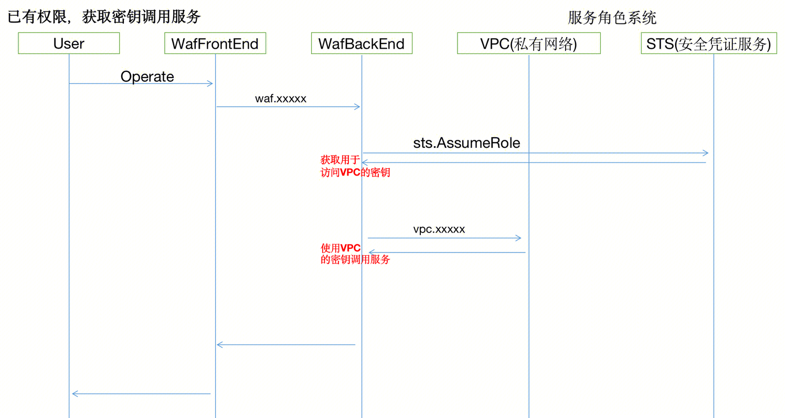
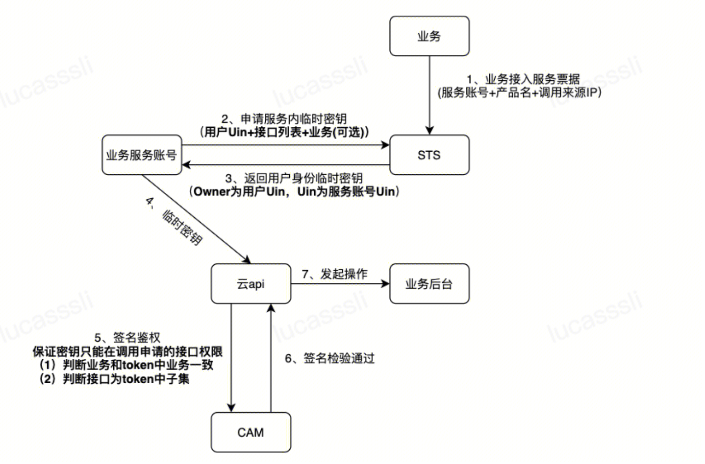

## 服务角色

### 1. 申请服务角色
#### 1.1 提交申请的角色名称和权限范围
申请角色：**WAF**QCSLinkedRoleInAccess
角色关联策略：QcloudAccessForWAFLinkedRoleInAccess
策略语法：
``` 
{
  "version": "2.0",
  "statement": [
    {
      "action": [
        "dnspod:*",
        "ssl:*",
        "clb:*"
      ],
      "resource": "*",
      "effect": "allow"
    }
  ]
}
```
https://tapd.woa.com/20399462/prong/stories/view/1020399462880653795

#### 1.2 配置账号
https://docs.qq.com/doc/DZVVZS2hxUU1ReXVq
最终获得账号uin，secretid，secretkey


### 2. 用户授权角色
#### 2.1 判断用户是否已经授权角色

后台提供接口，供前端调用，判读用户是否已经授权了角色。
该接口基于服务角色的secretid和key，创建sts客户端，并查询用户角色。
``` 
func (r *InstanceSer) DescribeRolePlayState(c *gin.Context) {
    // 解析请求
    var req models.ReqDescribeRoles
    var rsp models.RspDescribeRoles
    err := util.ParseAndCheckRequest(c, &amp;req)
    if err != nil {
        log.ErrorContextf(c, "ParseAndCheckRequest failed. %+v", err)
        return
    }
    // Init STS Client
    wafCred := common.Credential{
        SecretId:  config.WafGatePtr.StsSecretId,
        SecretKey: config.WafGatePtr.StsSecretKey,
    }
    stsc := InitSTSClient(&amp;wafCred, "ap-guangzhou", config.WafGatePtr.YunAPIEndPoint)

    // AssumeRole for cred
    uin, _ := strconv.Atoi(req.Uin)                           //not sub uin
    cred, _, err := stsc.AssumeRole(int64(uin), req.RoleName) // rolename
    if err != nil || cred == nil {
        rsp.Enable = false
    } else {
        log.InfoContextf(c, "role cred id is %v", cred.SecretId)
        rsp.Enable = true
    }
    rsp.RequestId = req.RequestID
    util.Rsp(c, rsp)
}
```

#### 2.2 为用户授权角色

如果没有用户尚未授权角色。前端唤起CAM组件，为用户添加服务角色。该请求又前端直接发送到CAM。


### 3. 获取已授权角色的用户AKSK

该过程通过调用STS，获取用户的临时密钥cred。通过这个密钥来操作云产品。
``` 
func (c *STSClient) AssumeRole(roleOwnerUin int64, roleName string) (*common.Credential, string, error) {
    request := sts.NewAssumeRoleRequest()
    roleArn := fmt.Sprintf("qcs::cam::uin/%d:role/tencentcloudServiceRoleName/%s", roleOwnerUin, roleName)
    roleSessionName := string("waf-external.access")
    durationSeconds := uint64(3600 * 12)

    request.RoleArn = &amp;roleArn
    request.RoleSessionName = &amp;roleSessionName
    request.DurationSeconds = &amp;durationSeconds

    response, err := c.client.AssumeRole(request)
    if err != nil {
        log.Errorf("roleOwnerUin=%d roleName=%s AssumeRole failed, error %+v", roleOwnerUin, roleName, err)
        return nil, roleArn, err
    }
    log.Infof("ownerUin=%d roleName=%s AssumeRole success", roleOwnerUin, roleName)

    cred := &amp;common.Credential{
        Token:     *response.Response.Credentials.Token,
        SecretId:  *response.Response.Credentials.TmpSecretId,
        SecretKey: *response.Response.Credentials.TmpSecretKey,
    }

    return cred, roleArn, nil
}
```

### 4. 使用临时密钥调用用户的腾讯云API接口 
例如、涉及 DNS CLB SSL接口调用。

## 服务票据

