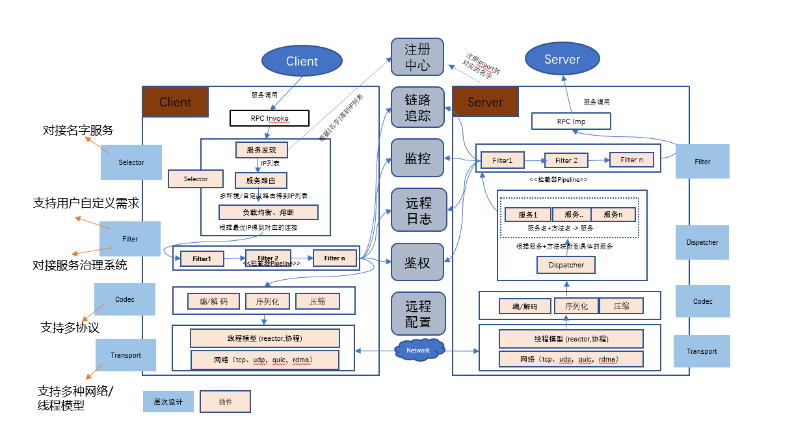

## 需求分析

### 为什么需要统一rpc
微服务框架是互联网行业近十几年来比较成熟的技术了。但在“开源协同”之前的腾讯，因为众所周知的原因，重复的轮子实在太常见了。2019年年初，PCG盘点后台组件的“家底”，名字服务六七个，开发框架规模比较大的就有十几个，其中一个更是派生了六七个变种，但即使是系出同门，却因为各有生长的山头，例如

- 名字服务各异：听说有个微服务，知道名字，但查户籍找不到；
- 通信协议不同：大家都讲“方言”，鸡同鸭讲。

不通，则痛。越是不通，越是痛。

总结起来就是:

- 框架插件化能力有限, 对于协同不够友好;
- 框架覆盖的语言类型有限, 无法覆盖主流的开发语言;
- 名字服务和协议不能互通, 甚至同一套框架下的变种都不能互通;
- 与devops工具链的对接存在问题, 处于年久失修状态.

公司各个业务使用的开发框架也呈现出一种非常杂乱的状态,有的业务甚至有同时使用几种不同开发框架的情况。这就给开发和运维在服务互通和服务治理上带来了很大的学习和维护成本,导致开发和运维效率都比较低。这就需要有一套RPC框架，能整合公司后台人力和历史研发、运营经验, 将存量框架收敛到一套，实现能与存量框架良好衔接，稳定并持续演进和运营。

### 技术选型
为什么需要自研一套新的RPC框架, 而不是基于公司内部或者开源成熟框架去打造? 

首先基于公司对多语言的需求，重点对能支持多语言的 Istio，gRPC和公司内部的TAF微服框架进行了研究和分析。

- gRPC 是Google开发的一款优秀的开源RPC框架，它主要面向移动应用开发并基于HTTP/2协议标准而设计。它基于ProtoBuf序列化协议开发，支持多语言和流式通信。但是对于内网服务间通信来讲，我们并不需要HTTP/2这种复杂协议，HTTP/2对性能也有一定影响，而且 gRPC 对于多协议的支持改造难度偏大，修改后很难回归社区

- Istio是当前最热门的Service Mesh微服务架构解决方案，它可以作为服务间通信的基础设施层。其最大的特色是作为“边车”运行，对业务程序零侵入，大大降低了应用程序获取微服务治理能力的门槛。但是Istio没有提供开发框架，其架构设计在性能上也有缺陷

- TAF是公司内部提供的一套于开发框架、服务治理和运营平台为一体化的总体解决方案，使用多年，系统成熟稳定。但是正是其一体化的设计，导致其很难和其它体系做对接，业务使用不够灵活，迁移成本偏大

综合上面的思考，采用自研的方式可控性更强, 框架设计也更能贴近业务需求. 

## 设计

### 设计原则

为了最大程度满足公司各个业务，trpc设计要考虑:

- 分层和模块化：框架整体架构应该按功能和特性进行分层，各个核心模块最好能够独立演进；

- 可拔插：对于名字路由、配置管理、监控上报、日志收集、调用跟踪、鉴权、心跳上报等，框架设计和实现上应该提供扩展点，以允许插入这些特性和默认实现；

- 通用并且高性能：框架应该适用于绝大多数用例场景，相比针对特定用例的框架，框架只会牺牲一点性能；

### 插件设计
tRPC核心框架是采用基于接口编程的思想, 通过把框架功能抽象成一系列的插件组件, 注册到插件工厂, 并由插件工厂实例化插件. tRPC框架负责串联这些插件组件, 拼装出完整的框架功能。

### filter设计
为了使框架有更强的可扩展性, tRPC引入了拦截器这个概念,它借鉴了java面向切面(AOP)的编程思想. 具体做法是通过在框架指定的动作前后设置埋点, 然后通过在埋点地方插入一系列的filter, 来实现将系统功能引入到框架中.

面向切面编程（AOP）是一种编程范式，主要用于处理系统中分布于各个模块的横切逻辑，常用来解决模调监控，横切日志，链路跟踪，过载保护，预处理等这些跟接口请求相关的问题。

拦截器的最终目的是通过对业务逻辑与系统级服务的解耦, 允许各自进行内聚性开发. 通过filter预设埋点, 为程序提供了一种在不修改源代码的情况下给程序动态添加或替换功能的机制.

### 总体设计

### 调用流程

