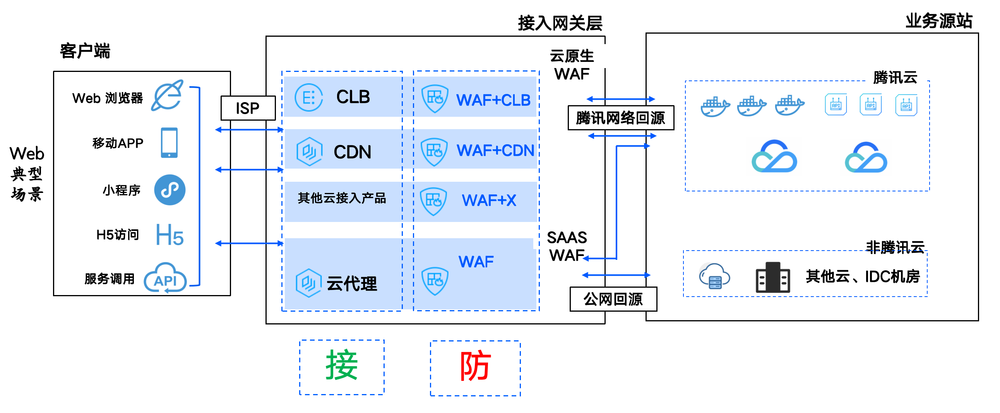

# 介绍
欢迎来到我的个人主页！在这里，我将与您分享关于WAF（Web应用防火墙）产品底层实现的知识和经验。WAF是一种保护Web应用程序免受恶意攻击的安全解决方案。它可以识别并阻止各种Web应用程序安全漏洞，如SQL注入、跨站脚本（XSS）和跨站请求伪造（CSRF）等。在这个主题中，我们将重点讨论云上WAF的控制面和三个关键模块：接入模块、日志模块和防护模块。

* 控制面：控制面负责多租户创建和维护策略。涉及租户管理、配置管理、API管理等。

* 接入模块：接入模块负责将WAF无缝地集成到您的Web应用程序中。它可以通过代理、负载均衡器或DNS解析等方式实现。接入模块的主要目标是确保WAF能够在不影响应用程序性能的情况下，对所有传入和传出的网络流量进行实时监控和分析。

* 日志模块：日志模块负责记录WAF的所有活动，包括检测到的攻击、阻止的请求以及其他与安全相关的事件。这些日志数据对于分析攻击模式、调整防护策略以及进行安全审计和合规性检查非常重要。日志模块还可以将数据导出到外部系统，如SIEM（安全信息和事件管理）平台，以便进行进一步的分析和报告。

* 防护模块：防护模块是WAF的核心组件，负责实际识别和阻止恶意请求。它使用多种技术来检测攻击，如签名匹配、行为分析和机器学习等。防护模块还可以根据您的应用程序特性和安全需求进行定制，以提供最佳的保护效果。

在这个主页上，您将找到关于WAF产品底层实现的详细文章、教程和案例研究。我们将深入探讨每个模块的工作原理、最佳实践以及如何优化WAF性能和安全性。

# 全景图
