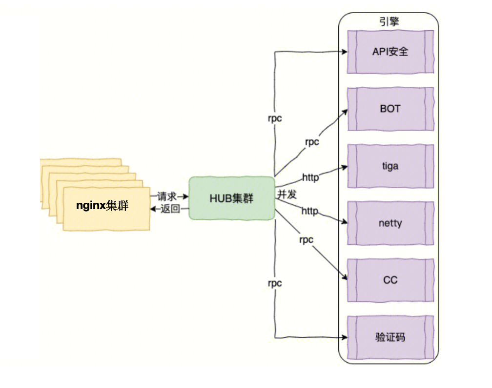
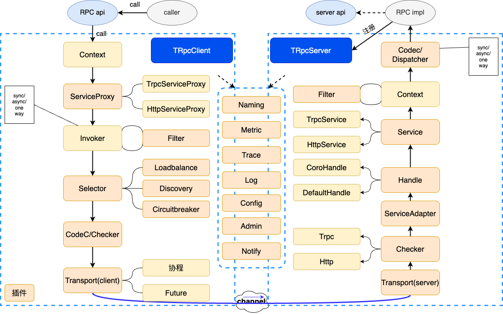

## 防护引擎性能优化

### 问题
一个请求到达WAF后，会经过cc检测、bot检测、规则匹配、ai检测等多个检测模块。
当前检测架构基于openresty，nginx收到请求之后，通过resty.http串行发起请求，依次将请求发送到各个检测模块。wrk压测情况，4c8g，3000QPS，串行检测p99检测延时为178ms。时延较长，不满足60ms的目标。分析问题，主要是因为串行检测，检测时延累加导致较长时延。因此，制定了串行检测改并发检测的优化方案。

### 方案选型

#### 基于openresty的并发方案
使用timer.defer_at(0)和resty.http模块保证并发异步地发送HTTP请求到下游服务器。
```lua
local http = require "resty.http"
local cjson = require "cjson"
local timer = require "resty.core.timer"  -- 需要OpenResty 1.13.9 或更高版本

-- 创建http客户端
local httpc = http.new()

-- 准备请求列表
local requests = {
    {url = "http://example.com/api1", body = "payload1"},
    {url = "http://example.com/api2", body = "payload2"},
    -- ... 其他请求
}

-- 并发执行请求的函数
local function send_requests(requests)
    local resps, errs = {}, {}

    local function send_request(req)
        sem:wait()  -- 等待信号量
        local httpc = http.new()
        local resp, err = httpc:request_uri("http://" .. req.host .. ":" .. req.port .. req.path, {
            method = "POST",
            body = req.body,
            headers = {
                ["Content-Type"] = "application/json",
            },
        })

        if not resp then
            errs[#errs + 1] = err
        else
            resps[#resps + 1] = resp
        end
        sem:post()  -- 释放信号量
    end

    for _, req in ipairs(requests) do
        timer.defer_at(0, send_request, req)
    end

    -- 等待所有请求完成
    sem:wait_all()

    return resps, errs
end

-- 执行并发请求并处理响应
local resps, errs = send_requests(requests)

for i, resp in ipairs(resps) do
    local json_body = cjson.decode(resp.body)
    ngx.say("Response " .. i .. ": " .. resp.status .. " " .. json_body.message)
end

for i, err in ipairs(errs) do
    ngx.say("Error " .. i .. ": " .. err)
end
```

问题：随着下游引擎数量增加，openresty性能急剧下降。表现为承载的QPS不断下降、CPU负载不断升高。影响到openresty的转发性能。
原因：

- CPU资源消耗：当LuaVM发送HTTP请求并读取响应时，会与Nginx进行数据拷贝。请求数据会从LuaVM复制到Nginx内部缓冲区，然后由Nginx通过网络发送出去。响应数据会先接收到Nginx内部缓冲区，再复制到LuaVM中。连接建立、请求响应解析都会占用CPU资源。
- 网络资源消耗：当LuaVM发送HTTP请求会占用Nginx连接数。Nginx有最大连接数限制，当达到这个限制时，新的连接请求将会被拒绝。如果 LuaVM发送的HTTP请求占用了大量连接，可能会导致新的HTTP请求无法得到处理。
- 内存资源消耗：为了处理大量并发请求，Nginx需要维护大量连接，这会占用内存。(因为使用http1.1协议，暂不支持多路复用)

总结：基于openresty的并发改造方案，将大量扩散请求，从CPU、网络、内存上都对原本openresty转发性能有较大影响，影响到集群稳定性，因此放弃改方案。

#### 基于旁路的并发方案
为了解决openresty并发方案因扩散请求导致的性能问题，设计了旁路并发方案。该方案新增了旁路路由组件HUB，接受来自openresty的检测请求，并发调用下游多个检测引擎，汇总检测结果后再发送响应给openresty。




优势：

- 语言生态好：lua生态系统单薄，新增的旁路路由组件可以基于非lua语言编写，可以找到有大量的开源库和框架可供使用。
- 并发能力强：openresty集群仅和HUB进行通信，由HUB并发调用下游检测服务，不影响openresty集群本来的性能。
- 架构清晰：hub集中进行并发调用，架构清晰。

劣势：

- 网络开销：新增hub节点将增加网络链路长度。
- 成本开销：部署新组件增加计算资源成本。

总结：基于旁路的并发方案，新增路由组件，加长网络链路，增加计算资源成本。但是保证了openresty集群的稳定性，同时增加架构的灵活性和清晰度。采用该方案。

### 技术选型
确定了基于旁路的并发方案后，从语言和框架上进行技术选型，实现该方案。

#### 语言选型
团队熟练语言是golang、python、c。
目标是实现高并发低延时的系统，从编程语言的性能、并发模型、生态系统以及开发效率等进行了语言选型。

Go语言在设计时特别考虑了并发性，通过goroutines和channels提供了清晰的CSP并发模型。相比python，golang性能通常更高。相比c，golang具有垃圾回收机制，减少了内存泄漏的风险，易于开发和维护。

总结：Go语言在保持较高性能的同时，提供了简洁且高效的并发模型，易于开发和维护。此外，Go的生态系统也相对成熟，支持多种应用场景。最终选择Golang作为开发语言。


#### 框架选型

在公司内部RPC框架中，主要从性能数据、服务治理、可观测性进行了评估。最终选择了Trpc框架，该框架已开源。


- 性能数据: todo补充性能数据。
- 服务治理: 支持服务发现、负载均衡、路由选择、熔断
- 可观测性: 支持远程日志、分布式链路跟踪、监控上报

### 实现

hub逻辑图


流程:

搭建http服务器，接受来自openresty的检测请求。
根据检测报文中的检测的类型向缓存获取数据后并发调用下游引擎，等待所有引擎返回结果，对结果进行封装后返回给openresty。


### 性能优化
构建完初试版本服务后，进行压测发现，4c8g仅能压到1wqps并且p99时延达到120ms。完全不满足目标。于是开始性能优化。

#### 打点分析耗时
想要找到是哪里的代码逻辑比较耗时，手段是通过打点分析。最终发现主要耗时在json序列化和反序列化的位置和http收发包。

##### 针对json序列化耗时的优化

- 将原生的encode/json替换为fastjson发现存在部分提升。
- 继续探索，发现snoicjson性能更好，最终使用了snoicjson作为json解析函数。

##### 针对http收发包的优化

- 从net/http库切换到fasthttp库优化


优化完以上两个点之后，p99整体时延128ms优化到40ms。开始满足60ms的时延要求。


#### 打印gc次数
虽然p99满足了60ms的要求，但是发现p9999长尾延时258ms，怀疑到是gc问题。
主要从两个方面优化了gc

- 优化gc触发策略：通过ballast和gcpercent调整
- 减少内存分配：模仿fasthttp优化内存分配方案进行逃逸分析和对象复用

优化完gc之后，p9999整体时延258ms优化到68ms.


### 线上问题

#### 流量高峰连接数打满，没有新流量进来。

##### 问题现象

openresty侧表现为建立连接失败，大量的请求处于连接重试和等待hub响应的状态。同时不断有新的请求进来，导致openresty cpu飙升，集群处于不可用状态。

hub侧变现为连接数非常高，无法新建连接，但是cpu利用率和内存利用率非常低。

由于hub cpu和内存利用率低，无法触发自动扩容策略。导致openresty到hub一直处于无法新建连接的状态，openresty也无法恢复。

临时解决方案是只能先手动扩容解决。然后因为扩容速度很慢不够及时，集群一直处于崩溃状态。所以开始新建hub集群，在rs上通过名字服务进行流量调度到新hub集群。勉强稳住了rs的整体情况。


##### 问题排查

因为hub已经处理无法新建连接的情况，无法利用新的请求去跑pprof来定问题。所以先加上了pprof，等到下次流量高峰复现问题。

果然下次流量高峰又出现了这个问题，通过pprof分析发现trpc框架一个map存在资源竞争，大量协程修改map，需要先获取lock，再函数lockslow耗时非常长。导致协程无法返回，waitgroup一直阻塞。然后hub是存在连接池的，旧的协程拿着连接一直无法释放，新的请求只能不断的新建连接，最终导致连接池达到上限，无法新建连接。


##### 解决问题
通过golang的ctx，设置下游调用的超时时间，强制回收协程。让waitgroup强制返回。让rs可以和hub新建连接，触发扩容机制，处理流量高峰。


#### 缓存击穿问题

##### 问题现象
流量高峰，出现cache server因为hub大量访问导致服务不可用。

##### 问题分析
hub缓存失效后，同一时间发起了有大量的查询请求到cache server

##### 问题处理
用singleflight减少缓存击穿。


#### 半连接数打满问题
##### 问题现象


