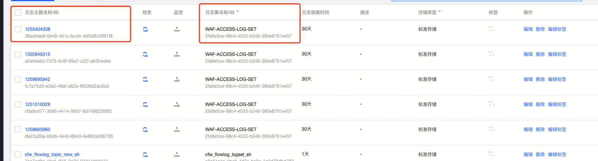

## syncer
syncer服务既作为kafka的消费者也作为了kafka的生产者。

## golang sarama kafka
sarama是一个go语言操作kafka的包。但是sarama存在一定的问题，
### 问题现象
所有Sarama Go版本客户端存在以下已知问题：
- 当Topic新增分区时，Sarama Go客户端无法感知并消费新增分区，需要客户端重启后，才能消费到新增分区。
- 当Sarama Go客户端同时订阅两个以上的Topic时，有可能会导致部分分区无法正常消费消息。
- 当Sarama Go客户端的消费位点重置策略设置为 `Oldest(earliest)` 时，如果客户端宕机或服务端版本升级，由于Sarama Go客户端自行实现OutOfRange机制，有可能会导致客户端从最小位点开始重新消费所有消息。
### 解决方案
建议尽早将Sarama Go客户端替换为Confluent Go客户端。Confluent Go客户端的Demo地址，请访问[kafka-confluent-go-demo](https://github.com/AliwareMQ/aliware-kafka-demos/tree/master/kafka-confluent-go-demo)。

## 消费
#### 消费模式：
syncer采用异步消费的方式，保证消费者能够及时处理消息，防止消息在kafka中堆积。
具体方式为：

1. 批量读取kafka消息，并放到chan中。（消费者任务完成，并采用autocommit的机制，提交offset）
2. 
3. 处理协程从chan中读取消息，并处理。（真正的消息处理异步开始）

#### 实现细节：
```
//定义
client, err := sarama.NewConsumerGroup(kafkaAddress, groupId, sarama.config{})
//消费，handler为consumer，用户需要自己实现handler
for {
    client.Consume(ctx, strings.Split(topics, ","), &consumer); 
}

/* ------------ handler要实现三个方法 ----------------
type ConsumerGroupHandler interface {
    // Setup is run at the beginning of a new session, before ConsumeClaim.
    Setup(ConsumerGroupSession) error

    // Cleanup is run at the end of a session, once all ConsumeClaim goroutines have exited
    // but before the offsets are committed for the very last time.
    Cleanup(ConsumerGroupSession) error

    // ConsumeClaim must start a consumer loop of ConsumerGroupClaim's Messages().
    // Once the Messages() channel is closed, the Handler must finish its processing
    // loop and exit.
    ConsumeClaim(ConsumerGroupSession, ConsumerGroupClaim) error
}
-------------------------------------------------------*/
```

## 生产
``` 
consumer := ConsumerGroupManager{}
ConsumerGroupManager实现了上述的三个方法，其中与业务相关的是ConsumeClaim。

//将从kafka中读取的message，插入到了manager.proxySer.OutputProxy.QueueCh()中
func (manager *ConsumerGroupManager) ConsumeClaim(session sarama.ConsumerGroupSession, claim sarama.ConsumerGroupClaim) error {
    for {
        select {
        case <-session.Context().Done():
            return nil
        case message := <-claim.Messages():
            manager.proxySer.OutputProxy.QueueCh() <- message.Value:
            session.MarkMessage(message, "")
        }
    }
}
```

```
manager有个成员为proxySer
proxySer会根据配置文件去初始化真正的consumer
例如 access . cls会调用 NewAccessCHServer（）函数：
s.OutputLogConsumer = qc.NewQueueWorker(consumerOpt, s.AsyncConsumeWorker)

NewQueueWorker函数，其实是读取manager.proxySer.OutputProxy.QueueCh()中的数据，
然后调用s.AsyncConsumeWorker去处理这份数据。

因此真正的处理逻辑是在s.AsyncConsumeWorker中。
每个消费者都有自己的AsyncConsumeWorker
```

### 腾讯云cls
```
//接口参数 data 为 kafka mssage
func (s *AccessCLSServer) AsyncConsumeWorker(id int32, data interface{}) error {
    cache := data.(*LogCache) //结构化成log的形式
    appid := cache.slot.(int64) //取appid

    resource, ok := s.resources[appid]
 	s.uploadLog(appid, resource, cache.logs)
}
```

```
// uploadLog 
1. 基于kafka message 构造结构化的日志，（key : value）
2. 基于cls的客户端，上传结构化日志，同时附带日志集和日志主题
```

通过公有云cls可以查看


cls一般用于给用户展示日志

### kafka
投递到kafka这部分一般用于ai和bot进行统计分析，实时分析用户流量

- ai :  topic - AccessAIKafkaServer
- bot :  topic - AccessBotKafkaServer


### 发送到ElasticSearch
ElasticeSearch一般用于开发人员排查问题，配合kibana使用

### ClickHouse
clickhouse一般用于给客户统计数据