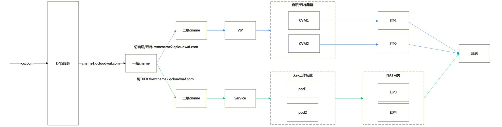
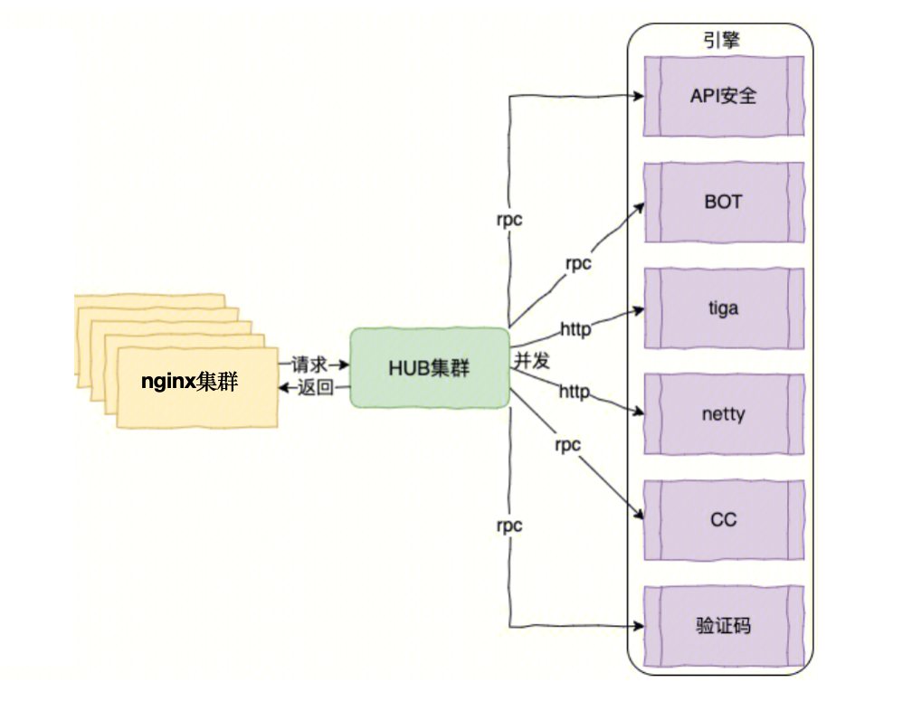
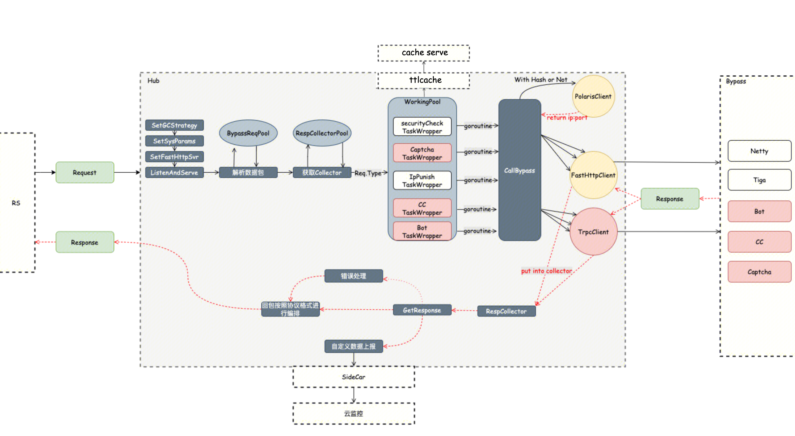
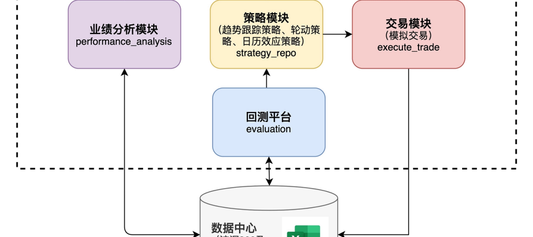

## CVM集群迁移上KBS集群

### 问题背景
在2021年-2022年产品初期，产品年收入4000w，客户主要是中小企业，全地域（广州、北京、上海、成都、香港和国际站）流量加起来约500wQPS。通过人工运维的CVM集群勉强能够应付业务对底层流量承载的需求。

但随着2022年业务快速发展，开始接入了例如央视频、小红书、荣耀等大客户，全地域日常流量突破1000wqps。流量集中在例如上海、北京、广州的大客户集群，此时需要人工运维1000+CVM节点。开始暴露一些问题：

- 1.扩缩容困难问题：背景是业务QPS存在时段性的高峰，例如央视频冬奥会春晚期间、荣耀发布会期间、双十期间，业务需要承载突发流量近2000wqps。然而，CVM节点无法自动扩容，需要人工提前申请并部署机器，这个过程至少1天。面对大突发流量，基本上集群资源会被打崩。影响客户业务。
- 2.节点一致性问题：一个节点上的组件是比较多的，主要有nginx、lua、日志、防护策略同步、转发策略同步等组件，并且大客户还有定制开发组件。人工部署经常出现组件不完整的问题。也会影响到客户业务。
- 3.成本高问题：业务为了应对突发流量，必须一直预留大量的机器，日常资源利用率低。2022年公司开始进行降本增效，该问题必须解决。

针对以上问题，领导决策规划半年集中解决稳定性问题，停止产品功能性迭代。

### 我的任务
2022年3月，成立了一个三人小组负责这个任务，分别是我、一位10级工程师还有产品leader。（10级工程师在讨论方案阶段被降本增效了...）首先问题本身业内肯定是有成熟解决方案的，就是采用云计算基础实施管理平台去自动扩缩容资源。我们朝着这个方向在公司内部进行了产品调研，主要调研了Openstack和K8S两款产品，Openstack基于虚拟机技术，K8S基于容器化技术。二者都能够为我们提供资源管理的功能。进过多次讨论，最终我们选择了公司内部基于K8S技术的TKEX平台。主要是因为：

- 1.针对扩缩容困难的问题，K8S通过HPA机制解决能够自动扩容，并且Docker可以实现秒级创建，但是虚拟机需要至少分钟级。
- 2.针对节点一致性问题，虚拟机还需要脚本安装组件，docker通过镜像打包保证了一致性。
- 3.考虑经验问题，公司内部应用对K8S的使用程度远高于openstack，TKEX产品文档完善并且对方团队十分愿意配合。

定了大方向之后，我们就开始拉通TKEX平台的同事和一直负责运维CVM节点的同事进行频繁讨论。不断进行方案评审，最终制定了详细的方案，主要分成了两个部分：上云方案、迁移方案。

#### 上云方案
主要结合业务讨论了Docker镜像怎么制作、集群workload和pod怎么组织。

##### 镜像制作

主要讨论点在于选择富容器还是轻量级容器。
富容器把所有组件打包到一个镜像，一个pod部署一个容器。最大程度保证在不对原来业务组件改造。

轻量级容器为每个组件都制作一个镜像，一个pod部署多个容器。实现了业务解耦，比较符合云原生的思想。

最终让我们决定用轻量级容器的是业务发布场景。业务中nginx组件是长期不会变更的，但是lua、日志等组件是会经常变更的。如果用富容器打包，那么即使发布lua也需要整体升级，这会导致nginx流量中断，也会中断长链接的业务，还有可能导致服务负载不均的情况发生。如果用轻量级容器，我们可以仅升级lua组件，然后reload nginx实现优雅热启动。

一个pod部署多个容器，容器之间

##### 集群搭建方案

以前的集群设计方案是每个地域都划分了很多个小集群来做客户业务的隔离，可以一定程度上减少单集群故障影响范围。问题在于预留buffer碎片严重，应对突发流量的能力差。

针对这个问题，我们从集群故障原因的角度进行了分析，并且从TKEX平台上面寻找了解决方案。

- 某地域机房故障，我们要求平台给我的资源是跨可用区机房的，在机房间进行故障转移。
- 集群的网络资源被打满导致不可用，我们要求平台在底层为我们提供独享集群，出入口保证大带宽不和其他业务共享。
- 集群的计算资源被打满导致不可用，我们通过K8S的HPA机制进行扩容解决。

通过以上方案，可以很大程度避免集群故障，所以最终我们决定使用大集群的方案。每个地域部署少量的workload，可以为每个workload配置较大容量，来应对突发流量。

我们还需要解决的是，通过文件挂载的方式实现同个pod中多个容器数据共享、通过推动TKEX支持shareProcessNamespace来保证通过pod中多个容器的进程空间共享。

#### 制定迁移方案
主要讨论了在TKEX集群已经搭建好的情况下，我们如何把业务流量无损平滑的从CVM集群迁移到TKEX集群。

目前业务的网络架构是客户端通过一级CNAME解析到二级CNAME再最后解析到VIP，由VIP做负载均衡，发送客户端请求到CVM节点，CVM节点对流量进清洗后，通过EIP回源到用户源站。我们主要通过修改一级CNAME到二级CNAME的DNS解析到TKEX集群上。

迁移方案涉及到网络链路变更，属于高风险行为。所以我们和DNS团队进行了协作，通过DNS智能解析，按照移动、联动、电信、BGP进行划分，按照运营商逐步灰度。

但是在推进过程中，还是非常不顺利的。：

- 1.客户端写死了入向IP，修改DNS解析是不生效的，流量迁移不成功。
- 2.源站为出口IP添加了安全组，直接阻断新的出IP，导致业务中断。
- 3.迁移前没有做新集群拨测、迁移中出现问题也没有自动回滚的工具。

针对写死入向IP问题，已经无法通过技术方案解决了。只能协调售前和商务，让他们逐个推动客户切换到CNAME。光是推动售前和商务，在公司内部就拉各方的总监进行了好多次会议。
然后这个过程还是非常不顺利，因为部分客户联系不上、客户不愿意做变更、客户需要申请变更窗口期等，我们成立了专项每周对各种用户情况进行统计，在运维、商务、售前、售后、研发等角色齐心协力下，花了接近2个月的时间才解决大部分客户写死入向IP的问题。剩下的无法联系的客户，只能继续在CVM集群上继续运作。

针对出向IP客户源站添加了安全组问题，我们统计了用户源站，80%都是腾讯云资源。因此我们联系了腾讯云VPC负责人，沟通协作拿到内部SDK，以用户授权的方式我们自动为用户源站放通新IP的安全组。

针对工具缺失的问题，我们搭建了运营平台，为迁移提供一站式的工具。包括拨测工具、自动迁移工具、一键回滚工具等。

#### 开发过程
在方案讨论的同事，我们也在进行开发。开发人员共3人，分别是我、一位TKEX平台的同事、一位实习生。

我负责内容为：

- 编写dockerfile打包镜像
- 编写TKEX接口交互的组件来自动创建Workload和Service
- 编写DNS智能解析和DNS调度工具来进行流量灰度迁移
- 编写和CAM服务交互获取用户授权、和VPC服务交互自动创建安全组代码

开发过程中，主要挑战在于：

- 要深入理解腾讯云DNS、CAM、VPC、TKEX等平台的工作原理和API接口。
- 在和多产品交互的流程中，通过事务机制保证原子性、通过Tracing保证可观测性。
- 跨多个团队协作。不同团队可能有不同的目标和优先级，导致难以协同工作。主要还是通过上层沟通推进下层执行的方式解决。

### 上线后问题
经过近一个月的开发和测试，三个月的流量迁移。K8S集群承载QPS来到了500wqps。已经接近70%的用户在使用新的K8S集群了。
在这个阶段我们又遇到了一些问题。

#### 面对突发流量，触发HPA后，集群仍然雪崩

主要问题是用户压测，触发workload HPA后，开始大量扩容Pod，但是Pod长时间处于Pending状态，无法处理流量。
随着QPS暴增，旧Pod的CPU被打满，也开始进入pending状态。随着越来越多的pod不可用，workload雪崩，也基本进入不可用状态。

我们从多个方面分析复盘了此次事故。

- 扩容的Pod长时间pending问题。
我们分析了pod从新建到就绪过程，发现时延集中在镜像拉取和健康检查阶段。
在镜像拉取阶段我们给镜像替换了更加轻量的基础镜像。镜像从5G减小到2G。
在健康检查阶段，我们放宽了检查条件，只要nginx进程开始监听端口则认为pod就绪。不需要其他组件全部就绪。

- 旧Pod进入pending问题。
旧Pod之所以进入pending状态，是因为CPU满载，无法快速响应健康检查，健康检查机制将pod标记为pending。
我们放宽了健康检查条件，从应用层健康检查修改为TCP层健康检查，避免因为业务响应不及时导致的pending。

- HPA水位优化。
我们优化了HPA水位，从60%cpu内存触发，修改为30%cpu内存触发。为紧急情况，争取了时间。

#### QPS超量，无限触发HPA，成本增加

和CVM不同，K8S集群，可以自动扩缩容。我们无法限制K8S集群的总QPS。
很多用户超量使用QPS，我们却只能任由HPA扩容。这将带来大量的成本上升。

因此，我们制定了沙箱隔离方案：

如果域名QPS超量，我们将该域名流量调度到沙箱workload。沙箱workload不启用HPA。

技术实现上，我们将nginx access log推送到kafka，由腾讯云Oceance Flink消费kafka数据，按照域名纬度，实时聚合统计QPS。然后sink到redis的hashmap中。使用python编写的监控服务会不断读取该hashmap和域名实际购买的QPS进行对比，超量30%，则通过DNS调度到沙箱集群。

### 成果

- 1.稳定性提升：全地域稳定承载日常流量1000w+QPS。2023年重大事故数量下降到0起。
- 2.成本优化：计算资源成本从每97.6w下降到35.8w，下降63.3%。带宽成本每下降30w。
- 3.效率提升：发布时间从1-2月缩短到1-2周。自动扩容，减少30%集群运维工作。

## 防护引擎性能优化

### 问题背景
请求到达nginx后，在access阶段通过lua模块的resty.http串行发起网络调用cc检测、bot检测、规则匹配、ai检测等防护引擎，来防御攻击请求。白流量通过nginx回源，黑流量直接被阻断。

随着检测模块增多，串性网络调用的时延也在不断提高。

然而，对延时敏感的大客户给我们的处理超时时间是60ms。（从客户端请求发送nginx开始，到收到nginx响应的过程）

当前架构下进行wrk压测情况是 4c8g Pod，3000QPS，p99检测延时为178ms，远超60ms。也就是说，业务连99%的可用性都无法保证。

而友商可用性保证承诺99.9%，导致我们产品被客户挑战，也存在客户流失的现象。

为了winback客户，我们成立了防护引擎性能优化项目组，主要优化检测延时，4c8g Pod，3000QPS下 目标p999 60ms以内。

### 我的工作

防护引擎性能优化项目组有我在内的三人进行开发工作。

大家的分工是:

- 两人负责cc和bot检查引擎内部逻辑优化，争取减少引擎内部时延。
- 我负责优化lua调用逻辑，把串性调用改为并发调用，减少IO时延。

在讨论串行改并发调用的方式时，我们主要探讨了了两种方案。

- 1.在lua上通过协程直接开启并发调用检测引擎。
- 2.新增旁路组件，lua仅与旁路通信，由旁路并发调用检测引擎。

#### lua协程并发方案

lua协程和python协程的基本一致，都是用户侧协程。通过事件循环和IO多路复用来实现IO搞并发。

我们快速的实现了该方案的demo，开始进行压测。却发现完全相反的结果：
随着检测引擎数量增加，nginx和lua组件性能急剧下降，CPU负载不断升高，承载的QPS不断下降。检测引擎全开的情况下，4c8g Pod仅能承载不到2000qps，比
未优化时表现还差。

分析原因：

- CPU资源消耗：通过火焰图分析，热点函数在于json序列化和反序列化和内存拷贝。因为lua协程会将请求通过并发的方式扩散出去，http并发至少提高了4-5倍。
cpu大量时间在进行json序列化和反序列化。 内存拷贝是因为当Lua发送HTTP请求并读取响应时，会在lua缓冲区与Nginx缓冲区之间进行大量数据拷贝。

- 网络资源消耗：表现为客户端大量connection refused。通过netstat查看发现nginx connection提高了很多，达到了nginx最大连接数限制。当Lua发送HTTP请求会占用Nginx连接数。Nginx有最大连接数限制，当达到这个限制时，新的连接请求将会被拒绝。

基于lua协程并发方案，会大量扩散请求，对CPU、网络都不友好。非但没有提升性能还导致性能进一步降低。只能转向调研旁路并发方案。

#### 旁路并发方案
该方案新增了旁路路由组件HUB，接受来自lua的检测请求，由旁路并发调用下游多个检测引擎，汇总检测结果后再发送响应给lua。

优势：

- 语言生态好：lua生态系统单薄，新增的旁路路由组件可以基于非lua语言编写，可以找到有大量的开源库和框架可供使用。
- 并发能力强：openresty集群仅和HUB进行通信，由HUB并发调用下游检测服务，不影响openresty集群本来的性能。
- 架构清晰：hub集中进行并发调用，架构清晰。

劣势：

- 网络开销：新增hub节点将增加网络链路长度。
- 成本开销：部署新组件增加计算资源成本。

总结：基于旁路的并发方案，新增路由组件，加长网络链路，增加计算资源成本。但是保证了nginx lua集群的稳定性，同时增加架构的灵活性和清晰度。采用该方案。

### 技术选型
确定了基于旁路的并发方案后，从语言和框架上进行技术选型，实现该方案。

语言选型，
我熟练语言是golang、python。
目标是实现高并发低延时的系统，Go语言在设计时特别考虑了并发性，通过goroutines和channels提供了清晰的CSP并发模型。相比python，golang性能通常更高。此外，Go的生态系统也相对成熟，支持多种应用场景。最终选择Golang作为开发语言。

框架选型，
在公司内部RPC框架中，主要从性能数据、服务治理、可观测性进行了评估。最终选择了Trpc框架，该框架已开源。

- 性能数据: 16c32g 18w+QPS p99 9.50ms p99.9 17ms
- 服务治理: 支持服务发现、负载均衡、路由选择、熔断
- 可观测性: 支持远程日志、分布式链路跟踪、监控上报

### 开发

hub逻辑图

HUB根据收到检测报文后，解析json内容，通过本地和redis二级缓存获取metadata。通过CSP模式，同步多个并发请求。最终汇总所有的结果返回给调用方。

开发难点主要在于：深入理解golang并发编程原理、协程调度模式、如何保证同步和互斥。

### 性能优化
构建完开发版本服务后，压测旁路HUB发现，4c8g仅能压到1wqps且p99时延达到120ms。还是不满足60ms的目标。

#### 针对时延问题

通过pprof工具，我们分析了程序执行过程中的主要耗时函数：json序列化和反序列化。

首先将原生的encode/json替换为fastjson，通过benchmark测试，是存在一定提升的。
其次，由于旁路的请求内容是比较固定的，我们测试了自己编解码json，在fastjson上进一步提升。
最后，经过不断benchmark测试，发现snoicjson性能最优，最终使用了snoicjson作为json解析库。

#### 针对压测数据qps较低问题

我们发现压测客户端存在大量的connection refused的问题。此时服务器上establish连接数较多但是远没达到连接数上限、而且CPU负载也不算高。

通过netstat分析，发现全连接队列溢出的次数一直在增加。客户端connection refused基本是因为全连接队列溢出导致连接丢弃。

为此我们深入研究了框架在网络层面上的实现，发现其是I/O多路复用+单reactor模式。

如果，每个请求在read和write期间cpu占用时间较高，例如存在大量序列化、内存拷贝等，则很有可能事件循环来不及accept新链接，导致全链接队列溢出。

为此，我们一方面联系框架开发团队寻求帮助，替换底层网络库，从单reactor模式切换到多reactor模式。另一方面我们调整了内核somaxconn，从默认128提升到600.

优化完以上两个点之后，4c8g压测数据从1wqps、p99 120ms优化到2wqps p99 40ms。基本满足了要求。

### 线上问题

#### p9999延时要求
荣耀在使用产品时，按照p9999标准进行压力测试，发现业务没达到承诺的60ms延时，导致检测成功率不符合要求。

我们自己进行了压测复现，发现虽然p99满足了60ms的要求，但是p9999长尾延时来到了258ms。确实存在问题。

长尾延时很有可能是gc导致的问题，因为golang gc是会stw的。我们统计了gc次数，3分钟内gc次数1122，频率太高了。

为此我们深入研究了golang的内存分配和内存回收原理，主要从减少堆内存分配和减少gc触发两个方面进行了优化：

#### 减少内存分配

- 逃逸分析：通过golang逃逸分析，分析栈上变量逃逸到堆的情况。最终优化编码方式，减少函数返回，通过参数引用修改变量。
- 池化：通过sync.pool，对常用对象进行了复用，减少内存分配。

#### 优化gc触发策略

- 通过压舱石提前占用大量内存，增加下一次gc触发的内存增长阈值。
- gcpercent调整，调整gcpercent为200%，内存增长200%才开启gc。

优化完gc之后，p9999整体时延258ms优化到68ms.

#### 流量高峰连接数打满，没有新流量进来。

客户端表现为建立连接失败，大量的请求重试和等待响应。
旁路HUb表现为为连接数非常高，但是cpu利用率和内存利用率非常低。

通过pprof分析发现框架底层并发调用互斥锁存在lockslow问题，从而导致协程无法快速处理业务逻辑后返回。
表现为请求hub后没有得到响应，连接一直没有释放，新请求会不断新建连接，最终达到连接池上线。

最根本问题还是协程返回不及时，因此在新建协程时制定了超时事件，达到超时时间后强制协程返回，及时是返回超时错误。

## 小程序安全加速

### 背景

内忧外患下，我们迫切寻找新的业务突破点。

- 内部赛马： EdgeOne网关整合cdn、waf、ddos统一售卖，减少购买和运维成本，导致部分waf客户迁移到edgeone。
- 外部压力： 阿里waf的产品较高，在价格、时延、检测能力上都存在优势。导致一些头部客户迁移到阿里。

产品营收增长乏力，客户留存率下降、获取新客困难。我们迫切寻找新的业务突破点。

客户需求帮助我们找到新的发力点 --- 茶百道上市连续优惠活动，迫切寻找小程序防Bot解决方案。

我们提出了小程序安全的产品形态，依靠腾讯生态，打造差异化竞争点，助力winback。

### 我的任务

### 寻求小程序业务合作

了解到小程度生态的donut网关是具备简单的安全防护能力。

思考能否和donut网关合作？达到1+1大于2的效果。

Donut安全网关虽然能够提供基本的安全防护，但是WAF能够提供更加深刻的安全防护能力。 比如在抗CC攻击的时候，公有云WAF具有更多的集群容量，可以抵抗更好峰值的CC攻击。 又比如WAF基于20年沉淀的防护规则，能够提供更加全面的防护范围。 最重要的是Donut不支持用户根据业务自定义防护规则，而WAF支持细粒度的自定义防护规则。 总的来说，基于专业的WAF进行攻击防护是更好的选择。 因此，WAF积极与Donut网关进行合作。 一方面，WAF将获取到微信小程序客户资源。另一方面，Donut网关对外提供更加全面的安全能力。为用户完整的提供私有链路、网络加速、防Bot、安全检测能力。

通过和donut协商，达成合作关系。开始套路架构实现。

### 确定架构

要求之一：透明接入。Donut网关希望waf可以做到透明接入。但是反向代理waf是无法做到这一点的。

提出了新的waf接入架构，旁挂式透明接入。Donut通过subrequest请求waf，waf仅提供防护能力，将检测结果返回给Donut，由Donut决定是否阻断请求。

网络架构：
 
补充小程序的clb架构

控制面架构：

waf作为第三方平台，用户小程序授权waf，将用户小程序一键接入到waf独享的donut网关。

### 开发挑战
本项目的挑战点并不在技术层面，因为在技术上，我们主要的工作的是构建API，调用微信小程序、Donut网关的接口和用mysql维护用户操作数据。 本项目的挑战点在于如何紧急，设计、开发、联调、上线、运营一个不被合作方重视的新功能。

问题1： 虽然我方极其重视该项目，但是微信方一开始并不重视，导致功能设计、开发、联调过程效率低下。
及时与上级沟通项目进展和卡点，推动上级和微信方上级沟通，阐明项目对WAF的重要程度，以及一起合作能够产生什么样的收益，拉近和微信项目方的关系，推动功能开发工程。

问题2:作为项目负责人，在本次项目中，再次认识到了团队协作的重要性，尤其是在节奏快，时间紧的开发任务中，大家充分沟通和协作才能够及时完成任务。

### 上线

#### 初步上线

因为不熟悉微信方内部实现的逻辑，测试不充分，导致客户接入踩坑。 例如, 茶百道接入实战记录 四川蜀道云茶科技有限公司（茶百道） https://docs.qq.com/doc/DWUNrYnlDSGpNQ3hW?u=4301e595957e4f30b3fa82153570ec19
及时安抚客情，及时和微信沟通实现细节然后向客户阐明原因，争取下次灰度发布机会。突出项目运营能力。

#### 逐步完善

充当前场的角色，帮助客户接入，随时上会帮助用户解决问题。

在不断收集客户问题和反馈下，小程序安全加速又经历了三次迭代开发。提供更加完整的接入能力。

### 项目成果
在营收方面，从有小程序WAF的想法到落地并开始客户试用和付费使用，我们花了一个季度的时间。 

制定了标准付费方案。
达成了：接入客户数12个。
增加营收500w。

### 改进和学习
在茶百道时间中，我们反思了问题的原因。认为新功能踩坑是一个必然并且良性的行为，但是不应该让大客户来踩坑，所以即使在紧迫的情况下，我们也应该首先推小客户试用。以及大客户重点保障的流程。

## 量化开发(个人)

### 背景

量化是未来主流的投资手段。利用数据分析进行回测和投资。

投资前做到 回测，心中有底

投资中做到 不人为干预，严格纪律

### 基于理论自己设计投资框架

https://github.com/mashiroissocute/J.P.Lucas/tree/master

- 回测模块
- 数据模块
- 交易模块
- 策略模块

### 发现了更好的投资框架

fretrqde

- 通过ccxt对接交易所，获取行情数据，提交订单。
- 自带回测框架。

让使用者专注开发量化策略。

#### 开发策略

##### 选股策略

###### 多因子选股策略

`经济模型`
市场上的投资者，不管是价值投资还是投机，都会根据某些因子来判断涨跌。当有一群交易者同时采用某个因子的时候，就会造成该因子有效。

`选取因子`
回测因子单调性表现，选取头部做多，尾部做空。

- 基本面因子：市值因子 
- 技术面因子：成交量因子，波动率因子，动量因子

`候选池构建`
通过因子层层过滤构建候选池：

- 做多候选池：选取市值大前50币种，其中选取成交量大前20币种，其中选取波动小前10币种，其中选取动量小前5币种，形成最终的候选池。 

- 做空候选池：选取市值小前50币种，其中选取成交量小前20币种，其中选取波动大前10币种，其中选取动量大前5币种，形成最终的候选池。 

`持仓策略`
从做多候选池中打乱顺序选择1个币种开仓做多。
从做空候选池中打乱顺序选择1个币种开仓做空。
24小时调仓。当币种不在候选池的时候平仓，重新选择一个币种开仓。

###### 板块轮动选股策略
`经济模型`
在一个完整的经济周期中，有些是先行板块，有些是跟随板块。

板块轮动思想指导我们在板块轮动前开始进行配置，在板块结束后进行调整。
具体来说是板块上涨时获利了结，继续配置还未上涨的板块，如此循环，从而获取超额收益。

`选取板块`
从以下两个方面选取候选板块：

- 市场情绪： 选取热门板块(体现在成交量，广场讨论程度)
- 强势程度： 选取强势板块(体现在反弹程度、拒绝下跌程度)

`选取币种`
选取每个候选板块中，选取市值最大的两个币种作为候选币种。

`持仓策略`
等比例买入所有候选板块的所有候选币种。
24小时调仓，保证所有币种的比例相等。

##### 择时策略

###### 趋势跟踪策略
基于MACD和DMI形成趋势判断指标。跟踪全市场200+币种，当币种趋势指标形成后直接买入。达到盈利线或亏损线后卖出。

###### 动量反转策略
基于Wavetrade和RSI形成超买超卖指标。跟踪全市场200+币种，当币种超买时做多，超卖时做空。达到盈利线或亏损线后卖出。

###### 突破回踩策略
基于MACD和DMI形成趋势判断指标。
基于Wavetrade和RSI形成回调指标。
跟踪全市场200+币种，当币种趋势指标形成后观望，当回调时进场买入。达到盈利线或亏损线后卖出。

##### 算法交易

- DCA交易策略

- 网格交易策略

##### 超参数优化策略

基于贝叶斯优化的超参数学习模型。贝叶斯优化思想假设所有参数变量是对目标函数的联合高斯分布，通过采集函数（方差和均值的函数）选择参数优化方向，使用过程中最优解作为最终解。我们在交易过程中往往会对一些超参数设置感到困惑，例如我应该多少点止损止盈，我应该用多少天的数据计算指标，我是否应该用这个指标。以上所有的选择都是超参数，我们可以为这些参数定义参数空间，联合起来做贝叶斯优化，目标函数可以选择夏普率、收益率、最大回撤等。通过优化后获得比较理想的参数设置。

`超参数优化 挖掘因子`

实现了常见的技术指标因子，并且为每个指标配置开关超参数。

通过超参数优化，寻找最大夏普率参数。

积累夏普率最大的技术指标组合为选股或者择时因子。

`超参数优化 寻找最优参数`

在策略开发过程中，难免会遇到很多超参数，例如最大仓位数量、计算指标所用的时间长度、止盈止损百分比。

通过超参数优化，寻找最大夏普率参数。

帮助设置最优超参数。

##### XGBOOST机器学习策略

基于xgboost进行预测涨跌的策略。xgboost是集成决策树模型，能够自动学习哪些特征是对做出正确决定起到较大作用的。由于本人并不擅长技术指标分析，所以使用了常见的的技术指标共30个，扩展到15m 1h 4h 1d 上，并结合BTC ETH进行特征工程，最后构造了1000+纬度特征向量。采用后一天的涨跌最为lable，训练xgboost或者任意分类模型。最终预测下一个k线涨跌，胜率55%。由于模型具有时效性，所以在运行过程中需要定期重新训练最新模型。

##### 回测陷阱

###### 未来函数

`移动止损止盈回测陷阱`

当回测时间框架处于比较长周期时，使用trailing stop loss极易出现使用未来函数的情况。
因为没有bar内部的行情，所以在计算移动止损止盈的时候，会根据bar的最高价和最低价计算，并且先计算了止盈再计算止损。导致回测收益非常道。
但是有可能会先到达止损，或者在bar中途就止盈掉。

#### 模拟盘

回测数据较好，并且不存在未来函数的情况下。会通过提交虚拟订单的方式，跑模拟盘。

- 主要观察程序执行情况是否符合预期。
- 通过一段时间的模拟盘和这段时间的回测结果，观察回测数据是否真实。

#### 实盘

实盘时主要需要尽量少的变更策略。也不要因为短期内的回测而否定和怀疑策略。

## 量化跟单(个人)

项目地址：https://github.com/mashiroissocute/magic_copytrading

### 项目背景
顶级交易员的回撤和收益都是自己的量化模型难以望其项背的。
萌生了学习他们交易思路的想法。

### 项目架构

### 项目难点

#### 监控交易员订单流

通过网页爬虫，伪造请求，获取到交易员的订单流。

#### 订单比例
入场订单根据保证金设置比例，出场订单需要根据持仓量比例买出。因此需要准确计算交易员持仓量和程序持仓量。并且需要数据落盘，保证程序崩溃后，状态还能保持一致。

#### 减少时延
服务器就近部署
