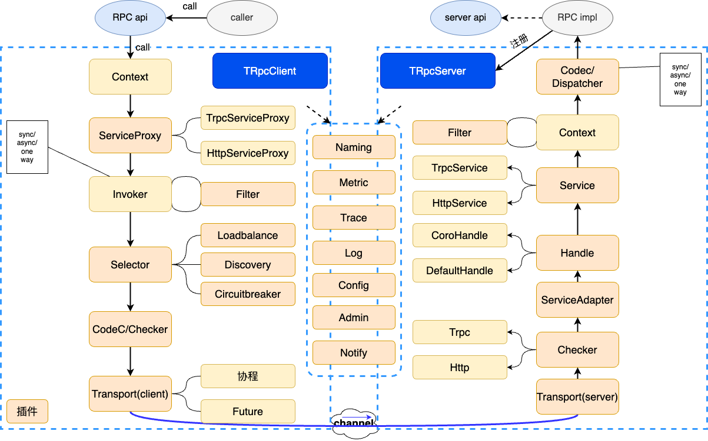

## 防护引擎性能优化

### 问题
一个请求到达WAF后，会经过cc检测、bot检测、规则匹配、ai检测等多个检测模块。
当前检测架构基于openresty，nginx收到请求之后，通过resty.http串行发起请求，依次将请求发送到各个检测模块。wrk压测情况，4c8g，3000QPS，串行检测p99检测延时为178ms。时延较长，不满足60ms的目标。分析问题，主要是因为串行检测，检测时延累加导致较长时延。因此，制定了串行检测改并发检测的优化方案。

### 方案选型

#### 基于openresty的并发方案
使用timer.defer_at(0)和resty.http模块保证并发异步地发送HTTP请求到下游服务器。
```lua
local http = require "resty.http"
local cjson = require "cjson"
local timer = require "resty.core.timer"  -- 需要OpenResty 1.13.9 或更高版本

-- 创建http客户端
local httpc = http.new()

-- 准备请求列表
local requests = {
    {url = "http://example.com/api1", body = "payload1"},
    {url = "http://example.com/api2", body = "payload2"},
    -- ... 其他请求
}

-- 并发执行请求的函数
local function send_requests(requests)
    local resps, errs = {}, {}

    local function send_request(req)
        sem:wait()  -- 等待信号量
        local httpc = http.new()
        local resp, err = httpc:request_uri("http://" .. req.host .. ":" .. req.port .. req.path, {
            method = "POST",
            body = req.body,
            headers = {
                ["Content-Type"] = "application/json",
            },
        })

        if not resp then
            errs[#errs + 1] = err
        else
            resps[#resps + 1] = resp
        end
        sem:post()  -- 释放信号量
    end

    for _, req in ipairs(requests) do
        timer.defer_at(0, send_request, req)
    end

    -- 等待所有请求完成
    sem:wait_all()

    return resps, errs
end

-- 执行并发请求并处理响应
local resps, errs = send_requests(requests)

for i, resp in ipairs(resps) do
    local json_body = cjson.decode(resp.body)
    ngx.say("Response " .. i .. ": " .. resp.status .. " " .. json_body.message)
end

for i, err in ipairs(errs) do
    ngx.say("Error " .. i .. ": " .. err)
end
```

问题：随着下游引擎数量增加，openresty性能急剧下降。表现为承载的QPS不断下降、CPU负载不断升高。影响到openresty的转发性能。
原因：

- CPU资源消耗：当LuaVM发送HTTP请求并读取响应时，会与Nginx进行数据拷贝。请求数据会从LuaVM复制到Nginx内部缓冲区，然后由Nginx通过网络发送出去。响应数据会先接收到Nginx内部缓冲区，再复制到LuaVM中。连接建立、请求响应解析都会占用CPU资源。
- 网络资源消耗：当LuaVM发送HTTP请求会占用Nginx连接数。Nginx有最大连接数限制，当达到这个限制时，新的连接请求将会被拒绝。如果 LuaVM发送的HTTP请求占用了大量连接，可能会导致新的HTTP请求无法得到处理。
- 内存资源消耗：为了处理大量并发请求，Nginx需要维护大量连接，这会占用内存。(因为使用http1.1协议，暂不支持多路复用)

总结：基于openresty的并发改造方案，将大量扩散请求，从CPU、网络、内存上都对原本openresty转发性能有较大影响，影响到集群稳定性，因此放弃改方案。

#### 基于旁路的并发方案
为了解决openresty并发方案因扩散请求导致的性能问题，设计了旁路并发方案。该方案新增了旁路路由组件HUB，接受来自openresty的检测请求，并发调用下游多个检测引擎，汇总检测结果后再发送响应给openresty。


优势：

- 语言生态好：lua生态系统单薄，新增的旁路路由组件可以基于非lua语言编写，可以找到有大量的开源库和框架可供使用。
- 并发能力强：openresty集群仅和HUB进行通信，由HUB并发调用下游检测服务，不影响openresty集群本来的性能。
- 架构清晰：hub集中进行并发调用，架构清晰。

劣势：

- 网络开销：新增hub节点将增加网络链路长度。
- 成本开销：部署新组件增加计算资源成本。

总结：基于旁路的并发方案，新增路由组件，加长网络链路，增加计算资源成本。但是保证了openresty集群的稳定性，同时增加架构的灵活性和清晰度。采用该方案。

### 技术选型
确定了基于旁路的并发方案后，从语言和框架上进行技术选型，实现该方案。

#### 语言选型
团队熟练语言是golang、python、c。
目标是实现高并发低延时的系统，从编程语言的性能、并发模型、生态系统以及开发效率等进行了语言选型。

Go语言在设计时特别考虑了并发性，通过goroutines和channels提供了清晰的CSP并发模型。相比python，golang性能通常更高。相比c，golang具有垃圾回收机制，减少了内存泄漏的风险，易于开发和维护。

总结：Go语言在保持较高性能的同时，提供了简洁且高效的并发模型，易于开发和维护。此外，Go的生态系统也相对成熟，支持多种应用场景。最终选择Golang作为开发语言。


#### 框架选型

在公司内部RPC框架中，主要从性能数据、服务治理、可观测性进行了评估。最终选择了Trpc框架，该框架已开源。


- 性能数据: 16c32g 18w+QPS p99 9.50ms p99.9 17ms
- 服务治理: 支持服务发现、负载均衡、路由选择、熔断
- 可观测性: 支持远程日志、分布式链路跟踪、监控上报

### 实现

hub逻辑图


流程:

搭建http服务器，接受来自openresty的检测请求。
根据检测报文中的检测的类型向缓存获取数据后并发调用下游引擎，等待所有引擎返回结果，对结果进行封装后返回给openresty。


### 性能优化
构建完初试版本服务后，进行压测发现，4c8g仅能压到1wqps并且p99时延达到120ms。完全不满足目标。于是开始性能优化。

#### 打点分析耗时
想要找到是哪里的代码逻辑比较耗时，手段是通过打点分析。最终发现主要耗时在json序列化和反序列化的位置和http收发包。

##### 针对json序列化耗时的优化

- 将原生的encode/json替换为fastjson发现存在部分提升。
- 继续探索，发现snoicjson性能更好，最终使用了snoicjson作为json解析函数。

##### 针对http收发包的优化

- 从net/http库切换到fasthttp库优化


优化完以上两个点之后，p99整体时延128ms优化到40ms。开始满足60ms的时延要求。


#### 打印gc次数
虽然p99满足了60ms的要求，但是发现p9999长尾延时258ms，怀疑到是gc问题。
主要从两个方面优化了gc

- 优化gc触发策略：通过ballast和gcpercent调整
- 减少内存分配：模仿fasthttp优化内存分配方案进行逃逸分析和对象复用

优化完gc之后，p9999整体时延258ms优化到68ms.


### 线上问题

#### 流量高峰连接数打满，没有新流量进来。

##### 问题现象

openresty侧表现为建立连接失败，大量的请求处于连接重试和等待hub响应的状态。同时不断有新的请求进来，导致openresty cpu飙升，集群处于不可用状态。

hub侧变现为连接数非常高，无法新建连接，但是cpu利用率和内存利用率非常低。

由于hub cpu和内存利用率低，无法触发自动扩容策略。导致openresty到hub一直处于无法新建连接的状态，openresty也无法恢复。

临时解决方案是只能先手动扩容解决。然后因为扩容速度很慢不够及时，集群一直处于崩溃状态。所以开始新建hub集群，在rs上通过名字服务进行流量调度到新hub集群。勉强稳住了rs的整体情况。


##### 问题排查

因为hub已经处理无法新建连接的情况，无法利用新的请求去跑pprof来定问题。所以先加上了pprof，等到下次流量高峰复现问题。

果然下次流量高峰又出现了这个问题，通过pprof分析发现trpc框架一个map存在资源竞争，大量协程修改map，需要先获取lock，再函数lockslow耗时非常长。导致协程无法返回，waitgroup一直阻塞。然后hub是存在连接池的，旧的协程拿着连接一直无法释放，新的请求只能不断的新建连接，最终导致连接池达到上限，无法新建连接。


##### 解决问题
通过golang的ctx，设置下游调用的超时时间，强制回收协程。让waitgroup强制返回。让rs可以和hub新建连接，触发扩容机制，处理流量高峰。


#### 缓存击穿问题

##### 问题现象
流量高峰，出现cache server因为hub大量访问导致服务不可用。

##### 问题分析
hub缓存失效后，同一时间发起了有大量的查询请求到cache server

##### 问题处理
用singleflight减少缓存击穿。


#### 半连接数打满问题
##### 问题现象


## 上云

### 问题背景
在产品初期，客户较少，流量较小，人工运维的CVM集群能够满足客户需求。
但随着业务的快速发展，突破千万qps，需要人工运维1000+CVM节点。主要存在以下问题：

- 扩缩容困难：由于CVM扩容需要人工申请并部署机器，需要提前准备资源。面对突发流量，来不及扩容，集群被打崩。
- 1000+节点难以维护：节点上组件多，定制化节点也多。人工部署经常出现缺少组件、配置错误等问题。
- 成本高：为了应对突发流量，必须一直预留机器，日常资源利用率低，浪费大量计算资源。

以上问题促使停止产品迭代，开始注重产品稳定性建设。

### 调研
调研公司内部基于K8s的云原生平台tke能否解决CVM集群当前问题。

- 针对扩缩容困难的问题，通过HPA机制解决。
- 针对节点维护困难问题，使用相同的容器镜像保证pod不会缺少组件。
- 针对成本高的问题，不再需要预留闲置资源，可以减少成本。

确定通过tke平台能够解决问题后，制定上云方案。

### 制定上云方案

#### 镜像制作方案

选择富容器还是轻量级容器？

富容器虽然能够在不改变任何业务的情况下快速迁移，但是会给以后业务解耦留坑，也不够云原生。轻量级容器可以裁剪非必要组件，可以提升启动速度和资源利用。并且为部分功能组件的微服务化做好铺垫，如日志收集，安全策略分发等。

#### 程序配置方案

WAF业务将组件的配置分成两种，对应不同的处置方式：
只需要拉取一次不需要热加载的程序启动配置，采取rainbow-agent-init初始容器拉取，这种方式无业务侵入实现比较方便。需要热加载配置且支持SDK接入的组件则通过改造代码引入SDK解决。

#### 集群搭建方案

以往的集群规划比较混乱，每个地域都部署了多个小集群来做客户业务的隔离。这样虽然一定程度上保证了部分客户业务的稳定性，但仍然不能从根本解决问题。有以下几个劣势：

- 切割出来的集群还是共享集群，集群受攻击只是缩小了客户影响面，集群内的其他客户仍然受影响；
- 集群规模变小则预留buffer跟着变小，进一步导致应对突发流量的能力更差
- 资源碎片严重，利用率低成本高
- 集群变多，配置维护成本高

在业务上TKEx后，WAF使用workload作为集群的承载形式，搭建大集群。提升集群应对突发流量的能力，方便维护。


### 制定迁移方案

#### 迁移方案

新用户直接使用tke集群。老用户需要从cvm集群迁移到tke集群。

todo网络架构图。

入向通过cname进行流量切换。
出向因为存在安全组的因素，需要联系用户更改安全组后进行迁移。
这将导致迁移进度非常缓慢。
因此设计了一键放通安全的功能。
凡是用户在腾讯云上的源站，都通过一键放通安全组的能力，直接为用户放通安全组。
顺利迁移。


### 紧急预案

#### 一键bypass
在迁移过程中，难免有些历史问题会被忽略，因此为了避免在迁移过程中影响用户。设计了一键bypass功能。
通过一键bypass，直接将客户端流量发送到源站，绕过waf。避免因为waf故障导致的用户业务不可用。


### 上线后问题

#### 触发HPA后，新建Pod到Pod就绪间隔长，集群持续处于不可用状态。

- 给镜像“瘦身”：减少镜像拉取时间。
- 优化启动服务：减少健康检查时间。


#### 客户超量使用的问题如何解决？
客户实际QPS远超购买的QPS，HPA机制兜底，无法控制超量场景。

##### 沙箱隔离方案
首先为每个地域都建立了沙箱集群。

通过访问日志和flink来实时的统计客户的域名的QPS数据，
当用户域名qps超过了用户购买的量。
则将用户域名流量调度到沙箱集群。


## 微信网关

### 背景

内忧外患下，迫切寻找新的业务突破点。

内部赛马： EdgeOne网关整合cdn、waf、ddos统一售卖，减少购买和运维成本，导致部分waf客户迁移到edgeone。

外部压力： 阿里waf的产品较高，在价格、时延、检测能力上都存在优势。导致一些头部客户迁移到阿里。

产品营收增长乏力，客户留存率下降、获取新客困难。继续寻找新的突破点。

### 弯道超车

客户需求帮助我们找到新的发力点 --- 茶百道上市连续优惠活动，迫切寻找小程序防Bot解决方案。

提出了小程序安全的产品形态，依靠腾讯生态，打造差异化竞争点，助力winback。

### 寻求小程序业务合作

了解到小程度生态的donut网关是具备简单的安全防护能力。

思考能否和donut网关合作？达到1+1大于2的效果。


Donut安全网关虽然能够提供基本的安全防护，但是WAF能够提供更加深刻的安全防护能力。 比如在抗CC攻击的时候，公有云WAF具有更多的集群容量，可以抵抗更好峰值的CC攻击。 又比如WAF基于20年沉淀的防护规则，能够提供更加全面的防护范围。 最重要的是Donut不支持用户根据业务自定义防护规则，而WAF支持细粒度的自定义防护规则。 总的来说，基于专业的WAF进行攻击防护是更好的选择。 因此，WAF积极与Donut网关进行合作。 一方面，WAF将获取到微信小程序客户资源。另一方面，Donut网关对外提供更加全面的安全能力。为用户完整的提供私有链路、网络加速、防Bot、安全检测能力。

通过和donut协商，达成合作关系。开始套路架构实现。

### 确定架构

要求之一：透明接入。Donut网关希望waf可以做到透明接入。但是反向代理waf是无法做到这一点的。

提出了新的waf接入架构，旁挂式透明接入。Donut通过subrequest请求waf，waf仅提供防护能力，将检测结果返回给Donut，由Donut决定是否阻断请求。

网络架构：
 
补充小程序的clb架构

控制面架构：

waf作为第三方平台，用户小程序授权waf，将用户小程序一键接入到waf独享的donut网关。

### 开发挑战
本项目的挑战点并不在技术层面，因为在技术上，我们主要的工作的是构建API，调用微信小程序、Donut网关的接口和用mysql维护用户操作数据。 本项目的挑战点在于如何紧急，设计、开发、联调、上线、运营一个不被合作方重视的新功能。

问题1： 虽然我方极其重视该项目，但是微信方一开始并不重视，导致功能设计、开发、联调过程效率低下。
及时与上级沟通项目进展和卡点，推动上级和微信方上级沟通，阐明项目对WAF的重要程度，以及一起合作能够产生什么样的收益，拉近和微信项目方的关系，推动功能开发工程。


问题2:作为项目负责人，在本次项目中，再次认识到了团队协作的重要性，尤其是在节奏快，时间紧的开发任务中，大家充分沟通和协作才能够及时完成任务。

### 搀扶上线

因为不熟悉微信方内部实现的逻辑，测试不充分，导致客户接入踩坑。 例如, 茶百道接入实战记录 四川蜀道云茶科技有限公司（茶百道） https://docs.qq.com/doc/DWUNrYnlDSGpNQ3hW?u=4301e595957e4f30b3fa82153570ec19
及时安抚客情，及时和微信沟通实现细节然后向客户阐明原因，争取下次灰度发布机会。突出项目运营能力。

### 逐步完善

充当前场的角色，帮助客户接入，随时上会帮助用户解决问题。

在不断收集客户问题和反馈下，小程序安全加速又经历了三次迭代开发。提供更加完整的接入能力。

### 项目成果
在营收方面，从有小程序WAF的想法到落地并开始客户试用和付费使用，我们花了一个季度的时间。 

制定了标准付费方案。
达成了：接入客户数12个。
增加营收500w。

### 改进和学习
在茶百道时间中，我们反思了问题的原因。认为新功能踩坑是一个必然并且良性的行为，但是不应该让大客户来踩坑，所以即使在紧迫的情况下，我们也应该首先推小客户试用。以及大客户重点保障的流程。


## 量化开发(个人)

### 背景

量化是未来主流的投资手段。利用技术优势进行回测和投资。

投资前做到 回测，心中有底

投资中做到 不人为干预，严格纪律

### 基于理论自己设计投资框架

https://github.com/mashiroissocute/J.P.Lucas/tree/master


- 回测模块
- 数据模块
- 交易模块
- 策略模块


### 发现了更好的投资框架

fretrqde

- 通过ccxt对接交易所，获取行情数据，提交订单。
- 自带回测框架。

让使用者专注开发量化策略。

#### 开发策略

##### 选股策略

###### 多因子选股策略

`经济模型`
市场上的投资者，不管是价值投资还是投机，都会根据某些因子来判断涨跌。当有一群交易者同时采用某个因子的时候，就会造成该因子有效。

`选取因子`
回测因子单调性表现，选取头部做多，尾部做空。

- 基本面因子：市值因子 
- 技术面因子：成交量因子，波动率因子，动量因子

`候选池构建`
通过因子层层过滤构建候选池：

- 做多候选池：选取市值大前50币种，其中选取成交量大前20币种，其中选取波动小前10币种，其中选取动量小前5币种，形成最终的候选池。 

- 做空候选池：选取市值小前50币种，其中选取成交量小前20币种，其中选取波动大前10币种，其中选取动量大前5币种，形成最终的候选池。 

`持仓策略`
从做多候选池中打乱顺序选择1个币种开仓做多。
从做空候选池中打乱顺序选择1个币种开仓做空。
24小时调仓。当币种不在候选池的时候平仓，重新选择一个币种开仓。

###### 板块轮动选股策略
`经济模型`
在一个完整的经济周期中，有些是先行板块，有些是跟随板块。

板块轮动思想指导我们在板块轮动前开始进行配置，在板块结束后进行调整。
具体来说是板块上涨时获利了结，继续配置还未上涨的板块，如此循环，从而获取超额收益。

`选取板块`
从以下两个方面选取候选板块：

- 市场情绪： 选取热门板块(体现在成交量，广场讨论程度)
- 强势程度： 选取强势板块(体现在反弹程度、拒绝下跌程度)

`选取币种`
选取每个候选板块中，选取市值最大的两个币种作为候选币种。

`持仓策略`
等比例买入所有候选板块的所有候选币种。
24小时调仓，保证所有币种的比例相等。

##### 择时策略

###### 趋势跟踪策略
基于MACD和DMI形成趋势判断指标。跟踪全市场200+币种，当币种趋势指标形成后直接买入。达到盈利线或亏损线后卖出。

###### 动量反转策略
基于Wavetrade和RSI形成超买超卖指标。跟踪全市场200+币种，当币种超买时做多，超卖时做空。达到盈利线或亏损线后卖出。

###### 突破回踩策略
基于MACD和DMI形成趋势判断指标。
基于Wavetrade和RSI形成回调指标。
跟踪全市场200+币种，当币种趋势指标形成后观望，当回调时进场买入。达到盈利线或亏损线后卖出。

###### 算法交易

- DCA交易策略

- 网格交易策略

###### 超参数优化策略

`超参数优化 挖掘因子`

实现了常见的技术指标因子，并且为每个指标配置开关超参数。

通过超参数优化，寻找最大夏普率参数。

积累夏普率最大的技术指标组合为选股或者择时因子。


`超参数优化 寻找最优参数`

在策略开发过程中，难免会遇到很多超参数，例如最大仓位数量、计算指标所用的时间长度、止盈止损百分比。

通过超参数优化，寻找最大夏普率参数。

帮助设置最优超参数。


#### 回测

##### 评价指标如下

- 收益率指标

`总收益率`

`相对收益率`:
总收益率 - 基准收益率


- 风险指标

`夏普率`

`最大回撤`


##### 回测陷阱

###### 未来函数

`移动止损止盈回测陷阱`

当回测时间框架处于比较长周期时，使用trailing stop loss极易出现使用未来函数的情况。
因为没有bar内部的行情，所以在计算移动止损止盈的时候，会根据bar的最高价和最低价计算，并且先计算了止盈再计算止损。导致回测收益非常道。
但是有可能会先到达止损，或者在bar中途就止盈掉。


#### 模拟盘

回测数据较好，并且不存在未来函数的情况下。会通过提交虚拟订单的方式，跑模拟盘。

- 主要观察程序执行情况是否符合预期。
- 通过一段时间的模拟盘和这段时间的回测结果，观察回测数据是否真实。


#### 实盘

实盘时主要需要尽量少的变更策略。也不要因为短期内的回测而否定和怀疑策略。


## 量化跟单(个人)

项目地址：https://github.com/mashiroissocute/magic_copytrading

### 项目背景
顶级交易员的回撤和收益都是自己的量化模型难以望其项背的。
萌生了学习他们交易思路的想法。

### 项目架构

### 项目难点


#### 监控交易员订单流

通过网页爬虫，伪造请求，获取到交易员的订单流。

#### 订单比例
入场订单根据保证金设置比例，出场订单需要根据持仓量比例买出。因此需要准确计算交易员持仓量和程序持仓量。并且需要数据落盘，保证程序崩溃后，状态还能保持一致。


#### 减少时延
服务器就近部署
