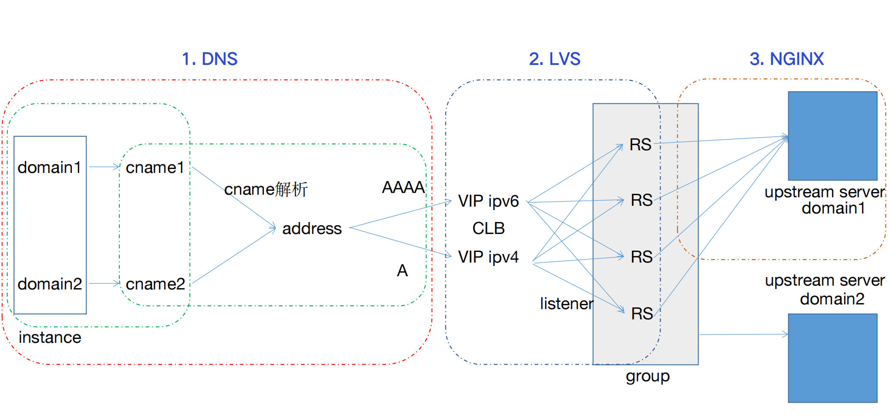
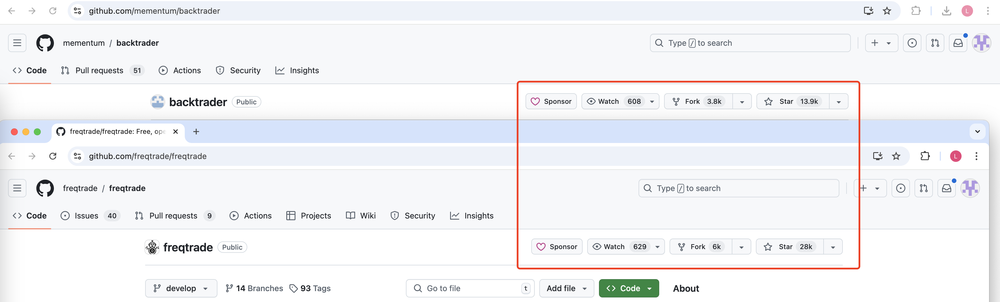
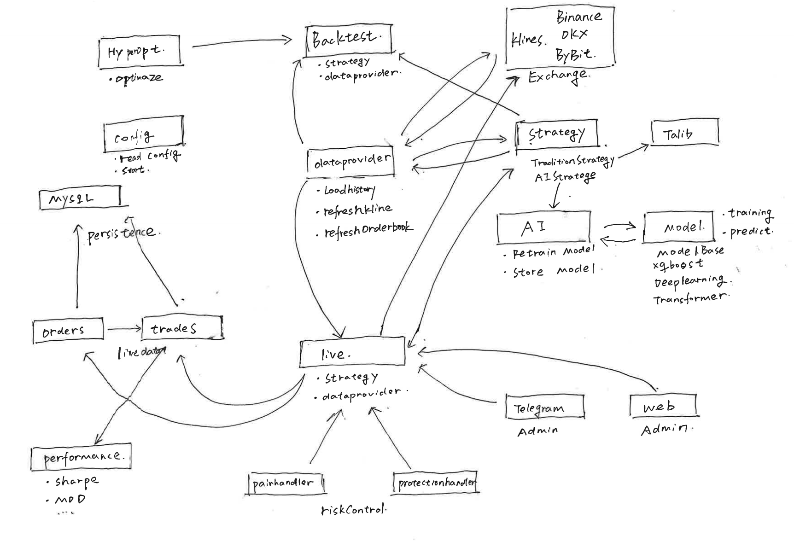

## CVM集群迁移上KBS集群

针对物理服务器集群扩缩容困难的问题，我们基于腾讯云Kubernete、Docker、DNS、LB、NAT、Nginx等产品，从0到1设计和搭建自动资源调度、高可用、高性能、低成本、低延时的云上计算集群。

我作为项目负责人，主要负责:

- 1.K8S计算集群架构设计和搭建。主要从低延时、高可用、高性能方面考量去设计集群架构。
- 2.集群监控和资源调度。一方面是基于HPA在cpu、内存等指标上做自动扩缩容。另一方面是通过flink实时计算业务指标，开发controler做计算资源调度。
- 3.将业务从物理集群迁移到K8S集群。主要涉及平滑迁移、灰度发布工作。其中还涉及一些项目管理、沟通协调的事务。

用到的技术栈有腾讯云、DNS、K8S、Docker、Nginx、负载均衡、Flink、Redis、golang

### 问题背景
在2021年-2022年产品初期，产品年收入4000w，客户主要是中小企业，全地域（广州、北京、上海、成都、香港和国际站）流量加起来约500wQPS。通过人工运维的CVM集群勉强能够应付业务对底层流量承载的需求。

但随着2022年业务快速发展，开始接入了例如央视频、小红书、荣耀等大客户，全地域日常流量突破1000wqps。流量集中在例如上海、北京、广州的大客户集群，此时需要人工运维1000+CVM节点。开始暴露一些问题：

- 1.扩缩容困难问题：背景是业务QPS存在时段性的高峰，例如央视频冬奥会春晚期间、荣耀发布会期间、双十期间，业务需要承载突发流量近2000wqps。然而，CVM节点无法自动扩容，需要人工提前申请并部署机器，这个过程至少1天。面对大突发流量，基本上集群资源会被打崩。影响客户业务。
- 2.节点一致性问题：一个节点上的组件是比较多的，主要有nginx、lua、日志、防护策略同步、转发策略同步等组件，并且大客户还有定制开发组件。人工部署经常出现组件不完整的问题。也会影响到客户业务。
- 3.成本高问题：业务为了应对突发流量，必须一直预留大量的机器，日常资源利用率低。2022年公司开始进行降本增效，该问题必须解决。

针对以上问题，领导决策规划半年集中解决稳定性问题，停止产品功能性迭代。

### 我的任务
2022年3月，成立了一个三人小组负责这个任务，分别是我、一位10级工程师还有产品leader。首先问题本身业内肯定是有成熟解决方案的，就是采用云计算基础实施管理平台去自动扩缩容资源。我们朝着这个方向在公司内部进行了产品调研，主要调研了Openstack和K8S两款产品，Openstack基于虚拟机技术，K8S基于容器化技术。二者都能够为我们提供资源管理的功能。进过多次讨论，最终我们选择了公司内部基于K8S技术的TKEX平台。主要是因为：

- 1.针对扩缩容困难的问题，K8S通过HPA机制解决能够自动扩容，并且Docker可以实现秒级创建，但是虚拟机需要至少分钟级。
- 2.针对节点一致性问题，虚拟机还需要脚本安装组件，docker通过镜像打包保证了一致性。
- 3.考虑经验问题，公司内部应用对K8S的使用程度远高于openstack，TKEX产品文档完善并且对方团队十分愿意配合。

定了大方向之后，我们就开始拉通TKEX平台的同事和一直负责运维CVM节点的同事进行频繁讨论。不断进行方案评审，最终制定了详细的方案，主要分成了三个部分：集群架构设计、集群监控和资源调度、业务迁移方案。

#### 集群架构设计
主要结合业务讨论了Docker镜像怎么制作、集群workload和pod怎么组织、低延时高可用如何保证。

##### 镜像制作

主要讨论点在于选择富容器还是轻量级容器。
富容器把所有组件打包到一个镜像，一个pod部署一个容器。最大程度保证在不对原来业务组件改造。

轻量级容器为每个组件都制作一个镜像，一个pod部署多个容器。实现了业务解耦，比较符合云原生的思想。

最终让我们决定用轻量级容器的是业务发布场景。业务中nginx组件是长期不会变更的，但是lua、日志等组件是会经常变更的。如果用富容器打包，那么即使发布lua也需要整体升级，这会导致nginx流量中断，也会中断长链接的业务，还有可能导致服务负载不均的情况发生。如果用轻量级容器，我们可以仅升级lua组件，然后reload nginx实现优雅热启动。

同个pod多个容器共享网络地址空间，我们还需要解决的是，通过文件挂载的方式实现同个pod中多个容器数据共享、通过推动TKEX支持shareProcessNamespace来保证通过pod中多个容器的进程空间共享。

##### 集群规划

主要讨论点在于选择小集群还是大集群。

小集群的设计思路是每个地域都划分了很多个小集群来做业务的隔离，减少某个集群故障影响范围。问题在于集群容量碎片化严重，单集群应对突发流量的能力差。

大集群的设计思路是每个地域一个集群，与小集群恰恰相反的是，故障影响范围大，但是集群资源集中，应对突发流量能力强。

考虑到成本、运维、应对突发事件来说，我们更倾向于大集群的方式，所以主要是针对集群故障的场景进行分析，并且讨论是否有解决思路：

- 某机房故障，我们可以设计异地多活的集群部署方式，在机房间进行故障转移。
- 集群的计算、网络资源被打满导致不可用，我们通过K8S的HPA机制进行扩容解决。

采用大集群，要求我们在高可用上进行保证。

##### 高可用高性能低延时方案

业务维度：

低水位HPA机制，我们为K8S集群配置了30%cpu内存水位的HPA机制，预留了大量的资源来面对业务突发流量，防止单集群高负载而不可用。

集群维度：

- 跨可用区容灾：单个地域集群内部的计算节点按照跨机房的方式部署，通过K8S service来跨可用区访问节点，并配置熔断策略及时剔除故障节点，来实现跨可用区熔灾。
- 就近访问和异地容灾：我们在广州、上海、北京、重庆等多地部署集群。在多个地域间，通过DNS ECS协议，按照用户DNS代理的地域属性，就近访问集群，一方面起到减少网络时延的作用。另一方面，我们为DNS配置默认路由和IP拨测，来实现地域间集群故障切换。
- 负载均衡：所有的计算节点都通过负载均衡的方式对外提供高性能计算集群服务。

通过上述方案，我们实现了多地域、多中心、低延时、高可用、高性能的集群。

#### 集群调度与监控

通过以上架构设计，我们发现一些问题：

- K8S集群基于HPA机制自动扩容，我们难以控制某一个业务使用资源的上限。
- 某些业务具有会话保持属性，无法做负载均衡，长期造成特定的节点负载高，存在资源倾斜的问题。

因此，我们需要集群监控和资源调度方案：

监控上：

- 首先是考虑把业务数据上传到clickshouse，使用ck进行聚合，但是ck的并发性能比较差、聚合数据的延时大概是有三分钟的，无法接受。
- 然后是搭建流式计算服务实时统计业务指标。技术实现上，我们将nginx access log推送到kafka，通过Flink的kafka connector消费kafka数据，通过keyby形成keyedstream，在滚动窗口内计算业务指标，然后sink到redis中。

调度上：

编写一个controller组件，拉取redis数据，按照调度规则，将任务调度到对应的集群。

规则上，主要是使用任务的QPS作为指标。

调度上，主要是通过修改负载均衡的规则，把任务调度到相应的K8S集群。

#### 制定迁移方案
主要讨论了在K8S集群已经搭建好的情况下，我们如何把业务流量无损平滑的从物理集群迁移到K8S集群。

目前业务的网络架构是客户端通过一级CNAME解析到二级CNAME再最后解析到VIP，由VIP做负载均衡，发送客户端请求到CVM节点，CVM节点对流量进清洗后，通过EIP回源到用户源站。我们主要通过修改一级CNAME到二级CNAME的DNS解析到TKEX集群上。

迁移方案涉及到网络链路变更，属于高风险行为。所以我们和DNS团队进行了协作，通过DNS智能解析，按照移动、联动、电信、BGP进行划分，按照运营商逐步灰度。

但是在推进过程中，还是非常不顺利的。：

- 1.客户端写死了入向IP，修改DNS解析是不生效的，流量迁移不成功。
- 2.源站为出口IP添加了安全组，直接阻断新的出IP，导致业务中断。
- 3.迁移前没有做新集群拨测、迁移中出现问题也没有自动回滚的工具。

针对写死入向IP问题，已经无法通过技术方案解决了。只能协调售前和商务，让他们逐个推动客户切换到CNAME。光是推动售前和商务，在公司内部就拉各方的总监进行了好多次会议。
然后这个过程还是非常不顺利，因为部分客户联系不上、客户不愿意做变更、客户需要申请变更窗口期等，我们成立了专项每周对各种用户情况进行统计，在运维、商务、售前、售后、研发等角色齐心协力下，花了接近2个月的时间才解决大部分客户写死入向IP的问题。剩下的无法联系的客户，只能继续在CVM集群上继续运作。

针对出向IP客户源站添加了安全组问题，我们统计了用户源站，80%都是腾讯云资源。因此我们联系了腾讯云VPC负责人，沟通协作拿到内部SDK，以用户授权的方式我们自动为用户源站放通新IP的安全组。

针对工具缺失的问题，我们搭建了运营平台，为迁移提供一站式的工具。包括拨测工具、自动迁移工具、一键回滚工具等。

在这里面，主要难点在于项目管理和跨团队协作。

#### 开发过程

我负责内容为：

- 编写dockerfile打包镜像
- 编写TKEX接口交互的组件来自动创建Workload和Service
- 编写DNS智能解析和DNS调度工具来进行流量灰度迁移
- 编写和CAM服务交互获取用户授权、和VPC服务交互自动创建安全组代码

开发过程中，主要挑战在于：

- 要深入理解腾讯云DNS、CAM、VPC、TKEX等平台的工作原理和API接口。
- 在和多产品交互的流程中，通过事务机制保证原子性、通过Tracing保证可观测性。
- 跨多个团队协作。不同团队可能有不同的目标和优先级，导致难以协同工作。主要还是通过上层沟通推进下层执行的方式解决。

### 上线后问题
经过近一个月的开发和测试，三个月的流量迁移。K8S集群承载QPS来到了500wqps。已经接近70%的用户在使用新的K8S集群了。
在这个阶段我们又遇到了一些问题。

#### 面对突发流量，触发HPA后，集群仍然雪崩

主要问题是用户压测，触发workload HPA后，开始大量扩容Pod，但是Pod长时间处于Pending状态，无法处理流量。
随着QPS暴增，旧Pod的CPU被打满，也开始进入pending状态。随着越来越多的pod不可用，workload雪崩，也基本进入不可用状态。

我们从多个方面分析复盘了此次事故。

- 扩容的Pod长时间pending问题。
我们分析了pod从新建到就绪过程，发现时延集中在镜像拉取和健康检查阶段。
在镜像拉取阶段我们给镜像替换了更加轻量的基础镜像。镜像从5G减小到2G。
在健康检查阶段，我们放宽了检查条件，只要nginx进程开始监听端口则认为pod就绪。不需要其他组件全部就绪。

- 旧Pod进入pending问题。
旧Pod之所以进入pending状态，是因为CPU满载，无法快速响应健康检查，健康检查机制将pod标记为pending。
我们放宽了健康检查条件，从应用层健康检查修改为TCP层健康检查，避免因为业务响应不及时导致的pending。

- HPA水位优化。
我们优化了HPA水位，从60%cpu内存触发，修改为30%cpu内存触发。为紧急情况，争取了时间。

### 成果

- 1.稳定性提升：全地域稳定承载日常流量1000w+QPS。2023年重大事故数量下降到0起。
- 2.成本优化：计算资源成本从每97.6w下降到35.8w，下降63.3%。带宽成本每下降30w。
- 3.效率提升：发布时间从1-2月缩短到1-2周。自动扩容，减少30%集群运维工作。

## 防护引擎性能优化

针对Nginx串行调用下游防护引擎的时延问题，使用Golang开发路由组件，优化为并行检测，减少时延。并通过I/O优化、GC调优、内存分配优化、编解码优化等方式避免路由组件成为性能瓶颈。

我作为模块负责人，主要负责:

- 1.方案调研，对比原生的nginx并发方案和新写golang程序的并发方案的优劣来做方案选型。以及底层使用golang框架技术选型。
- 2.开发代码，从程序的可观测性、可读性、可扩性出发，编写golang代码。
- 3.性能优化，从cpu利用率、内存分配和回收、I/O效率方面去优化程序，避免程序成为性能瓶颈。

用涉及的知识点有golang协程并发、内存分配和垃圾回收策略、tencetRpc框架、I/O多路复用、pprof工具等

### 问题背景
请求到达nginx后，在access阶段通过lua模块的resty.http串行发起网络调用cc检测、bot检测、规则匹配、ai检测等防护引擎，来防御攻击请求。白流量通过nginx回源，黑流量直接被阻断。

随着检测模块增多，串性网络调用的时延也在不断提高。

然而，对延时敏感的大客户给我们的处理超时时间是60ms。（从客户端请求发送nginx开始，到收到nginx响应的过程）

当前架构下进行wrk压测情况是 4c8g Pod，3000QPS，p99检测延时为178ms，远超60ms。也就是说，业务连99%的可用性都无法保证。

而友商可用性保证承诺99.9%，导致我们产品被客户挑战，也存在客户流失的现象。

为了winback客户，我们成立了防护引擎性能优化项目组，主要优化检测延时，4c8g Pod，3000QPS下 目标p999 60ms以内。

### 我的工作

防护引擎性能优化项目组有我在内的三人进行开发工作。

大家的分工是:

- 两人负责cc和bot检查引擎内部逻辑优化，争取减少引擎内部时延。
- 我负责优化lua调用逻辑，把串性调用改为并发调用，减少IO时延。

在讨论串行改并发调用的方式时，我们主要探讨了了两种方案。

- 1.在lua上通过协程直接开启并发调用检测引擎。
- 2.新增旁路组件，lua仅与旁路通信，由旁路并发调用检测引擎。

#### lua协程并发方案

lua协程和python协程的基本一致，都是用户侧协程。通过事件循环和IO多路复用来实现IO搞并发。

我们快速的实现了该方案的demo，开始进行压测。却发现完全相反的结果：
随着检测引擎数量增加，nginx和lua组件性能急剧下降，CPU负载不断升高，承载的QPS不断下降。检测引擎全开的情况下，4c8g Pod仅能承载不到2000qps，比
未优化时表现还差。

分析原因：

- CPU资源消耗：通过火焰图分析，热点函数在于json序列化和反序列化和内存拷贝。因为lua协程会将请求通过并发的方式扩散出去，http并发至少提高了4-5倍。
cpu大量时间在进行json序列化和反序列化。 内存拷贝是因为当Lua发送HTTP请求并读取响应时，会在lua缓冲区与Nginx缓冲区之间进行大量数据拷贝。

- 网络资源消耗：表现为客户端大量connection refused。通过netstat查看发现nginx connection提高了很多，达到了nginx最大连接数限制。当Lua发送HTTP请求会占用Nginx连接数。Nginx有最大连接数限制，当达到这个限制时，新的连接请求将会被拒绝。

基于lua协程并发方案，会大量扩散请求，对CPU、网络都不友好。非但没有提升性能还导致性能进一步降低。只能转向调研旁路并发方案。

#### 旁路并发方案
该方案新增了旁路路由组件HUB，接受来自lua的检测请求，由旁路并发调用下游多个检测引擎，汇总检测结果后再发送响应给lua。

优势：

- 语言生态好：lua生态系统单薄，新增的旁路路由组件可以基于非lua语言编写，可以找到有大量的开源库和框架可供使用。
- 并发能力强：openresty集群仅和HUB进行通信，由HUB并发调用下游检测服务，不影响openresty集群本来的性能。
- 架构清晰：hub集中进行并发调用，架构清晰。

劣势：

- 网络开销：新增hub节点将增加网络链路长度。
- 成本开销：部署新组件增加计算资源成本。

总结：基于旁路的并发方案，新增路由组件，加长网络链路，增加计算资源成本。但是保证了nginx lua集群的稳定性，同时增加架构的灵活性和清晰度。采用该方案。

### 技术选型
确定了基于旁路的并发方案后，从语言和框架上进行技术选型，实现该方案。

语言选型，
我熟练语言是golang、python。
目标是实现高并发低延时的系统，Go语言在设计时特别考虑了并发性，通过goroutines和channels提供了清晰的CSP并发模型。相比python，golang性能通常更高。此外，Go的生态系统也相对成熟，支持多种应用场景。最终选择Golang作为开发语言。

框架选型，
在公司内部RPC框架中，主要从性能数据、服务治理、可观测性进行了评估。最终选择了Trpc框架，该框架已开源。

- 性能数据: 16c32g 18w+QPS p99 9.50ms p99.9 17ms
- 服务治理: 支持服务发现、负载均衡、路由选择、熔断
- 可观测性: 支持远程日志、分布式链路跟踪、监控上报

### 方案实现

hub逻辑图

设计上，该组件接受上游请求，对请求解析后通过协程并发调用下游检测引擎，最后通过同步机制收集下游结果并封包返回给上游。

开发难点主要在于：

- 深入理解golang并发编程原理、协程调度模式、如何保证同步和互斥合理。
- 要考虑下游服务的状态，例如是否需要hash路由，下游服务不可用时进行服务熔断（健康检查失败不返回IP，上报错误码达到阈值）。
- 要做好程序可观测性，提供远程日志（对接内部平台cls）、全链路跟踪（对接内部平台天机阁，traceid上报）、数据统计能力（对接内部平台北极星）。

### 性能优化
构建完开发版本服务后，压测旁路HUB发现，4c8g仅能压到1wqps且p99时延达到120ms。还是不满足60ms的目标。

#### 针对时延问题

通过pprof工具，我们分析了程序执行过程中的主要耗时函数：

1. json序列化和反序列化。

首先将原生的encode/json替换为fastjson，通过benchmark测试，是存在一定提升的。
其次，由于旁路的请求内容是比较固定的，我们测试了自己编解码json，在fastjson上进一步提升。
最后，经过不断benchmark测试，发现snoicjson性能最优，最终使用了snoicjson作为json解析库。

2. 临界区lock和unlock

通过走读代码，发现存在很多不合理的加锁现象。主要做了以下优化：

- 使用读写锁代替互斥锁
- 使用基于CAS乐观加锁的atmoic代替加锁
- 使用延迟写的sync.map代替并发不安全的map

#### 针对并发问题

我们发现压测客户端存在大量的connection refused的问题。此时服务器上establish连接数较多但是远没达到连接数上限。

通过netstat分析，发现全连接队列溢出的次数一直在增加。客户端connection refused基本是因为全连接队列溢出导致连接丢弃。cpu比较高。

为此我们深入研究了框架在网络层面上的实现，发现其是I/O多路复用+单reactor模式。

如果，每个请求在read和write期间cpu占用时间较高，例如存在大量序列化、内存拷贝等，则很有可能事件循环来不及accept新链接，导致全链接队列溢出。

为此，我们一方面联系框架开发团队寻求帮助，替换底层网络库，从单reactor模式切换到多reactor模式。另一方面我们调整了内核somaxconn，从默认128提升到600.

优化完以上两个点之后，4c8g压测数据从1wqps、p99 120ms优化到2wqps p99 40ms。基本满足了要求。

### 线上问题

#### p9999延时要求
荣耀在使用产品时，按照p9999标准进行压力测试，发现业务没达到承诺的60ms延时，导致检测成功率不符合要求。

我们自己进行了压测复现，发现虽然p99满足了60ms的要求，但是p9999长尾延时来到了258ms。确实存在问题。

长尾延时很有可能是gc导致的问题，因为golang gc是会stw的。我们统计了gc次数，3分钟内gc次数1122，频率太高了。

为此我们深入研究了golang的内存分配和内存回收原理，主要从减少堆内存分配和减少gc触发两个方面进行了优化：

#### 减少内存分配

- 逃逸分析：通过golang逃逸分析，分析栈上变量逃逸到堆的情况。最终优化编码方式，减少函数返回，通过参数引用修改变量。
- 池化：通过sync.pool，对常用对象进行了复用，减少内存分配。

#### 优化gc触发策略

- 通过压舱石提前占用大量内存，增加下一次gc触发的内存增长阈值。
- gcpercent调整，调整gcpercent为200%，内存增长200%才开启gc。

优化完gc之后，p9999整体时延258ms优化到68ms.

#### 流量高峰连接数打满，没有新流量进来。

客户端表现为建立连接失败，大量的请求重试和等待响应。
旁路组件表现为为连接数非常高，但是cpu利用率和内存利用率非常低。

通过pprof分析发现框架底层并发调用互斥锁存在lockslow问题，从而导致协程无法快速处理业务逻辑后返回。
表现为请求hub后没有得到响应，连接一直没有释放，新请求会不断新建连接，最终达到连接池上线。

最根本问题还是协程返回不及时，因此在新建协程时制定了超时时间，达到超时时间后强制协程返回，及时是返回超时错误。

## 小程序安全加速

与微信合作，打造小程序安全加速产品。依托微信生态创造腾讯云WAF差异化竞争能力。

我主要扮演方案设计、项目管理、技术支持的角色。

主要需要解决 一是技术上如何将我们的产品透明接入到微信链路。

二是如何能顺利推进这个项目。因为我方极其重视该项目，但是微信并不重视，导致功能设计、开发、联调过程效率低下的问题。

手段主要是 及时与上级沟通项目进展和卡点，推动上级和微信上级沟通。

在技术方面说服微信和我们一起合作能够产生什么样的收益，拉近和微信项目方的关系，推动功能开发。

### 背景

内忧外患下，我们迫切寻找新的业务突破点。

- 内部赛马： EdgeOne网关整合cdn、waf、ddos统一售卖，减少购买和运维成本，导致部分waf客户迁移到edgeone。
- 外部压力： 阿里waf的产品较高，在价格、时延、检测能力上都存在优势。导致一些头部客户迁移到阿里。

产品营收增长乏力，客户留存率下降、获取新客困难。我们迫切寻找新的业务突破点。

客户需求帮助我们找到新的发力点 --- 茶百道上市连续优惠活动，迫切寻找小程序防Bot解决方案。

我们提出了小程序安全的产品形态，依靠腾讯生态，打造差异化竞争点，助力winback。

### 我的任务

### 寻求小程序业务合作

了解到小程度生态的donut网关是具备简单的安全防护能力。

思考能否和donut网关合作？达到1+1大于2的效果。

Donut安全网关虽然能够提供基本的安全防护，但是WAF能够提供更加深刻的安全防护能力。 比如在抗CC攻击的时候，公有云WAF具有更多的集群容量，可以抵抗更好峰值的CC攻击。 又比如WAF基于20年沉淀的防护规则，能够提供更加全面的防护范围。 最重要的是Donut不支持用户根据业务自定义防护规则，而WAF支持细粒度的自定义防护规则。 总的来说，基于专业的WAF进行攻击防护是更好的选择。 因此，WAF积极与Donut网关进行合作。 一方面，WAF将获取到微信小程序客户资源。另一方面，Donut网关对外提供更加全面的安全能力。为用户完整的提供私有链路、网络加速、防Bot、安全检测能力。

通过和donut协商，达成合作关系。开始套路架构实现。

### 确定架构

要求之一：透明接入。Donut网关希望waf可以做到透明接入。但是反向代理waf是无法做到这一点的。

提出了新的waf接入架构，旁挂式透明接入。Donut通过subrequest请求waf，waf仅提供防护能力，将检测结果返回给Donut，由Donut决定是否阻断请求。

网络架构：
 
补充小程序的clb架构

控制面架构：

waf作为第三方平台，用户小程序授权waf，将用户小程序一键接入到waf独享的donut网关。

### 开发挑战
本项目的挑战点并不在技术层面，因为在技术上，我们主要的工作的是构建API，调用微信小程序、Donut网关的接口和用mysql维护用户操作数据。 本项目的挑战点在于如何紧急，设计、开发、联调、上线、运营一个不被合作方重视的新功能。

问题1： 虽然我方极其重视该项目，但是微信方一开始并不重视，导致功能设计、开发、联调过程效率低下。
及时与上级沟通项目进展和卡点，推动上级和微信方上级沟通，阐明项目对WAF的重要程度，以及一起合作能够产生什么样的收益，拉近和微信项目方的关系，推动功能开发工程。

问题2:作为项目负责人，在本次项目中，再次认识到了团队协作的重要性，尤其是在节奏快，时间紧的开发任务中，大家充分沟通和协作才能够及时完成任务。

### 上线

#### 初步上线

因为不熟悉微信方内部实现的逻辑，测试不充分，导致客户接入踩坑。 例如, 茶百道接入实战记录 四川蜀道云茶科技有限公司（茶百道） https://docs.qq.com/doc/DWUNrYnlDSGpNQ3hW?u=4301e595957e4f30b3fa82153570ec19
及时安抚客情，及时和微信沟通实现细节然后向客户阐明原因，争取下次灰度发布机会。突出项目运营能力。

#### 逐步完善

充当前场的角色，帮助客户接入，随时上会帮助用户解决问题。

在不断收集客户问题和反馈下，小程序安全加速又经历了三次迭代开发。提供更加完整的接入能力。

### 项目成果
在营收方面，从有小程序WAF的想法到落地并开始客户试用和付费使用，我们花了一个季度的时间。 

制定了标准付费方案。
达成了：接入客户数12个。
增加营收500w。

### 改进和学习
在茶百道时间中，我们反思了问题的原因。认为新功能踩坑是一个必然并且良性的行为，但是不应该让大客户来踩坑，所以即使在紧迫的情况下，我们也应该首先推小客户试用。以及大客户重点保障的流程。

## 量化开发(个人)
基于算法和数据建模，使用Python构建量化交易系统，包括量化框架开发、策略开发。

框架开发上，主要是对框架进行二次开发，以支持逻辑因子和机器学习因子的挖掘。以及针对单点性能问题，设计分布式量化框架，减少计算时延。

策略开发上，主要通过贝叶斯优化挖掘逻辑因子，XGBoost挖掘机器学习因子。通过多因子组合进行策略决断。

用到的技术栈有python、机器学习库、mysql、freqtrade量化框架。

### 策略开发足迹

#### 202306-202307 框架自研 

确定要做量化之后，选择了python作为开发语言。因为python在数据分析上具有很多优势。
首先，我是花了两周的时间自己实现了一套量化框架。包含：

- 数据中心（使用python协程异步获取OHLCV数据并进行存储）
- 回测系统（按照时序推演交易、根据交易计算盈利夏普等指标）
- 策略模块（使用pandas、talib等python库构建指标）
- 交易模块（对接了okx的订单系统API、存储交易到SQL数据库、推送消息到叮叮Bot、telegram）

https://github.com/mashiroissocute/J.P.Lucas/tree/master

经过了一段时间的使用，发现自研框架很多的不足。例如

- 回测系统没有支持按照止盈止损
- 很难支持开发机器学习策略
- 交易过程存在不一致性，交易所订单状态和本地订单状态不一致

自研框架需要从0开始造轮子，无法把时间集中在策略开发中。最终，还是决定去学习开源的量化框架。

#### 202307-202309 fretrqde

对比了一些开源量化框架freqtrade、backtrader、CryptoQuant。
发现freqtrade是比较符合我的要求的，而且文档比较丰富。

在开始之前，我对freqtrade的源码进行了阅读，将其分为以下模块：

- 数据中心(存储历史数据、历史交易、历史订单)
- 交易模块(对接交易所API，提供下单、撤单能力)
- 策略模块(定义了数据流程，从OCHLV数据到自定义指标，按照自定义规则计算买卖信号)
- 回测模块(时序回测引擎)
- 风控模块(自定义风控触发条件和风控行为)
- 超参数优化模块(贝叶斯优化理论+回测提供参数优化)
- AI模型(提供特征扩展能力，数据清洗能力、数据自动标注能力、模型定时训练更新能力)

目前对量化框架底层的开发是比较熟悉的，可以做到手写一套支持AI模型、支持超参数优化的量化框架的。

除此之外，我还针对框架的性能和高可用进行了优化。

##### 高可用保证

针对交易所延时问题:

- 采用把服务器和交易所同地域部署减少时延
- 提交限价买卖单的方式防止价格滑点

针对量化程序崩溃问题：

- 快速发现问题：心跳日志上报到admin
- 快速修复问题：后台脚步定时检查进程，进程消失后重新拉起
- 拉起后一致性问题：把所有的交易数据都存到mysql，防止数据丢失，程序重启后保证数据一致性

针对cpu密集性计算：

例如在用多因子机器学习模型的时候，需要大量的计算推理，算子串性计算过程延时较长的问题。

通过构建算子的执行依赖有向无环图，按照层序的方式，做多节点并行计算。所有节点通过ws通信。

利用dataframe作为数据流的载体，通过datetime进行dataframe数据对齐。

在最长路径的最后一个节点获取到完整的dataframe，最终执行交易动作。

#### 开发策略

##### 202310-202401 技术指标因子

- 趋势跟踪策略
基于MACD和DMI形成趋势判断指标。跟踪全市场200+币种，当币种趋势指标形成后直接买入。相反指标后退出。

- 动量反转策略
基于Wavetrade和RSI形成超买超卖指标。跟踪全市场200+币种，当币种超买时做多，超卖时做空。达到盈利线或亏损线后卖出。

- 突破回踩策略
基于MACD和DMI形成趋势判断指标。
基于Wavetrade和RSI形成回调指标。
跟踪全市场200+币种，当币种趋势指标形成后观望，当回调时进场买入。达到盈利线或亏损线后卖出。

经过了接近3个月纯技术面择时策略的开发、回测、实盘。

认为技术面指标比较依赖对市场的熟悉程度和交易经验，很难从历史数据中自动挖掘信息形成新的交易思路。

##### 202402-202403 逻辑因子：贝叶斯优化因子

在机器学习中，往往存在很多的超参数设置，例如学习率、步长等，不同的参数，对模型结果都会有影响。
在AutoML领域中，提出了可以通过贝叶斯优化来寻找最有的超参数。

贝叶斯优化思想假设所有参数变量是对目标函数的联合高斯分布，通过采集函数（方差和均值的函数）选择参数优化方向，使用过程中最优解作为最终解。

我在交易过程中往往会对一些超参数设置感到困惑，例如我是否应该用这个指标、我应该多少点止损止盈，我应该用多少天的数据计算指标，。
以上所有的选择都可以看作超参数，为这些参数定义参数空间，联合起来做贝叶斯优化，目标函数可以选择夏普率、收益率、最大回撤等。通过优化后获得比较理想的参数设置。

我为常见的技术指标都加上bool超参数来决定是否使用他们，目标函数使用收益率，最终获得了一个基于贝叶斯优化的交易模型。

经过了接近1个月实盘，认为贝叶斯优化模型，对历史数据过拟合，回测数据非常优秀，实盘数据差强人意。

##### 202404-202405 机器学习因子：集成树因子

集成树通过结合多个弱学习器（通常是决策树）来构建一个强大的集成模型，主要用于分类和回归问题。

我从tradingview上找了不同种类的指标（突破、反转、通道），扩展到15m 1h 4h 1d 上，并结合BTC ETH特征。

进行特征工程（处理缺失值、异常值， 归一化处理），最后构造了1000+纬度特征向量。采用后一天的涨跌作为当前lable。
训练了catboost、xgboost等模型。在测试集合上的表现，最优分类准确率胜率55%。

经过了半个月实盘，认为机器学习模型比较黑盒，实盘分类准确率只有52%，几乎接近随机事件。

##### 202405-202406 多因子组合策略

在因子挖掘上，我尝试了常见的基本面因子和技术面因子、贝叶斯优化挖到的逻辑因子和集成树模型挖到的机器学习因子。

但是单个因子都不足以让模型做出比较全面的决策。所以开始思考能不能组合逻辑因子和机器学习因子

组合方式是对所有的逻辑因子和机器学习因子做与操作，或者通过因子回测打分的方式赋予权重。形成最终的决策。

针对cpu密集性计算：

例如在用多因子机器学习模型的时候，需要大量的计算推理，算子串性计算过程延时较长的问题。

通过构建算子的执行依赖有向无环图，按照拓扑排序的方式，做多节点并行计算。所有节点通过ws通信。

利用dataframe作为数据流的载体，通过datetime进行dataframe数据对齐。

在最长路径的最后一个节点获取到完整的dataframe，最终组合因子，执行交易动作。

###### 202407-202407 板块轮动选股策略
`经济模型`
在一个完整的经济周期中，有些是先行板块，有些是跟随板块。

板块轮动思想指导我们在板块轮动前开始进行配置，在板块结束后进行调整。
具体来说是板块上涨时获利了结，继续配置还未上涨的板块，如此循环，从而获取超额收益。

`选取板块`
从以下两个方面选取候选板块：

- 市场情绪： 选取热门板块(体现在成交量，广场讨论程度)
- 强势程度： 选取强势板块(体现在反弹程度、拒绝下跌程度)

`选取币种`
选取每个候选板块中，选取市值最大的两个币种作为候选币种。

`持仓策略`
等比例买入所有候选板块的所有候选币种。
24小时调仓，保证所有币种的比例相等。

##### 202407-202407 仿盘交易

项目地址：https://github.com/mashiroissocute/magic_copytrading

顶级交易员的回撤和收益都是自己的量化模型难以望其项背的。
萌生了学习他们交易思路的想法。

通过网页爬虫，伪造请求，获取到交易员的订单流。

入场订单根据保证金设置比例，出场订单需要根据持仓量比例买出。因此需要准确计算交易员持仓量和程序持仓量。并且需要数据落盘，保证程序崩溃后，状态还能保持一致。

服务器就近部署

##### 202408-202409算法交易

- DCA交易策略

- 网格交易策略

#### 经验总结

##### 未来函数问题

`移动止损止盈回测陷阱`

当回测时间框架处于比较长周期时，使用trailing stop loss极易出现使用未来函数的情况。
因为没有bar内部的行情，所以在计算移动止损止盈的时候，会根据bar的最高价和最低价计算，并且先计算了止盈再计算止损。导致回测收益非常道。
但是有可能会先到达止损，或者在bar中途就止盈掉。

##### 构建模拟盘

回测数据较好，并且不存在未来函数的情况下。会通过提交虚拟订单的方式，跑模拟盘。

- 主要观察程序执行情况是否符合预期。
- 通过一段时间的模拟盘和这段时间的回测结果，观察回测数据是否真实。

