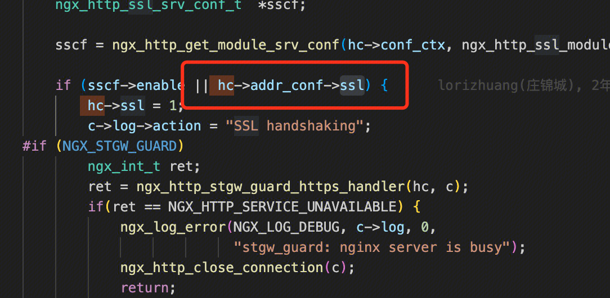
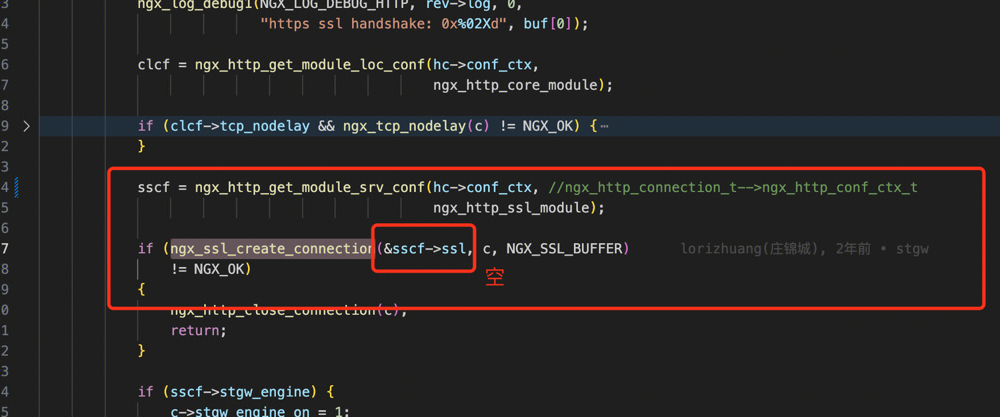
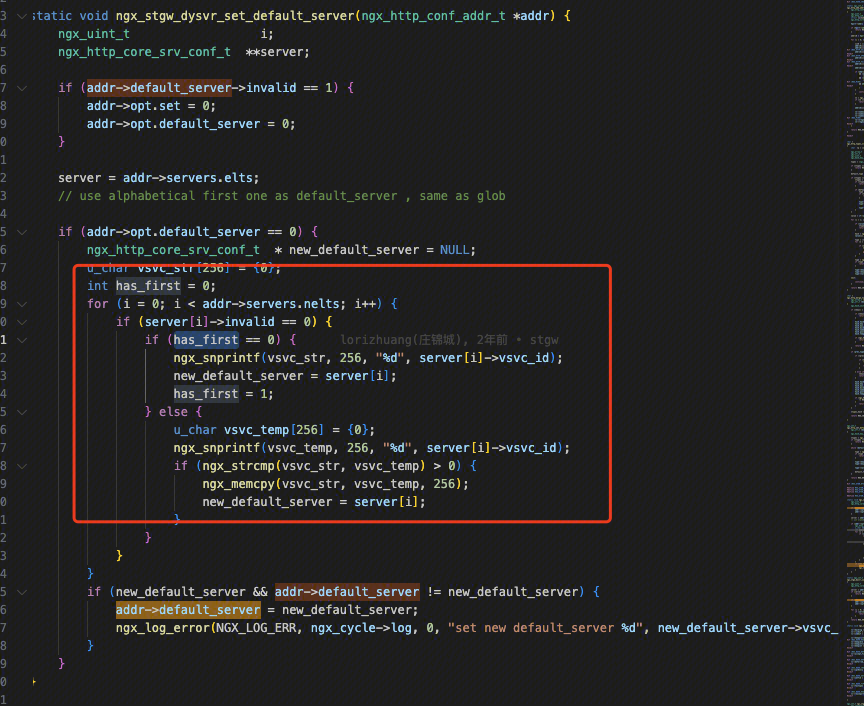

## 故障说明
上海双栈集群nginx异常触发大量coredump，导致部分客户流量抖动，部分请求会出现超时。
## 故障处置过程
【单Pod磁盘使用率告警，系系统产生大量core文件导致】
2023/8/2 18:04 上海双栈集群首次出现磁盘使用率>90%告警
2023/8/2 18:09 SRE初步定位是nginx打core文件导致磁盘打满
【定位到core文件由Nginx Worker进程产生】
2023/8/2 18:53 定位到Nginx 的工作进程在执行过程中发生了段错误
【集群大量pod出现nginx worker段错误退出问题】
2023/8/2 19:02 同一集群再次出现大批磁盘使用率>90%告警

【手动重建集群异常pod处理】
2023/8/2 19:03 重建POD处理
【客户保障事件发生】
2023/8/2 19:47 客户群内反馈域名api.yonghuivip.com，activity.yonghuivip.com流量下降，影响客户c端业务，出现访问超时，影响业务；
【重建pod已经跟不上pod异常的速度，集群可用pod数量持续下降】
2023/8/2 19:54 集群整体流量抖动，影响客户
【扩容集群】
2023/8/2 19:59 扩容集群到100个pod
【治标不治本，集群内部pod仍然大量coredump，客情升级】
2023/8/2 20:00 同一集群再次出现大批磁盘使用率>90%告警
2023/8/2 20:05 客户反馈现网业务受影响较大，升级非常紧急问题L3
【继续扩容集群】
2023/8/2 20:10 扩容集群到200个pod
【兵分四路：1 . 研发进行coredump分析；2.研发sre回顾集群变更事件；3. sre梳理用户列表；3.客户经理报备前场、商务、领导】
2023/8/2 20:11 梳理出集群内可能受影响客户信息
2023/8/2 20:13 安全产品故障周知群同步受影响客户列表
2023/8/2 20:20 梳理出集群无组件变更升级操作，仅下午存在用户变更nginx配置操作。大家一致认为，core为异常流量导致。
2023/8/2 20:30 研发定位coredump无果，集群持续coredump。 
【制定应对方案】
2023/8/2 20:35 临时计划：紧急迁移集群内部分流量。将下午存在配置变更的域名流量，迁移到隔离集群。
【临时方案无效】
2023/8/2 20:40 core事件继续发生。
2023/8/2 20:45 分析隔离集群的客户的业务特点，暂无明确结论。
【coredump分析】
2023/8/2 21:47 分析core文件，发现导致异常的请求客户端地址均为2402:4e00:1830:180a:0:9933:ed15:c9a（nginx对端IP），经过确认为安平扫描平台地址。
2023/8/2 22:27 通知安平关闭扫，此时不再有新的core文件产生。

【尝试复现未果】
2023/8/3 09:56 waf搭建测试环境给安平进行扫描。
2023/8/3 11:50 测试环境搭建完成，安平开始循环扫描，未发现异常。

【线上问题再次出现】
2023/8/3 17:30 出现新的节点coredump现象，发现导致异常的请求客户端地址均为安平扫描平台的ipv4地址和部分未知地址。
2023/8/3 17:56 安平加白waf节点IP，不再扫描ipv4地址，现象缓解。

【狠下心来定位core】
2023/8/3 17:56 分析core的堆栈信息，**发现core的原因为ssl->ctx空指针导致**。
2023/8/3 20:10 持续分析core的堆栈信息，发现导致异常请求的ssl上下文确实为空。且异常请求使用了默认的加密套件配置，而所有waf的域名配置了waf的加密套件，没有使用默认加密套件配置。**推测请求不带Host**。
2023/8/3 20:40 继续分析core的堆栈信息，发现导致异常的请求处理使用的host为work.yintongcard.com_8001.conf。**确认了异常端口**
2023/8/3 20:43 **对8001端口发起不带Host的https请求，稳定复现coredump**。

【分析】
2023/8/3 20:50 经过分析，得出最终原因如下：
（1）2020年4月10日给汉庭科技（苏州）有限公司开通了非标白名单，将原本作为标准http接入的端口8001给该用户的	metisapp.huazhu.com域名作为https协议端口进行了接入；
（2）2023年8月2日17:50 中银通支付商务有限公司接入域名work.yintongcard.com到waf，并和metisapp.huazhu.com接入在同一集群，同时开启了8001端口接入http协议；
（3）接入后集群nginx同时监听了8001作为处理work.yintongcard.com的http流量和metisapp.huazhu.com的https流量；
（4）客户正常访问携带了host不会有问题，waf的nginx均能正常处理；
（5）安平的扫描针对VIP和端口，以及其他客户的一些异常请求访问的时候不带host，只访问VIP和端口，比如发起如https://vip:8001这样的请求会导致nginx coredump；
（6）waf在当前配置下处理https://vip:8001请求时，由于8001端口没有default_server，当前nginx使用了work.yintongcard.com的配置处理这个请求，但是这个域名配置为http协议，server配置中没有任何ssl的相关配置。在进行ssl握手初始化时，nginx读取work.yintongcard.com的ssl配置（由于是http协议的server，没有任何ssl配置，因此实际是空指针）赋值给ssl处理回调函数，导致回调函数空指针处理异常，nginx产生coredump。
（7）waf只对80，443，8080，8443端口配置了default server，出现上述情况均会走到default server处理并返回400，不会出现上述异常，上述异常只会出现在非80，443，8080，8443端口，然后同时监听了http和https协议的情况。
【疑惑】
对nginx选择default_server的逻辑产生的怀疑。按照正常逻辑，应该选择第一个server作为default_server。咱们配置中，第一个server为https协议server。但是实际上却选择了第二个server，即http协议server为default_server。
【实验】
交换了http和https的server include顺序：
- https在前，可以通过配置检查，但是选择的default server为http。端口运行的协议实测为https。
- http在前，无法通过配置检查。报错，ssl certificate为定义。

原生nginx：
- https在前，可以通过配置检查，选择的default server为https。端口运行的协议实测为https。
- http在前，无法通过配置检查。报错，ssl certificate为定义。

【实验分析】
stgwnginx和原生nginx的差异点，在于defaultserver的选择。

【阅读源码】
通过阅读源码发现：STGW在选择default_server的时候，针对热加载功能，做了改变。导致这种情况下，选择了错误的default_server。

- 为什么选择的配置是http配置，还走了ssl握手：
是否进入ssl握手，取决于sscf-enable（defaultserver配置里面的ssl, hc->conf_ctx = hc->addr_conf->default_server->ctx;）或hc->addr_conf->ssl（端口上面运行的ssl协议）

- 为什么core了？
进入了ssl握手逻辑，但是没有ssl配置，所以sscf->ssl为空。ngx_ssl_create_connection里面任何操作该对象的逻辑，都会触发踩空。

- STGW是如何影响选择default_server的？
原生NGINX在从core_listen 到 add_address系列函数，已经构造每个ip:port的defaultserver为第一个server即https。 在后面的server_names函数中，调用了ngx_stgw_dysvr_set_default_server。该函数如下：

在热加载功能中，stgw会为每个server设置一个vsvcid，然后根据这个vsvcid来做热加载的server唯一id。此函数，在同一个ip:port的所有有效的server中选取一个vsvcid最小的server来作为default server。http的vsvcid小于https的vsvcid。

