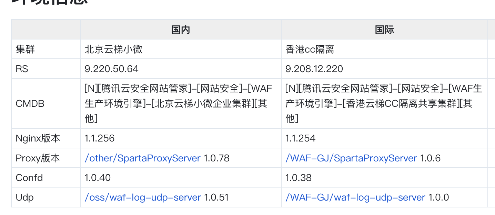
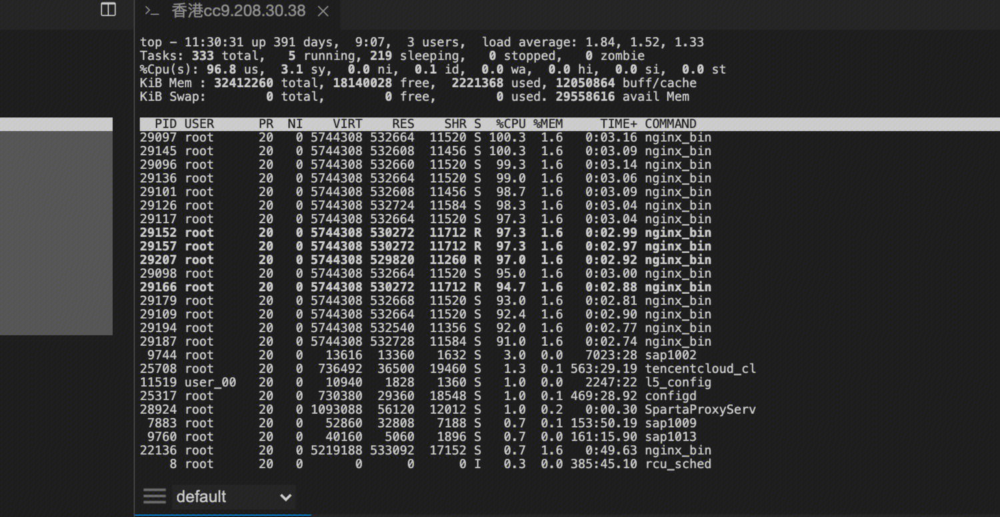
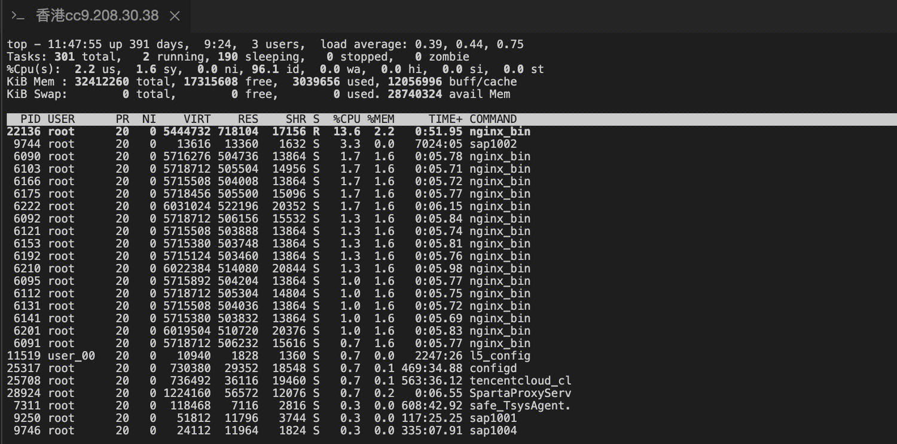
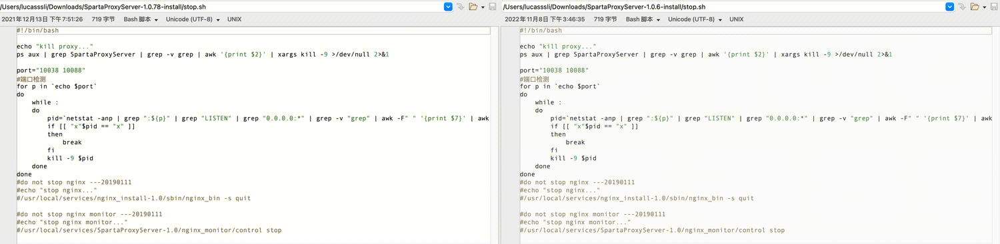
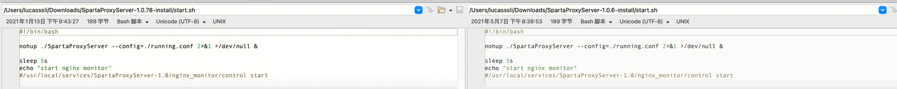
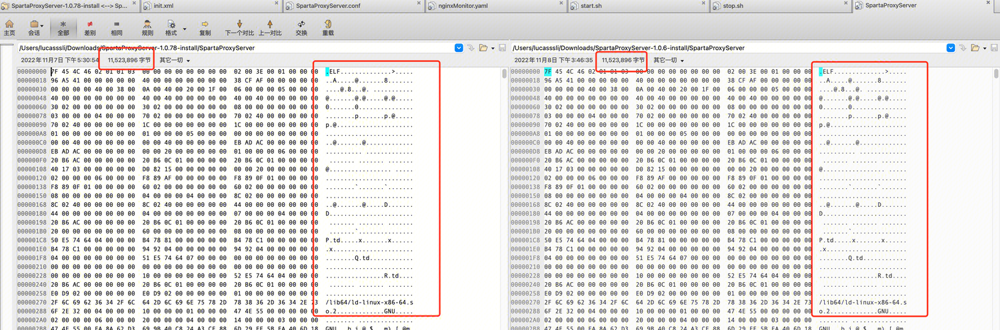
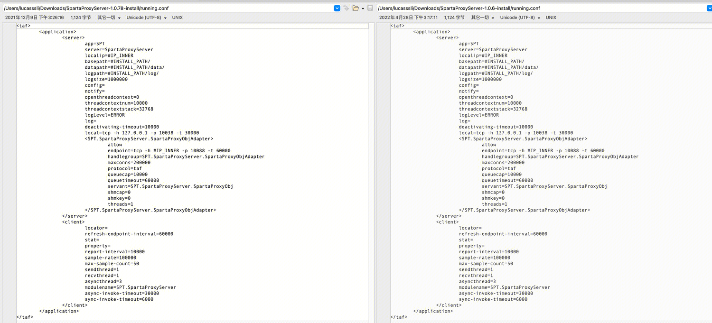
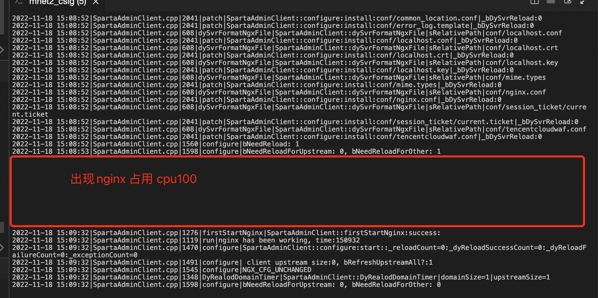
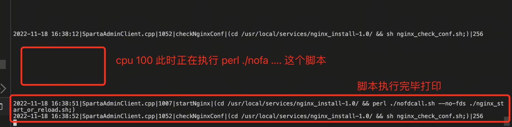
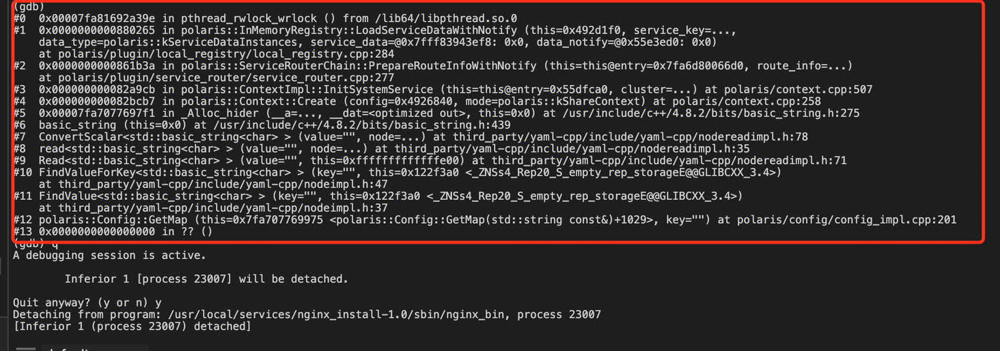

## 环境信息


## 问题
香港cc隔离 重启SpartaProxy时，nginx占用cpu100%。
北京云梯小微 重启则不会。

## 问题复现
`重启proxy`
``` 
ssh 9.208.12.220
sudo su
cd /usr/local/services/SpartaProxyServer-1.0
./stop.sh
./start.sh
```
新worker 占用cpu 100%


`reload CPU使用正常`


`现象` ：CPU使用情况 reload 和 重启proxy 情况差异明显。 重启proxy会导致新worker cpu占用100

## 问题分析
国际站机器重启proxy会复现问题。因此分析proxy重启过程。
### 文件内容分析
1.对比国内外stop start proxy脚本内容：`完全一致，就是暂停和启动SpartaProxyServer`
stop.sh


start.sh


2.对比国内外proxy二进制：`根据字节数判断完全一致`


3.对比启动proxy的配置文件：`完全一致`


4.由于上面的对比都是一致的，因此可以排除是配置文件或者脚本的差异。所以排查对象转为proxy的程序内容。


### 程序分析
#### Proxy 分析
``` 
if(configure(bNeedReload) && startNginx()) //configure返回1 bNeedReload = 1， 继续执行startNginx，这期间cpu100
    {
        saveMd5();
        FDLOG("configure")  << FILE_FUN << "SpartaAdminClient::firstStartNginx:success:" << endl;
    }
```



configure(bNeedReload) 函数执行完，打印bNeedReloadForOther1 这句日志。
开始执行startNginx。
startNginx执行完，打印success这句日志。
分析cpu使用情况得出，是执行startNginx期间，CPU100。

``` 
bool SpartaAdminClient::startNginx()
{
    // 执行这个脚本期间cpu100
    string cmd = "(cd " + _nginxFullPath + " &amp;&amp; perl ./nofdcall.sh --no-fds ./nginx_start_or_reload.sh;)";
    system(cmd.c_str());


    FDLOG("nginx_cmd") << FILE_FUN << cmd << endl; //打印的时候cpu已经下降了
    return true;
}
```
startNginx这个函数通过系统调用system()执行了nginx_start_or_reload.sh脚本。
nginx_start_or_reload.sh脚本的内容为：nginx master存在则reload。
所以最终是执行的nginx_reload.sh。
执行nginx_start_or_reload.sh脚本时打印的日志：


#### Nginx 分析
Nginx占用cpu 100%时的堆栈情况如下：

`看起来是因为lua通过ffi调用北极星的代码导致的死锁`。因此分析调用北极星的地方。

#### Engine分析
在Engine的配置文件中，tiga-mode控制了北极星的引用
``` 
local tiga_mode = waf.config.tiga_mode or 0
    if tiga_mode == 1 then
        polaris.init_polaris("/usr/local/services/nginx_install-1.0/TencentCloudWAF_Engine/conf/polaris.yaml")
    end
```
`将tige-mode从1 改为 0。再次重启proxy，发现问题消失了，cpu使用正常。`

## 原因分析
`原因推测`
proxy静态编译了北极星代码，并在启动的时候，初始化了北极星。 而后通过reload脚本，reload nginx。在init_worker的时候也初始化了北极星，引起了北极星冲突，导致死锁。

`验证分析`
因为nginx和proxy间是进程隔离的，因此比较容易怀疑到产生竞争的可能是文件。
排查到nginx中，初始化北极星依赖polars.yaml配置文件。
该文件中有一个persist项指定了一个文件路径。试了一下，修改该文件路径，再重启proxy发现问题消失了。

`结论与解答`
咨询北极星的同学，发现北极星有一个默认的路径作为缓存。proxy没有指定缓存路径，因此使用了默认路径。nginx虽然在persist项中指定了路径，但是该路径和默认路径一致。

- **为什么一样的配置文件国内没问题，国外有问题呢**？
因为，如果两个北极星的接入节点是一样的，其实也不会因为目录相同，存在文件并发问题。但是如果两个北极星的接入节点是不一致的，那么就存在文件并发问题。恰巧国际站中，proxy是国内的接入节点，Nginx是新加坡的接入节点。所以国际站存在该问题。但是国内站没有这个问题。
- **为什么nginx reload不会有问题呢**？
因为单单执行nginx reload，不会让proxy重新初始化北极星。不存在并发问题。