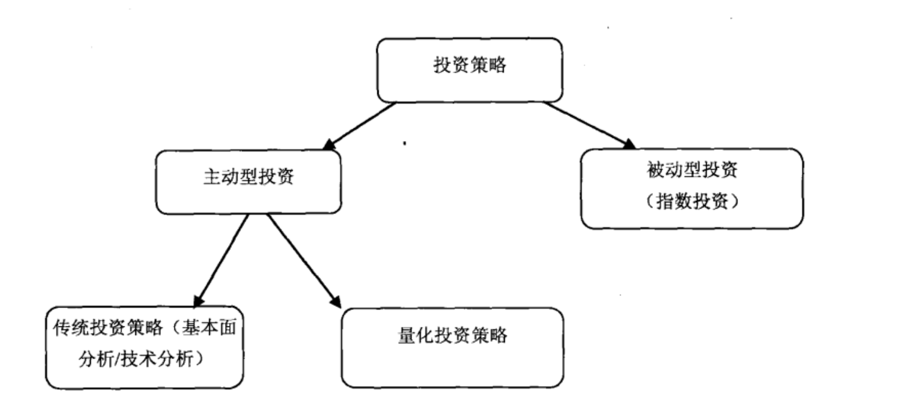

## 定义

投资策略定位：

量化投资  = 通过(计算机技术+数学模型)实现投资的目的。

相比传统投资策略，量化投资，优势在于: 

- 可回测：基于回测数据评估策略优劣
- 纪律性：计算机交易避免主观情绪
- 分散投资：相比人力，计算机可以同时交易更多的交易标的

相比量化投资，传统投资策略，劣势在于:

- 基金经理处理信息量的限制，例如处理股票数量的限制
- 认知偏差或者主观情绪作祟，难以按照计划做出决策
