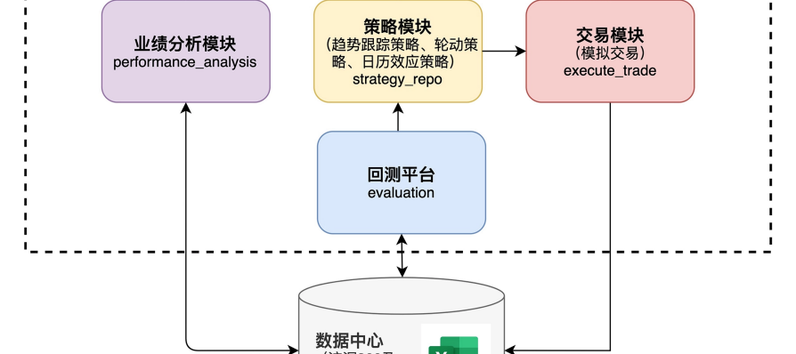

## 量化开发(个人)

### 背景

量化是未来主流的投资手段。利用技术优势进行回测和投资。

投资前做到 回测，心中有底

投资中做到 不人为干预，严格纪律

### 基于理论自己设计投资框架

https://github.com/mashiroissocute/J.P.Lucas/tree/master

- 回测模块
- 数据模块
- 交易模块
- 策略模块

### 发现了更好的投资框架

fretrqde

- 通过ccxt对接交易所，获取行情数据，提交订单。
- 自带回测框架。

让使用者专注开发量化策略。

#### 开发策略

##### 选股策略

###### 多因子选股策略

`经济模型`
市场上的投资者，不管是价值投资还是投机，都会根据某些因子来判断涨跌。当有一群交易者同时采用某个因子的时候，就会造成该因子有效。

`选取因子`
回测因子单调性表现，选取头部做多，尾部做空。

- 基本面因子：市值因子 
- 技术面因子：成交量因子，波动率因子，动量因子

`候选池构建`
通过因子层层过滤构建候选池：

- 做多候选池：选取市值大前50币种，其中选取成交量大前20币种，其中选取波动小前10币种，其中选取动量小前5币种，形成最终的候选池。 

- 做空候选池：选取市值小前50币种，其中选取成交量小前20币种，其中选取波动大前10币种，其中选取动量大前5币种，形成最终的候选池。 

`持仓策略`
从做多候选池中打乱顺序选择1个币种开仓做多。
从做空候选池中打乱顺序选择1个币种开仓做空。
24小时调仓。当币种不在候选池的时候平仓，重新选择一个币种开仓。

###### 板块轮动选股策略
`经济模型`
在一个完整的经济周期中，有些是先行板块，有些是跟随板块。

板块轮动思想指导我们在板块轮动前开始进行配置，在板块结束后进行调整。
具体来说是板块上涨时获利了结，继续配置还未上涨的板块，如此循环，从而获取超额收益。

`选取板块`
从以下两个方面选取候选板块：

- 市场情绪： 选取热门板块(体现在成交量，广场讨论程度)
- 强势程度： 选取强势板块(体现在反弹程度、拒绝下跌程度)

`选取币种`
选取每个候选板块中，选取市值最大的两个币种作为候选币种。

`持仓策略`
等比例买入所有候选板块的所有候选币种。
24小时调仓，保证所有币种的比例相等。

##### 择时策略

###### 趋势跟踪策略
基于MACD和DMI形成趋势判断指标。跟踪全市场200+币种，当币种趋势指标形成后直接买入。达到盈利线或亏损线后卖出。

###### 动量反转策略
基于Wavetrade和RSI形成超买超卖指标。跟踪全市场200+币种，当币种超买时做多，超卖时做空。达到盈利线或亏损线后卖出。

###### 突破回踩策略
基于MACD和DMI形成趋势判断指标。
基于Wavetrade和RSI形成回调指标。
跟踪全市场200+币种，当币种趋势指标形成后观望，当回调时进场买入。达到盈利线或亏损线后卖出。

###### 算法交易

- DCA交易策略

- 网格交易策略

###### 超参数优化策略

`超参数优化 挖掘因子`

实现了常见的技术指标因子，并且为每个指标配置开关超参数。

通过超参数优化，寻找最大夏普率参数。

积累夏普率最大的技术指标组合为选股或者择时因子。

`超参数优化 寻找最优参数`

在策略开发过程中，难免会遇到很多超参数，例如最大仓位数量、计算指标所用的时间长度、止盈止损百分比。

通过超参数优化，寻找最大夏普率参数。

帮助设置最优超参数。

#### 回测

##### 评价指标如下

- 收益率指标

`总收益率`

`相对收益率`:
总收益率 - 基准收益率

- 风险指标

`夏普率`

`最大回撤`

##### 回测陷阱

###### 未来函数

`移动止损止盈回测陷阱`

当回测时间框架处于比较长周期时，使用trailing stop loss极易出现使用未来函数的情况。
因为没有bar内部的行情，所以在计算移动止损止盈的时候，会根据bar的最高价和最低价计算，并且先计算了止盈再计算止损。导致回测收益非常道。
但是有可能会先到达止损，或者在bar中途就止盈掉。

#### 模拟盘

回测数据较好，并且不存在未来函数的情况下。会通过提交虚拟订单的方式，跑模拟盘。

- 主要观察程序执行情况是否符合预期。
- 通过一段时间的模拟盘和这段时间的回测结果，观察回测数据是否真实。

#### 实盘

实盘时主要需要尽量少的变更策略。也不要因为短期内的回测而否定和怀疑策略。

## 量化跟单(个人)

项目地址：https://github.com/mashiroissocute/magic_copytrading

### 项目背景
顶级交易员的回撤和收益都是自己的量化模型难以望其项背的。
萌生了学习他们交易思路的想法。

### 项目架构

### 项目难点

#### 监控交易员订单流

通过网页爬虫，伪造请求，获取到交易员的订单流。

#### 订单比例
入场订单根据保证金设置比例，出场订单需要根据持仓量比例买出。因此需要准确计算交易员持仓量和程序持仓量。并且需要数据落盘，保证程序崩溃后，状态还能保持一致。

#### 减少时延
服务器就近部署
