## freqtrade 和 backtrader

- github star

- future
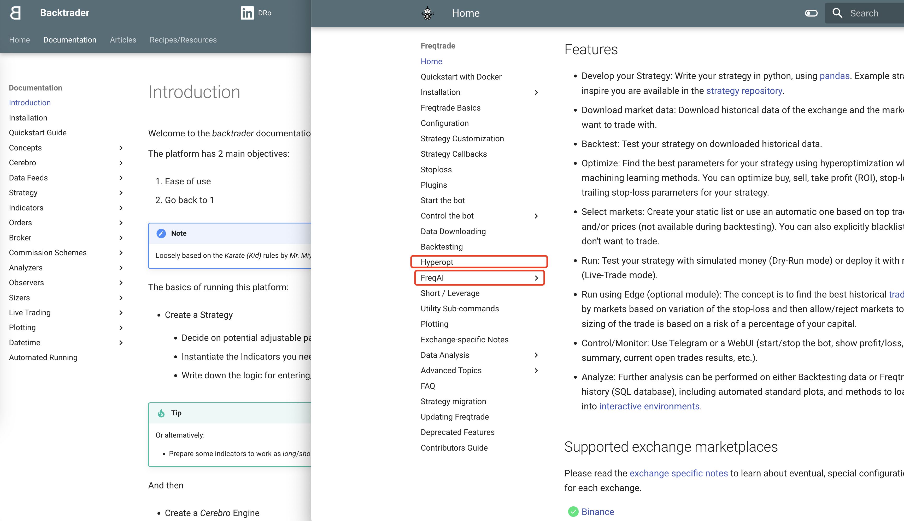

- livetrading exchange
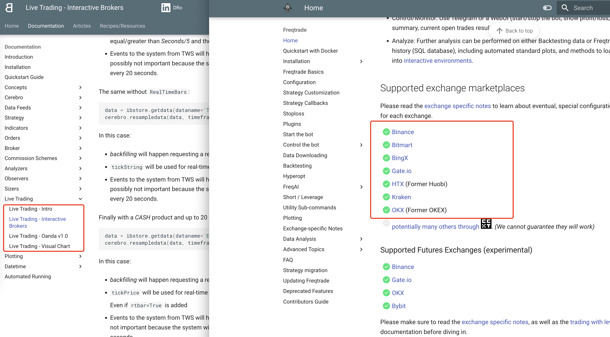

backtrader支持对接IB、安达服务公司。freqtrade支持直接对接binance okx等交易所。

## 框架梳理
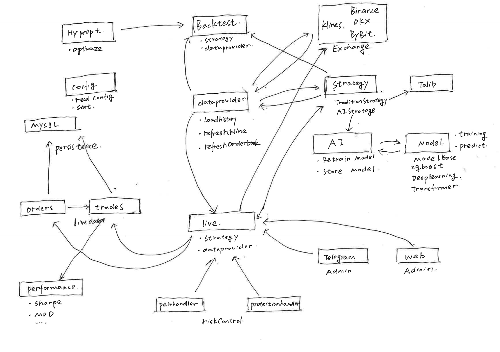

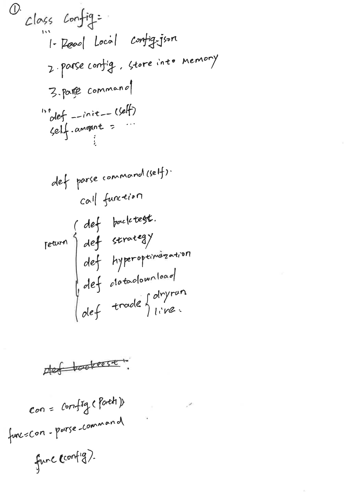
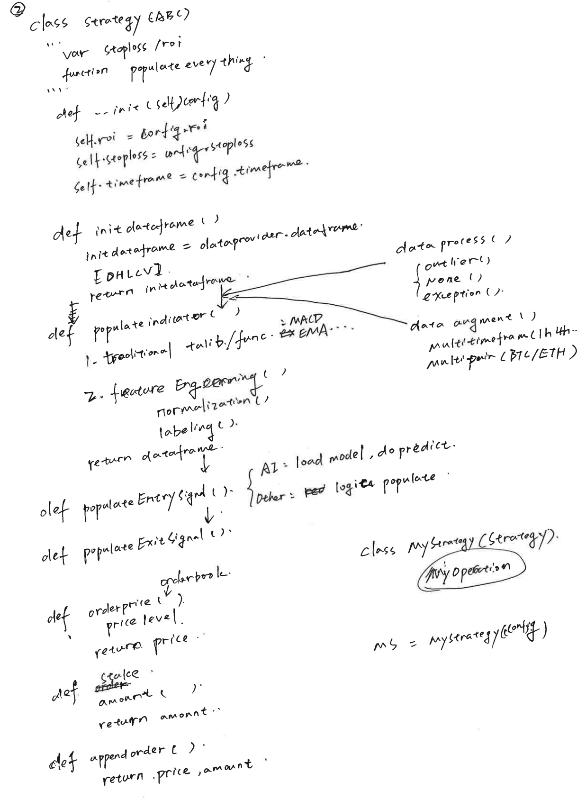
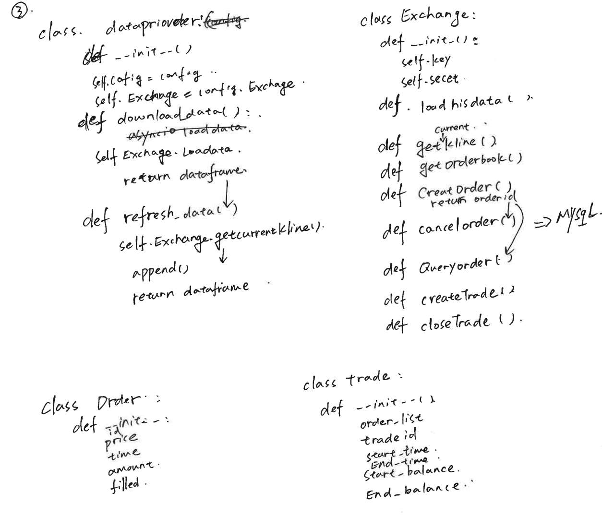
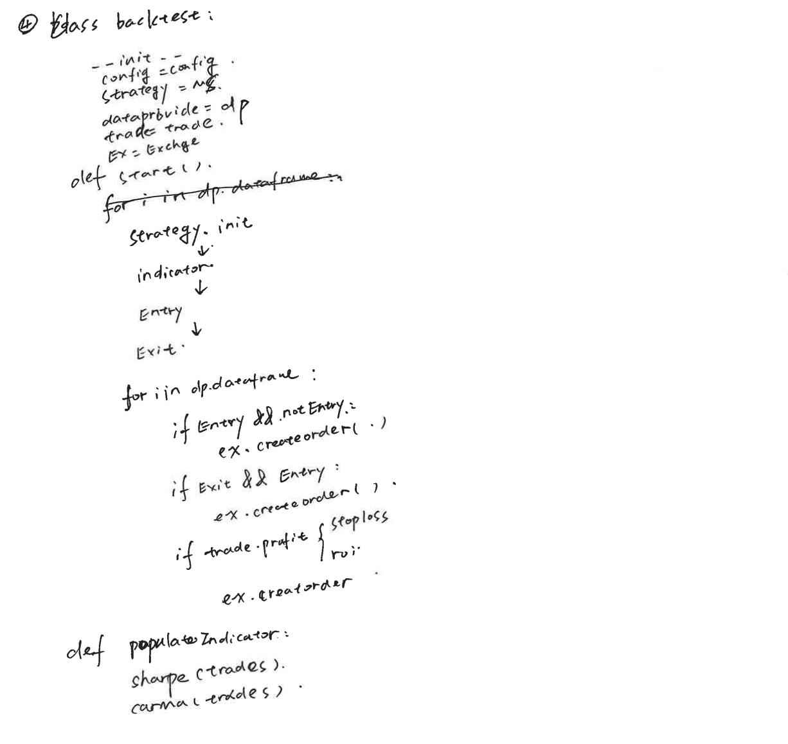
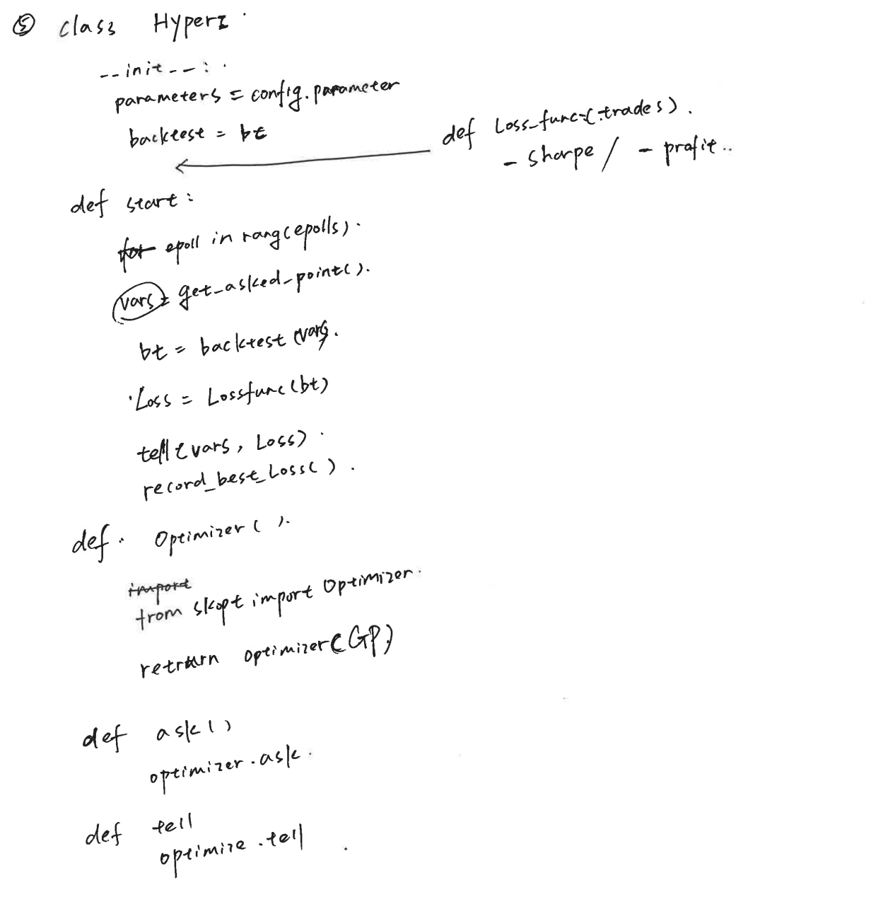
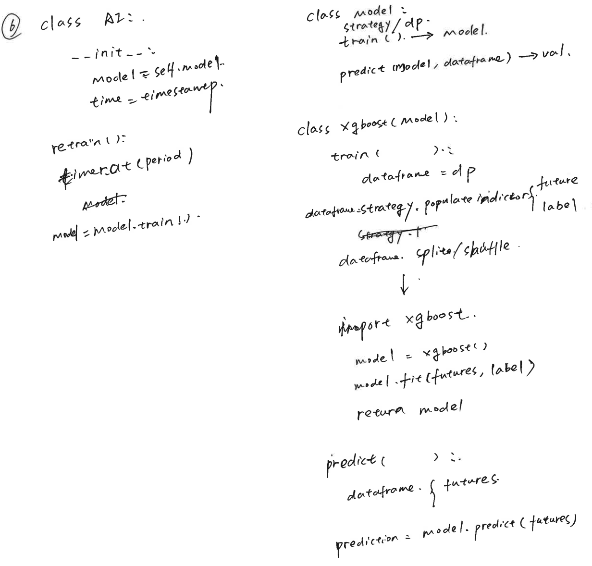
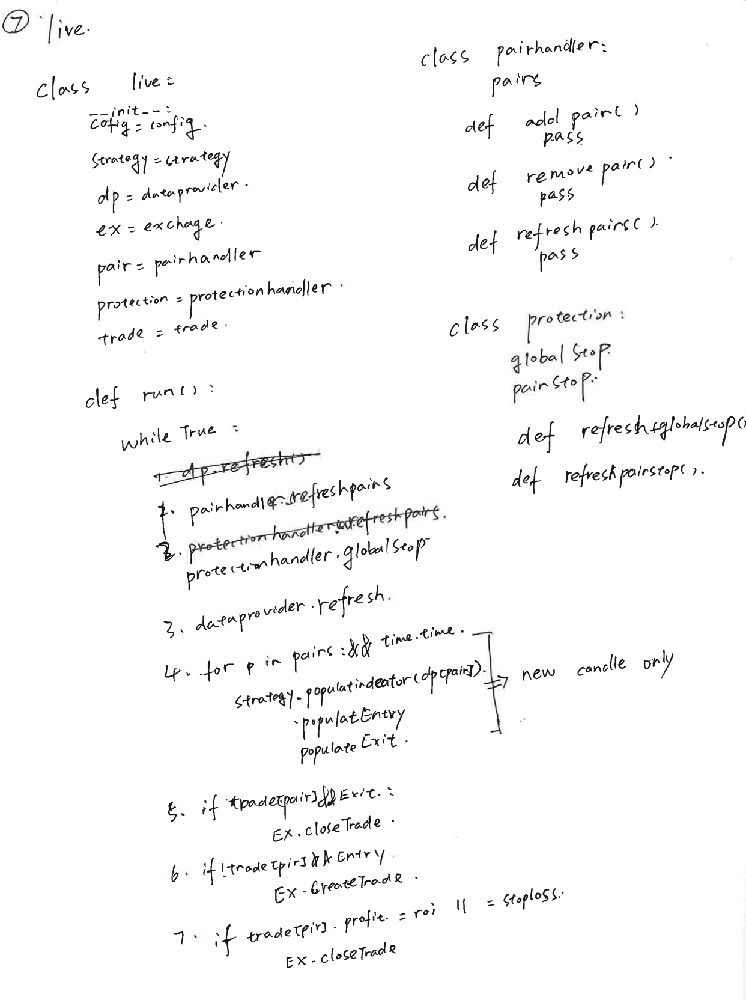

## 高性能问题

把算子构造为有向无环图
按照层序的方式进行多实例分配
实例间支持ws通行

## 高可用问题

- 心跳机制
- 崩溃后脚本拉取
- 交易所临近部署
- 限价单

### AI
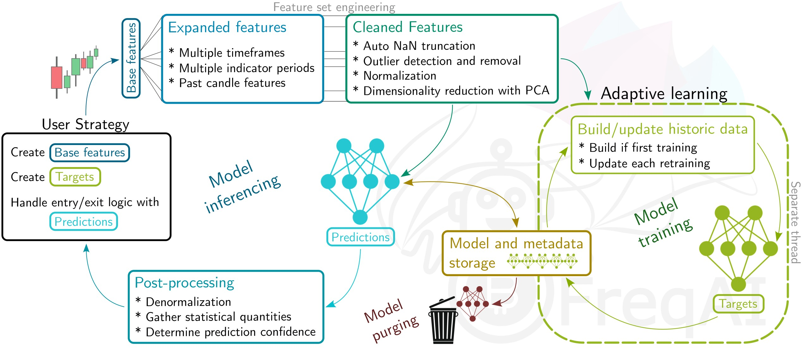