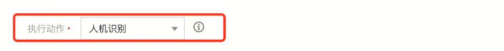
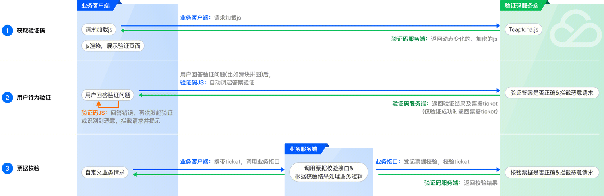
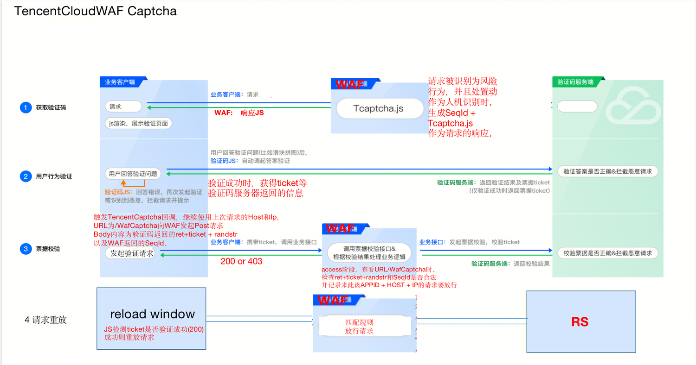
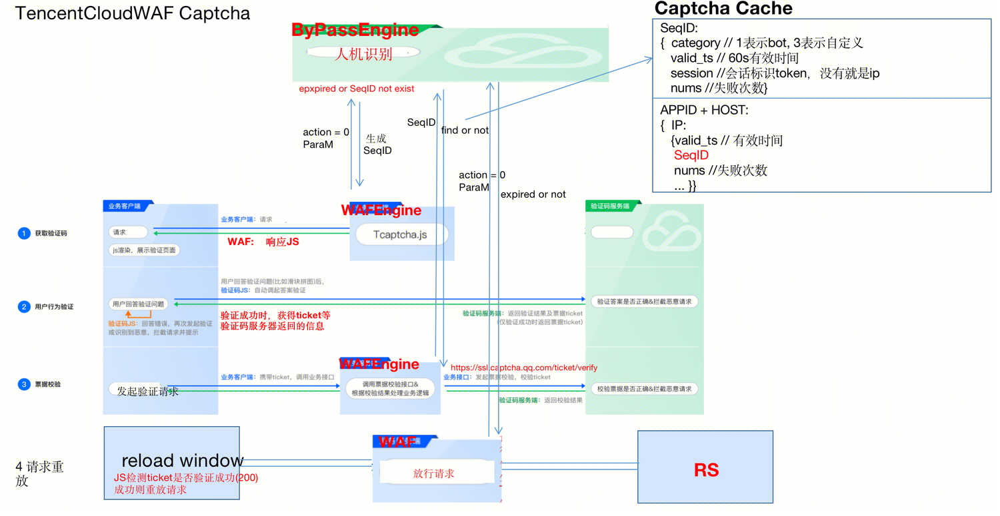
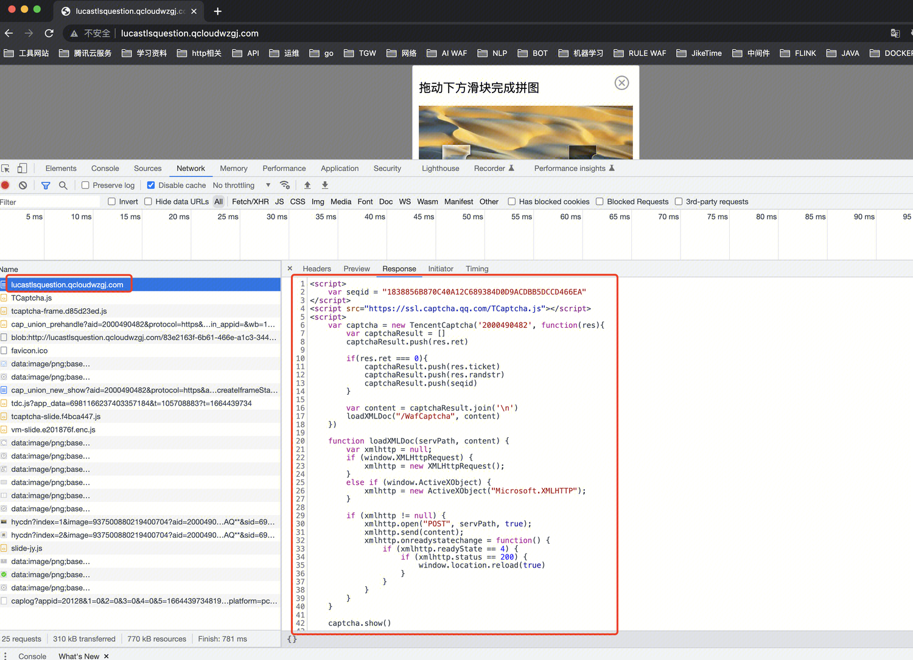

## 背景

WAF的人机识别，是基于验证码实现的。（大家也叫做防水墙）
下面介绍验证码的交互逻辑。

## 验证码交互逻辑
### 腾讯云验证码交互逻辑
云服务上，客户有感知的验证码交互逻辑如下：https://cloud.tencent.com/document/product/1110/36839

WAF采用了这种客户有感知的交互逻辑，但是进行了一定的改造，并适应了waf的交互方式。
### WAF验证码改造




## 发送验证码
当用户的处置动作为人机识别，并且命中防护策略时。会发送验证码：

该次请求返回的响应为一段Js代码。
``` 
<script>
    var seqid = "1838856B870C40A12C689384D0D9ACDBB5DCCD466EA"
</script>
<script src="https://ssl.captcha.qq.com/TCaptcha.js"></script>
<script>
    var captcha = new TencentCaptcha('2000490482', function(res){
        var captchaResult = []
        captchaResult.push(res.ret)

        if(res.ret === 0){
            captchaResult.push(res.ticket)
            captchaResult.push(res.randstr)
            captchaResult.push(seqid)
        }

        var content = captchaResult.join('\n')
        loadXMLDoc("/WafCaptcha", content)
    })

    function loadXMLDoc(servPath, content) {
        var xmlhttp = null;
        if (window.XMLHttpRequest) {
            xmlhttp = new XMLHttpRequest();
        }
        else if (window.ActiveXObject) {
            xmlhttp = new ActiveXObject("Microsoft.XMLHTTP");
        }

        if (xmlhttp != null) {
            xmlhttp.open("POST", servPath, true);
            xmlhttp.send(content);
            xmlhttp.onreadystatechange = function() {
                if (xmlhttp.readyState == 4) {
                    if (xmlhttp.status == 200) {
                        window.location.reload(true)
                    }
                }
            }
        }
    }

    captcha.show()

</script>
```

浏览器会执行Js代码，生成请求构造验证码滑块。

lua FUNCTION是： `captcha_request_rpc(req_obj, user_policy, token)`
参数中token是Js代码中的seqid：`1838856B870C40A12C689384D0D9ACDBB5DCCD466EA`

## 验证验证码
用户触发验证码的验证逻辑之后。
验证逻辑为：
lua FUNCTION是：`verify_captcha_request`

## 再次处理请求
