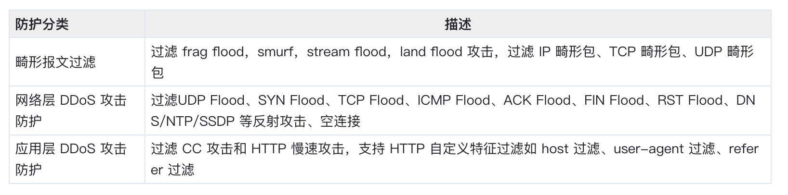

## DDOS


DDoS 高防 IP 默认提供基础安全策略，策略基于 IP 画像、行为模式分析、AI 智能识别等防护算法，有效应对常见 DDoS 攻击行为，同时提供灵活防护策略，您可针对自身业务需求配置，提供针对性防护。

## 四层防护 对外暴露高防IP
tcp/udp协议+端口转发
过滤UDP Flood、SYN Flood、TCP Flood、ICMP Flood、ACK Flood、FIN Flood、RST Flood、DNS/NTP/SSDP 等反射攻击、空连接

### 网络报文被转发后，源站ip是高仿ip。服务端如何获取客户端真实ip？
高防转发后，数据包同时会做 SNAT 和 DNAT，数据包的源地址和目标地址均修改。
TCP 协议下，为了将客户端 IP 传给服务器，会将客户端的 IP，port 在转发时放入了自定义的 tcp option 字段。


```
#define TCPOPT_ADDR    200  
#define TCPOLEN_ADDR 8    /* |opcode|size|ip+port| = 1 + 1 + 6 */

/*
*insert client ip in tcp option, now only support IPV4,
*must be 4 bytes alignment.
*/
struct ip_vs_tcpo_addr {
__u8 opcode;
__u8 opsize;
__u16 port;
__u32 addr;
}; 
```
Linux 内核在监听套接字收到三次握手的 ACK 包之后，会从  `SYN_REVC`  状态进入到  `TCP_ESTABLISHED`  状态。这时内核会调用  `tcp_v4_syn_recv_sock`  函数。 Hook 函数  `tcp_v4_syn_recv_sock_toa` 首先调用原有的 `tcp_v4_syn_recv_sock` 函数，然后调用  `get_toa_data`  函数从 TCP OPTION 中提取出 TOA OPTION，并存储在  `sk_user_data`  字段中。
然后用  `inet_getname_toa hook inet_getname` ，在获取源 IP 地址和端口时，首先调用原来的 `inet_getname` ，然后判断  `sk_user_data`  是否为空，如果有数据从其中提取真实的 IP 和 port，替换  `inet_getname`  的返回。

## 七层防护 配置业务域名的dns解析为高防IP
http/https协议+端口转发
过滤 CC 攻击和 HTTP 慢速攻击，支持 HTTP 自定义特征过滤如 host 过滤、user-agent 过滤、referer 过滤

### 应用层报文被转发后，源站ip是高仿ip。服务端如何获取客户端真实ip？
X-Forward-For或者X-real-ip字段

