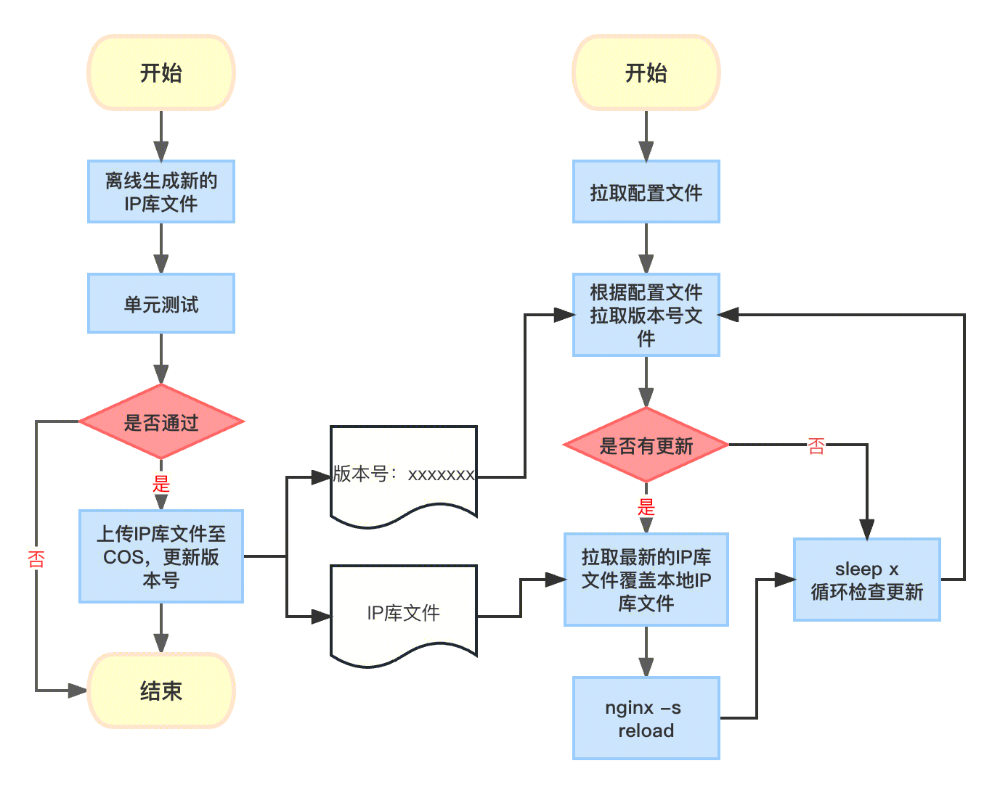

## 访问控制

主要是指地域封禁、用户自定义规则、IP黑白名单

参考[lua access](../../../access/engine/lua/access.md)

## IP地理库动态更新
### 背景：
目前在ngx_lua中地域封禁、日志的地理信息中都会用到IP库的数据，IP库的目录为`/usr/local/services/nginx_install-1.0/TencentCloudWAF_Engine/lib`，IP库文件每次都是跟随rs的升级才能升级更新IP库文件数据，导致IP库的更新周期冗长没法快速的解决因为数据未及时更新导致的系列问题。
所以对ngx_lua引擎中的IP库设计支持动态的更新，不再依赖ngx_lua引擎的更新。
### 设计

整体上分两个服务，一个服务负责离线的更新推送IP库文件以及版本号文件，然后将新版本的物料推送到COS上，另外在ngx引擎中增加一个服务周期的拉取物料判断是否有更新，如果有更新则更新物料重新加载。
#### 离线更新物料：
定期把原始的公司的IP库转换成ngx_lua引擎的IP库文件，转换生成离线的IP库文件后需要经过单元测试，只有测试通过后才能推送至COS。
推送的物料包括版本号文件，格式为当前的时间（xxxx-xx-xx xx:xx:xx），另外就是IP库文件分别包括IPv4和IPv6库文件。考虑到后续ngx引擎节点下载物料的时候的费用问题（参考：[超链接](https://cloud.tencent.com/document/product/436/56556) ），在国内的北上广这三个区分别上传物料，海外在新加坡上传物料，后面ngx引擎会根据就近的原则从COS拉取物料。
#### 在线更新物料：
ngx_lua引擎节点中会增加一个ipdb_update.py的进程，并且将IP库的目录从`/usr/local/services/nginx_install-1.0/TencentCloudWAF_Engine/lib/`调整为`/usr/local/services/nginx_install-1.0/TencentCloudWAF_Engine/lib/ipdb/`。
从北极星上拉取配置文件后就开始拉取版本号文件进行对比，如果没有更新则会根据配置文件中配置的检查周期+**随机一个0 ~ 10分钟的随机时间**后再次进行检查。
如果通过版本号对比发现有新的物料更新则从COS上面下载最新的物料到本地，容器的nginx pod需要新增加一个PVC的数据卷然后挂载到`/usr/local/services/nginx_install-1.0/TencentCloudWAF_Engine/lib/ipdb/`，避免容器重启后IP库版本回退。
IP库更新完成后调用`sbin/nginx -s reload`重新加载。
#### 部署：
考虑到容器化环境中拉取的最新的ipdb文件需要持久化存储，所以将ipdb的文件目录从` /usr/local/services/nginx_install-1.0/TencentCloudWAF_Engine/lib/iplib.ipdb`,调整为`/usr/local/services/nginx_install-1.0/TencentCloudWAF_Engine/lib/ipdb/iplib.ipdb`，这里需要将ngx_lua的config.json的配置项中的`geoip_binary_path_ipdb`进行更新，并且需要在容器中新增一个pvc挂载到`/data/ipdb`。
