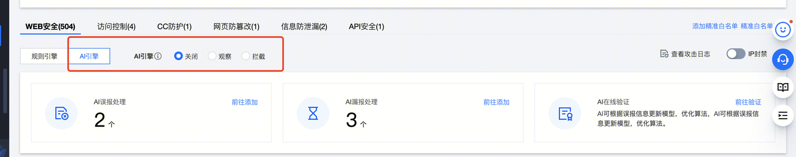

## 控制台


## 特点
因为svm模型参数较少，用户可以定制模型。
如果一个appid 自定义，3个模型大约20MB数据
100 个客户就是2000MB  2GB数据
1000 个客户就是20GB数据量 可以接受

## 模型 
**sqli svm**
**xss svm**
**rmea svm**

## 模型训练框架
- Embeding ： Weka String To Vector
https://weka.sourceforge.io/doc.dev/weka/filters/unsupervised/attribute/StringToWordVector.html
- SVM solver： Weka SMO
https://weka.sourceforge.io/doc.dev/weka/classifiers/functions/SMO.html
- Training Data：sqli ｜ xss ｜ rmea
https://git.woa.com/zunhuahu/bot-rpc-server/tree/master/data/attack

# Weka SVM训练框架 + Redis持久化存储

- Training data
``` 
NGramTokenizer ng = new NGramTokenizer();
ng.setNGramMaxSize(3);
ng.setNGramMinSize(1);
ng.setDelimiters(" \r\n\t");

filter1.setTokenizer(ng);
filter1.setInputFormat(instances);           //基于训练实例配置过滤器

//对instance进行filter操作，得到处理后的数据，filterData是一个数字的向量构成的
Instances filterData = Filter.useFilter(instances, filter1); // 直接对line进行分词，并转化成line对应的向量
```

- SVM Solver
``` 
String[] options = { "-C","1","-K","weka.classifiers.functions.supportVector.PolyKernel", "-L", "0.001", "-P", "1.0E-12", "-N", "0", "-V","1", "-W", "1"}; //SVM polyKernel 参数
// "-C","1",                                                                 The complexity constant C
// "-K","weka.classifiers.functions.supportVector.PolyKernel",               Kernel Function
// "-L", "0.001",                                                            The tolerance parameter.
// "-P", "1.0E-12",                                                          The epsilon for round-off error.
// "-N", "0",                                                                Whether to 0=normalize/1=standardize/2=neither. (default 0=normalize)
// "-V","1",                                                                 The number of folds for the internal cross-validation.
// "-W", "1"                                                                 The random number seed. 
// "-E", "1.0"                                                               The Exponent to use.
smo.setOptions(options);

//分类器使用filterData来建立分类器
smo.buildClassifier(filterData);
```

- Redis Store
把java类，包括类里面成员的参数，压缩并序列化成bytes后存入redis中
``` 
ByteArrayOutputStream baos = new ByteArrayOutputStream();
GZIPOutputStream gzip = new  java.util.zip.GZIPOutputStream(baos);
ObjectOutputStream oos = new ObjectOutputStream(gzip);
//mc是一个java类，类里面有训练好的smo成员。
oos.writeObject(mc); 
oos.close();
byte[] bytes = baos.toByteArray();

baos.close();
gzip.close();

//bytes 写入到redis里，这个是标准的模型
redisClient.insertSvmModel(appid, modelName, bytes);
```

# Load Model + Classify

- Load Model From Redis
将之前存入redis的java类读到本地，并利用readObject恢复出来。就可以得到之前训练好的mc.smo
``` 
payloadClassify mc = null;
byte[] bytes = redisClient.querySvmModel(appid, type);
ByteArrayInputStream bais;
bais = new ByteArrayInputStream(bytes);
GZIPInputStream gzip = new  java.util.zip.GZIPInputStream(bais);
ObjectInputStream ois =new ObjectInputStream(gzip);
mc = (payloadClassify) ois.readObject();
bais.close();
gzip.close();
ois.close();
```
- classify
``` 
Instance ins = makeInstance(payload, instances.stringFreeStructure(), false); //instance是weka在内存中的数据集的表示（原始数据集）
filter1.input(ins); //将payload转为向量
double ret = smo.classifyInstance(filter1.output()); //利用训练好的smo，二分类。 0:nagative 1:passtive
```


