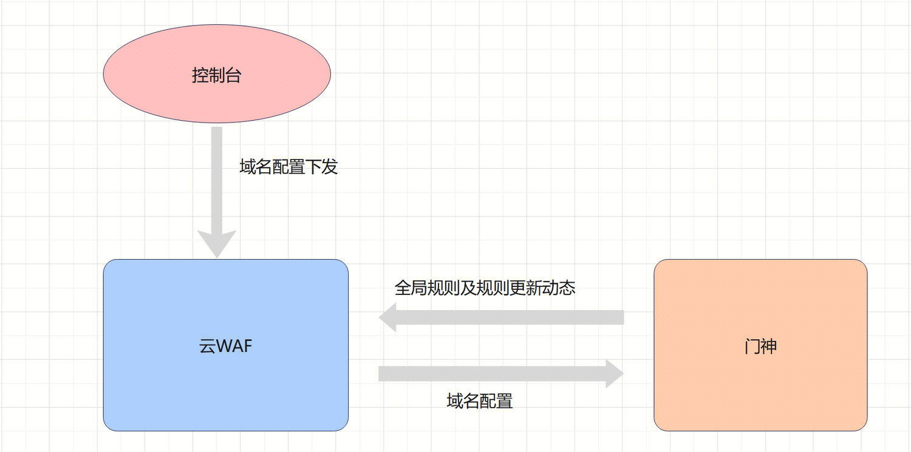

规则引擎主要是基于防护规则对攻击请求就像正则匹配。以门神为例：

有以下防护规则，且支持动态更新：

- 防护 eval、phpinfo 等 asp、php 代码执行或者 webshell 上传特征
- 防护 thinkphp5 远程代码执行漏洞，通过识别反序列化类特征
- 防护一些敏感的命令执行攻击，针对进行文件操作的命令的特征，如cat /etc/passwd等
- 拦截 sql 注入探测阶段中，一些使用逻辑操作符和运算符的特征及其变形的攻击请求，如 1 and 1=1\n
- 拦截 sql 注入探测和利用阶段中，一些使用逻辑操作符和 sql 函数调用的特征及其变形的攻击请求，如 1 and substr(current_user) 等
- 拦截 sql注入/盲注中，使用 is null/is not null 运算符进行探测的请求
- 拦截使用 procedure analyse 特征进行注入的恶意请求
- 防护文件读取中一些敏感文件模型特征，如svn，git泄漏，/etc/passwd等
- 检测 sql 注入中敏感的内置系统变量调用特征，如@@basedir，global变量
- 检测sql注入中，一些敏感的函数调用特征，如使用 updatexml 等报错注入，使用 ascii(substr(user())) 进行布尔盲注等
- 防护 sql 注入利用，通过检测 sql 注入中，使用 load data infile、into outfile 进行文件读取和文件写入的特征
- 检测sql注入中的nullif、ifnull函数特征
- 检测sql注入中，使用if函数进行盲注的特征
- 检测sql注入中，使用union select语句进行联合查询的特征
- 防护sql注入中， 使用insert进行数据库插入操作
- 检测sql注入中的select from特征
- 检测sql注入中，使用create/alter/drop database/table语句进行数据库、数据表操作的特征
- 检测sql注入中，使用sleep、benchmark等进行延时注入的攻击特征
- 检测sql注入中，使用case when语句进行布尔盲注的特征
- 检测sql注入中，使用尝试内联注释绕过的攻击特征
- 防护文件上传攻击，拦截一些可能存在恶意的上传后缀名
- 防护请求头注入(CRLF注入)攻击
- 防护CVE-2014-6271 bash shellshock 破壳漏洞攻击
- 防护CVE-2014-7169 bash shellshock破壳漏洞攻击
- 防护discuz本地文件包含漏洞
- 防护discuz x中，uc_key泄漏导致利用代码执行漏洞
- 防护wordpress中，使用/xmlrpc.php进行的恶意攻击
- 防护文件上传攻击，针对尝试使用多个Content-Dospostion行绕过的情况
- 拦截使用IIS Http.sys处理Range整数溢出漏洞(CVE-2015-1635)的攻击
- 防护文件上传攻击，针对通过畸形的数据包的绕过multipart/form-data的解析请求的情况
- 拦截特定文件或后缀的访问，如常见于php文件上传漏洞的利用的 php3 php4 php5，常见于扫描网站打包的 www.zip等
- 防护PHP DOS漏洞(CVE-2015-4024)攻击
- 检测sql注入中，查询current_user变量的攻击特征
- 防护XSS攻击中实体编码绕过攻击
- 防护struts漏洞，通过检测ognl表达式注入的字符特征
- 防护flash xss攻击
- 防护struts2-032(CVE-2016-3081)远程代码执行攻击
- 防护imageMagick远程命令执行攻击(CVE-2016-3714)
- 防护imageMagick 远程代码执行攻击
- 防护ffmpeg文件读取漏洞攻击
- 检测sql注入中，使用left/right函数进行盲注的攻击
- 防护Struts2 S2-037远程命令执行漏洞(CVE-2016-4438)攻击
- 根据UA信息判断，拦截常见web扫描器攻击请求
- 检测使用dirbuster扫描器尝试路径扫描的恶意请求
- 防护Resin viewfile任意文件读取漏洞攻击 和 Resin jndi-appconfig inputFile 任意文件读取攻击
- 防护node-serialize反序列化代码执行攻击(CVE-2017-5941)
- 检测文件上传中上传敏感文件后缀特征
- 防护struts2-045远程命令执行(CVE-2017-5638)攻击
- 防护struts2-045远程命令执行(CVE-2017-5638)攻击
- 防护fastjson反序列化代码执行攻击
- 防护struts2-046远程代码执行(CVE-2017-5638)攻击
- 防护fastjson反序列化代码执行攻击
- 防护IIS6缓冲区溢出攻击
- 防护jackson反序列化代码执行攻击
- 防护Jenkins未授权远程代码执行漏洞(CVE-2017-1000353)攻击
- 防护服务端模版包含(SSI注入)攻击
- 防护fastjson反序列化代码执行攻击
- 防护ffmpeg文件读取漏洞攻击
- 检测sql注入中order by语句特征
- 检测Nginx range过滤器整形溢出漏洞(CVE–2017–7529)攻击
- 防护svn、git等敏感文件泄漏的探测
- 防护任意文件读取攻击
- 防护SUPERVISORD远程命令执行漏洞(CVE-2017-11610)攻击
- 防护gitlab远程代码执行攻击
- 检测 xss中 data uri/base64 的攻击特征
- 防护针对Discuz!X SQL注入漏洞的攻击利用行为。影响版本：< Discuz! X3.4 R20191201 UTF-8
- 防护struts2-052远程代码执行攻击(CVE-2017-9805)
- 防护struts2-052远程代码执行攻击(CVE-2017-9805)
- 防护tomcat put方法任意文件写入漏洞攻击(CVE-2017-12615)
- 防护php代码注入和webshell上传攻击
- 防护java代码注入和jsp webshell上传攻击
- 防护Spring Data Rest服务器PATCH方法远程代码执行漏洞(CVE-2017-8046)
- 防护Discuz!X ≤3.4任意文件删除漏洞攻击
- 防护apache solr xmlparser解析器XXE攻击
- 防护xss攻击，检测攻击者调用alert/prompt等进行弹窗验证或添加恶意DOM节点的敏感操作
- 防护xss攻击，检测攻击者试图通过调用getScript/CreateElement函数来注入外部JS脚本的敏感操作
- 防护sql注入，检测攻击者试图通过and/&&等条件判断来获取敏感信息的请求
- 防护webshell攻击，检测$_GET/$_POST等敏感变量使用
- 防护由不安全反序列化导致的jboss远程代码执行攻击。影响版本：5.x和6.x
- 防护xss攻击中的flash xss攻击，检测能调用敏感函数的swf文件的访问请求
- 防护sql注入中postgresql类型数据库的注入攻击，形如pg_sleep、pg_read_file等
- 防护sql注入中mssql类型数据库的注入攻击
- 防护weblogic远程代码执行攻击。影响版本：10.3.6.0、12.1.3.0、12.2.1.0、12.2.1.1和12.2.1.2
- 防护sql注入中oracle类型数据库的注入攻击
- 防护SSRF类型的XXE攻击，检测针对HTTP协议和FILE协议的敏感协议调用
- 防护xss攻击中的一些敏感事件及敏感JS函数，形如onload=xxx和document.cookie等
- 防护远程下载文件形式的命令注入攻击，形如curl/wget等
- 防护PHP GD拒绝服务漏洞。影响版本：用于PHP在5.6.33之前的版本，在7.0.27之前的7.0.x，在7.1.13之前的7.1.x和7.2.1之前的7.2.x的GD图形库
- 防护Cisco crash远程代码执行漏洞攻击。此漏洞影响在Cisco产品上运行的Cisco ASA软件，如3000系列工业安全设备（ISA）、ASA 5500系列自适应安全设备等
- 防护drupal远程代码执行攻击。影响版本：7.58之前，8.3.9之前的8.x，8.4.6之前的8.4.x和8.5.1之前的8.5.x
- 检测sql注入攻击特征，形如having 1=1等
- 检测sql注入中like/sound like等攻击特征
- 防护spring oauth远程代码执行攻击。影响版本：2.3.3之前的2.3版本，2.2.2之前的2.2、2.1.2之前的2.1、2.0.15之前的2.0和更早的不受支持的版本
- 防护gitlab任意文件读取攻击
- 防护ImageMagick GhostScript远程代码执行攻击
- 防护ECSHOP远程代码执行攻击。影响版本：ECShop 2.x、3.0.x、3.6.x）
- 防护imageMagick 远程代码执行攻击
- 防护thinkphp5 远程代码执行攻击。影响版本：5.x
- 防护nginx+tomcat 任意URL跳转漏洞攻击
- 防护thinkphp5 远程代码执行攻击。漏洞范围: <= 5.0.23、<= 5.1.32
- 防护thinkphp5 远程代码执行攻击。影响版本：ThinkPHP 5.1.x~5.2.x全版本
- 防护命令注入攻击中一些远程交互操作攻击，如调用bash反弹shell等
- 防护代码注入攻击中一些敏感函数操作带来的攻击，如phpinfo/system等
- 防护 weblogic  WLS9-ASYNC 反序列化攻击。受影响版本：Oracle WebLogic Server 10.*、Oracle WebLogic Server 12.1.3
- 防护 PHP-FPM 远程代码执行攻击。影响版本：在FPM设置的某些配置中，低于7.1.33的PHP版本7.1.x，低于7.2.24的7.2.x和低于7.3.11的7.3.x
- 防护Apache Solr Velocity模版注入远程命令执行漏洞攻击。Apache Solr 5.0.0版本至8.3.1版本中存在输入验证错误漏洞。攻击者可借助Velocity模板利用该漏洞在系统上执行任意代码。
- 防护代码注入攻击中system函数执行代码的攻击特征
- 防护代码注入攻击中execute函数执行代码的攻击特征
- 防护xss攻击中一些敏感标签及其敏感属性，如<script src=xxx>/<iframe src=javascript:xxx>等攻击特征
- 防护本地文件包含攻击中php:input/filter等攻击特征
- 防护graphql未授权漏洞攻击
- 防护Apache Kylin 命令注入漏洞攻击。影响版本：Apache Kylin 2.3.0版本和2.6.5至3.0.1版本
- 防护文件读取攻击中一些敏感文件路径访问
- 防护特定恶意文件后缀访问，如服务器打包文件、配置文件等
- 防护struts2远程代码执行漏洞攻击（S2-016）。在2.3.15.1版本以前的 struts2中，没有对“action:”, “redirect:” , “redirectAction:”等进行处理，导致ongl表达式可以被执行。
- 防护PHP-CGI远程代码执行漏洞攻击
- 防护代码注入攻击，覆盖针对JAVA语言的通用代码注入特征
- 防护代码注入攻击，覆盖针对JAVA语言的通用代码注入特征
- 防护sql注入攻击，覆盖针对sqlite数据库的注入攻击
- 防护代码注入攻击，覆盖针对ASP语言的通用代码注入特征
- 防护代码注入攻击，覆盖针对nodejs语言的通用代码注入特征
- 防护jackson远程代码执行漏洞攻击
- 防护泛微云桥任意文件读取漏洞
- 防护 Microsoft Exchange远程代码执行漏洞 (CVE-2020-16875)
- 防护php解析漏洞攻击
- 检测利用php反序列化漏洞进行攻击的恶意特征
- 防护RFD（反射型文件下载），检测特定后缀的访问请求
- 检测sql注入中，尝试读取 current_user 恶意特征
- 防护Spring反射性文件下载漏洞(CVE-2020-5421)
- 针对CVE-2020-14882和CVE-2020-14883的权限绕过和反序列化代码执行漏洞
- 针对CVE-2017-3506/CVE-2017-10271/CVE-2019-2725/CVE-2019-2729 Weblogic反序列化代码执行漏洞
- 针对Weblogic uddiexplorer ssrf漏洞防护(CVE-2014-4210)
- 针对禅道<=12.4.2文件上传漏洞的漏洞防护
- 针对mysql报错注入函数的检测
- 识别针对特定表名的sql查询操作，如 information_schema 库表，如 dual 表
- 针对  CVE-2020-11651/11652 saltstack api 权限绕过+命令注入漏洞
- sql盲注防护规则，针对运算符+函数调用的模式
- 检测常见的webshell恶意文件名访问
- 针对 CVE-2018-1999002 jenkins路径遍历漏洞
- 针对jenkins CVE-2018-1000861权限绕过漏洞
- 针对drupal远程代码执行漏洞，CVE-2018-7600，CVE-2018-7602
- 针对ldap注入中，通过ObjectClass对象类进行查询的操作
- Fortinet FortiOS 5.6.3版本至5.6.7版本和6.0.0版本至6.0.4版本中的SSL VPN Web门户存在路径遍历漏洞。该漏洞源于网络系统或产品未能正确地过滤资源或文件路径中的特殊元素。攻击者可利用该漏洞访问受限目录之外的位置。
- 防护IIS短文件名泄露攻击
- 防护iis 5.0认证绕过漏洞的攻击利用
- 防护Jboss历史安全验证绕过漏洞的攻击利用，覆盖CVE：CVE-2007-1036、CVE-2010-0738
- 防护Jboss Application Server反序列化命令执行漏洞利用，远程攻击者利用漏洞可在未经任何身份验证的服务器主机上执行任意代码。
- 防护ThinkPHP历史漏洞利用
- 宽松模式下，xss防护规则
- 针对致远OA htmlofficeservlet 远程命令执行漏洞\n漏洞影响的产品版本包括：\n致远A8-V5协同管理软件 V6.1sp1\n致远A8+协同管理软件V7.0、V7.0sp1、V7.0sp2、V7.0sp3\n致远A8+协同管理软件V7.1
- 针对泛微OA BeanShell组件导致的远程命令执行漏洞（CNVD-2019-32204）\n影响产品\te-cology <=9.0
- 针对泛微OA dbconfigreader 接口数据库配置信息泄露漏洞
- 针对致远A8反序列化代码执行漏洞
- 针对XStream历史漏洞的防护
- 针对Microsoft Exchange Server远程代码执行漏洞
- 针对 Axis < 1.4 的远程代码执行漏洞
- 针对Windows环境下Apache RCE漏洞，CVE-2019-0232
- 防护IIS服务器历史服务器端文件名解析漏洞，形如shell.asp;.jpg、shell.asp/1.jpg、789.jpg/.php等
- 防护IIS 6.0 PUT 上传漏洞。IIS Server 在 Web 服务扩展中开启了 WebDAV，并且管理员在配置权限时，没有遵循最小原则，给 IIS 配置了可以写入的权限，包括网站根目录，导致任意文件上传。
- 防护Confluence路径穿越漏洞。 在Page或Blogs具有添加附件权限的用户，或具有创建新空间或个人空间权限的用户，或对某空间具有“管理员”权限的用户可利用此路径穿越漏洞将文件写入任意位置。一定条件下可以执行任意代码。
- 防护通达OA任意文件删除和文件上传导致的远程代码执行漏洞。攻击者通过任意文件漏洞删除上传点包含的身份验证文件，可以未授权访问实现任意文件上传。影响版本：通达OA V11.6\n
- 防护通达OA任意文件上传/文件包含GetShell漏洞。通过绕过身份认证, 攻击者可上传任意文件，配合文件包含即可触发远程恶意代码执行。影响版本：V11.3版、2017版、2016版、2015版、2013版、2013增强版
- 针对Coremail mailsms接口敏感信息泄漏漏洞
- 防护通达OA任意用户登录漏洞。影响版本： 通达OA < 11.5、通达OA = 2017
- eYou邮件系统文件 /user/send_queue/listCollege.php 路径泄露漏洞
- 针对eYou邮件系统 /send_queue/del_addition.php 任意文件删除漏洞
- 针对输出点在js环境中xss漏洞利用的场景，如使用 ;new Function(atob(` 执行恶意js代码的操作
- 针对Flask/Jinja2模板注入的恶意利用特征
- 针对使用expr命令，进行命令注入的探测的检测，例如 expr 988939119 + 963088680
- 针对通过bash命令反弹shell的特征检测
- 针对 CVE-2020-10148 权限绕过导致的文件泄漏防护
- 针对 CVE-2020-10148 权限绕过导致的文件泄漏防护\n
- 针对 java 反序列化中常见的协议，包括 rmi ldap jms 等
- 针对Apache Flink，通过REST handler导致的任意文件上传漏洞
- 针对Apache Flink 目录遍历漏洞(CVE-2020-17519)
- 针对Laravel在Debug模式下Ignition的代码执行漏洞
- 针对任意文件写入覆盖ssh authorized_keys的操作
- 针对基于velocity和java反射的特征，针对velocity模版注入漏洞的防护
- 针对 confluenc CVE-2019-3396的代码执行漏洞
- zabbix中latest.php和jsrpc.php中存在的报错注入漏洞(CVE-2016-10134)，本规则用于拦截针对该漏洞的探测和利用操作
- 针对xss漏洞利用中，使用on事件执行js的操作，本规则用于覆盖新增的，可用于执行javascript的on事件
- 针对jenkins Git client Plugin插件，--upload-pack 导致的命令注入漏洞（CVE-2019-10392）
- 针对jumpserver命令执行漏洞，利用生成connection-token导致的命令执行
- 针对的 CVE-2021-2109 的防护规则，特定cgi，应用于宽松模式下的匹配
- 针对Saltstack多个未授权远程代码执行漏洞，CVE-2021-25281、CVE-2021-25282、CVE-2021-25283
- 防护 druid CVE-2021-25646 代码执行漏洞
- 针对 CVE-2021-21972 vSphere Client RCE 漏洞
- 针对dedecms通过 /data/admin/ver.txt 或者 mysql_error_trace.inc 获取系统版本信息的防护规则
- 针对thinkcmf，a=fetch的远程代码执行漏洞
- 针对thinkphp配置不当导致的日志泄漏，以及利用thinkphp日志文件的包含行为等
- 针对74cms assign_resume_tpl远程代码执行漏洞
- 针对phpcms v9.6任意文件上传的漏洞
- 防护Cacti 1.2.8权限绕过和任意命令执行漏洞。如果来宾用户具有图形实时特权，则Cacti 1.2.8中的graph_realtime.php允许远程攻击者通过cookie中的shell元字符执行任意OS命令。
- 针对dedecms，digg_frame.php、digg_ajax.php代码注入漏洞
- 防护Apache DolphinScheduler远程执行代码漏洞（CVE-2020-11974）。在选择mysql作为数据库时，攻击者可通过jdbc connect参数在DolphinScheduler 服务器上远程执行代码
- 防护Apache Kylin 中的静态 API 存在命令注入漏洞。攻击者可借助特制输入利用该漏洞在系统上执行任意OS命令。
- 针对命令注入，代码执行的攻击载荷中，出现常见的http反连和dnslog回显域名的检测
- 防护Apache Solr 远程命令执行漏洞。漏洞出现在Apache Solr的DataImportHandler，由于DIH配置可以包含脚本，因此攻击者可以通过构造危险的请求，从而造成远程命令执行。
- 防护攻击者通过Apache Solr的ConfigAPI 设置 jmx.serviceUrl指向恶意的 RMI 服务器而导致的RCE漏洞，漏洞编号为CVE-2019-0192
- 防护攻击者通过ReplicationHandler实现任意文件读取的漏洞利用行为，漏洞编号为CVE-2017-3163
- 防护Nexus Repository Manager权限绕过修改管理员密码漏洞利用，漏洞编号为CVE-2020-11444
- 防护Nexus Repository Manager历史RCE漏洞利用，漏洞编号包含CVE-2019-7238、CVE-2020-10204、CVE-2020-10199
- 针对php变量覆盖中，通过请求参数覆盖超全局变量的场景
- 针对dedecms模版注入导致的代码执行
- 防护利用PUT、MOVE等方法上传恶意文件的攻击；
- 防护Apache Solr 模版注入漏洞利用，阻止攻击者通过篡改配置文件实现模板注入攻击的行为
- 防护攻击者通过RunExecutableListener实现RCE的漏洞利用行为，漏洞编号为CVE-2017-12629
- 防护Apache Kylin API未授权访问导致信息泄露的漏洞利用（CVE-2020-13937)
- 防护针对SSRF的漏洞利用行为
- 针对 derby 数据库注入的利用，基于文件读写，数据导入导出的敏感函数特征
- 针对一些嵌入式数据库中的sql注入场景中，利用 external name 等操作执行java代码的场景
- 针对使用h2数据库的sql注入利用操作，包含文件读写，代码执行等
- 针对嵌入式数据库中，使用 create_alias 进行代码执行的操作
- fastjson反序列化在multipart/form-data场景下的防护规则
- 针对请求参数中，尝试进行文件读取/文件写入的操作， ../ 特征
- 针对Cookie中，尝试进行文件读取/文件写入的操作， ../ 特征
- 针对 Exchange CVE-2021-26855 SSRF 漏洞
- 针对Xstream 若干漏洞(CVE-2021-21341-CVE-2021-21351) 的反序列化特征
- 针对shrio CVE-2020-1957权限绕过漏洞
- 严格xss规则，针对js中的预定义全局变量
- 严格xss规则，针对一些html标签注入的场景
- 严格xss规则，针对IE下使用css执行javascript的场景
- 严格xss规则，针对一些特殊编码的防护规则
- 防护恶意的XSS漏洞利用探测行为
- 防护2021年PHP源码供应链攻击。php官方发布其 git.php.net 服务器遭攻陷，攻击者仿冒PHP编程语言作者Rasmus lerdorf和软件开发者 Nikita Popov 的账号发起了两次恶意代码提交，并留下了远程代码执行后门。
- 针对出现在 header 中的 webshell 写入特征
- 针对 Apache OFBiz RMI反序列化（CVE-2021-26295）漏洞
- 针对 F5 BIG-IP认证绕过RCE（CVE-2021-22986）
- 针对更多命令，使用大括号形式的尝试命令注入的场景
- 针对 org.mitre:openid-connect-server-webapp 的SSRF漏洞，https://github.com/mitreid-connect/OpenID-Connect-Java-Spring-Server/pull/1547
- 针对 ntopng Admin密码重置漏洞（2.x版本）(CVE-2021-28073)
- 针对基于jdbc链接的反序列化漏洞，可以覆盖 CVE-2021-26919 druid反序列化代码执行漏洞
- 针对 MessageSolution EEA信息泄露（CNVD-2021-10543）
- 针对xss中，针对javascript伪协议的防护
- 防护Apache Solr任意文件读取漏洞利用。攻击者可以在未授权的情况下读取目标服务器敏感文件和相关内容。
- Solr的ReplicationHandler类对输入数据数据处理不当，存在服务器请求伪造漏洞，涉及漏洞编号为CVE-2017-3164。
- 防护Apche Solr 未授权上传漏洞利用。在特定的Solr版本中ConfigSet API存在未授权上传漏洞，攻击者利用漏洞可实现远程代码执行。
- 防护ProxyLogon漏洞利用，ProxyLogon是Microsoft Exchange Server上的一个漏洞，它使攻击者可以绕过身份验证并冒充管理员。未经身份验证的攻击者可以在Microsoft Exchange Server上执行任意命令。
- 针对VMWare vRealize SSRF漏洞(CVE-2021-21975)的防护规则
- 防护ProxyLogon漏洞利用，ProxyLogon是Microsoft Exchange Server上的一个漏洞，它使攻击者可以绕过身份验证并冒充管理员。未经身份验证的攻击者可以在Microsoft Exchange Server上执行任意命令。
- 针对 shrio-550的一些特定的情况的防护
- 防护攻击者针对S2-016漏洞的攻击绕过行为
- 防护攻击者针对XSS漏洞的探测利用行为
- 防护锐捷RG-UAC统一上网行为管理审计系统账号密码泄露漏洞利用。攻击者可以通过审查网页源代码获取到用户账号和密码，导致管理员用户认证信息泄露。\n
- 防护Joomla com_media后台RCE漏洞利用。由于Joomlacom_media模块对上传文件校验不严格，攻击者可以通过上传恶意文件，从而实现远程代码执行。影响范围：Joomla CMS 3.0.0-3.9.24
- 防护FastAdmin框架有条件RCE漏洞利用。当开启了分片上传功能和攻击者具有一定用户权限的前提下，可以实现任意文件上传，导致RCE。
- 针对jeecg loadtreedata sql注入漏洞
- 针对 jellyfin 任意文件读取漏洞（CVE-2021-21402）
- 针对天擎gettablessize前台SQL注入漏洞
- 针对泛微OA8 getSelectAlld SQL注入漏洞
- 针对泛微OA9 uploadOperation.jsp 任意文件上传漏洞
- 针对帆软 FineReport V9任意文件上传漏洞
- 针对 ElasticSearch Groovy 脚本远程代码执行漏洞（CVE-2015-1427）
- 针对快客邮件系统(QuarkMail) get2.cgi 远程代码执行漏洞
- 针对 cgi 中尝试通过 ..\\ 进行权限绕过或者文件读取的场景
- 针对 solr 任意文件读取的防护
- 防护Jellyfin任意文件读取漏洞。Jellyfin存在未授权任意文件读取漏洞，其中多个接口是利用Windows的"\\"字符的技巧来实现目录穿越读取任意文件。
- 防护针对齐治堡垒机前台远程命令执行漏洞的攻击利用
- 防护针对Spring Boot Actuator命令执行漏洞的利用行为
- 防护Spring表达式注入攻击及潜在利用行为
- 覆盖部分SpEL表达式注入，形式如：T(String).getClass().forName("javax.script.ScriptEngineManager").newInstance()等
- 防护蓝凌OA 任意文件写入漏洞
- 防护浪潮 ClusterEngineV4.0 集群管理系统命令执行漏洞 (CVE-2020-21224)
- 防护用友NC 6.5版本 RCE漏洞\n
- 防护天融信DLP 未授权+越权漏洞。管理员登录系统系统之后修改密码，未采用原密码校验，且存在未授权访问导致存在越权修改管理员密码。\n
- 防护0day漏洞：禅道CMS 11.6 SQL注入漏洞\n
- 防护Apache Solr任意文件读取漏洞利用变体，影响版本：Apache Solr <= 8.8.1
- 针对天阳 OA 配置信息泄漏漏洞
- 针对亿邮邮件系统的远程代码执行漏洞（CNVD-2021-26422）
- 针对 EL 表达式注入的探测请求的防护规则
- 针对 skyeye 扫描器的 user_agent 特征防护规则
- 针对 nmap 扫描器的 user_agent 特征防护规则
- 针对奇治堡垒机任意用户登陆的漏洞的防护
- 防护0day漏洞：奇安信NS-NGFW 前台RCE漏洞
- 防护0day漏洞：三星WLAN AP WEA453e路由器RCE漏洞\n
- 防护0day漏洞：ERP-NC 目录遍历漏洞\n
- 防护通达OA任意用户登录漏洞，影响版本：<11.8版本
- 防护通达OA低权限文件上传和低权限目录穿越漏洞，可造成系统任意命令执行，影响版本：<11.8版本
- 防护0day漏洞：天擎数据库信息泄漏漏洞\n
- 针对出现在请求头重的ldap注入palyoad，如 (&(username=xxxx)(password=xxx))
- 针对特定情况下的权限绕过漏洞，覆盖某应用的权限绕过漏洞
- 防护0day漏洞：Canal敏感信息泄漏漏洞，泄漏信息中包含阿里云Secret Key
- 针对 xstream反序列化漏洞，覆盖了xstream反序列化可能的被利用的包前缀
- 防护Xstream反序列化漏洞，针对近期发现的一个特定0day漏洞
- 防护0day漏洞：Coremail存在目录穿越、任意文件上传并远程执行命令的0day漏洞
- 防护北京信安世纪应用网关系统远程命令执行0day漏洞
- 防护0day漏洞：D-Link DCS系列监控账号密码泄漏漏洞
- 防护历史未授权漏洞，包括docker、hadoop、ES等
- 防护Apache Dubbo HTTP接口反序列化漏洞，CVE编号为：CVE-2019-17564
- 防护出现在body中的ldap注入攻击
- 防护部分regexp if形式的SQL注入攻击
- 针对出现在请求路径和get参数的ldap注入paylaod，如 a=type=printer)(uid=*)
- 防护Pulse Connect Secure远程代码执行漏洞，CVE漏洞编号：CVE-2021-22893。未经身份验证的远程攻击者通过向目标设备发送恶意的HTTP请求，利用该漏洞能够在目标设备网关上执行任意代码。
- 针对phpstudy后门的防护请求
- 针对 zzzcms zzzphp parserIfLabel 模版注入导致的命令执行 (CVE-2021-32605)
- 防护泛微OA远程代码执行漏洞的利用行为。WorkflowServiceXml接口可被未授权访问，攻击者调用该接口，可构造特定的HTTP请求绕过泛微本身一些安全限制从而达成远程代码执行。
- 防护HTTP协议栈远程代码执行漏洞（CVE-2021-31166）的利用行为，该漏洞存在于HTTP 协议栈驱动模块 (http.sys)，攻击者可以远程通过向目标主机发送特制数据包来进行利用，成功利用可能造成目标系统崩溃或远程代码执行（困难）
- 针对 ruby_rails config/database.yml 配置信息泄漏
- 针对 sftp-config.json ftp 配置文件敏感信息泄漏漏洞
- 针对 CVE-2020-3452 Adaptive Security Appliance Software and Firepower 配置信息泄漏漏洞
- 防护带有AWVS扫描器特征的扫描行为
- 防护Jboss未授权敏感信息泄露漏洞的利用行为
- 针对nikto扫描器的扫描特征
- 针对 nessus 扫描器插件中出现的特征
- 针对Nginx在alias配置不当时，可能导致的信息泄漏
- 针对 Gemfile.lock/Pipfile.lock/composer.lock/package-lock.json/yarn.lock/Cargo.lock 文件的信息泄漏防护，参考：https://github.com/knqyf263/remic
- 针对vmware vcenter远程代码执行漏洞（CVE-2021-21985）
- struts-showcase为struts的测试页面，常被利用来批量扫描struts框架的漏洞
- PHPUnit是PHP中的一个单元测试框架，本规则针对PHPUnit中出现过的远程代码执行漏洞（CVE-2017-9841)
- 针对cgi类路径的防护规则，拦截一些使用历史的cgi代码执行漏洞的扫描请求
- 针对HTTP请求中的cookie字段，拦截使用 procedure analyse 特征进行SQL注入的恶意请求
- 针对HTTP请求中的cookie字段，检测sql注入中，使用create/alter/drop database/table语句进行数据库、数据表操作的特征
- 针对HTTP请求中的cookie字段，防护sql注入中， 使用insert语句进行插入数据的敏感操作
- 针对HTTP请求中的cookie字段，检测sql注入中的nullif、ifnull函数特征
- 针对HTTP请求中的cookie字段，防护 sql 注入利用，通过检测 sql 注入中，使用 load data infile、into outfile 进行文件读取和文件写入的特征
- 针对HTTP请求中的cookie字段，检测sql注入中，使用union select语句进行联合查询的特征
- 针对HTTP请求中的cookie字段，检测sql注入中以order by语句特征
- 针对一些特征明显的命令注入请求，匹配请求中带有类似 ${IFS} 变量的内容
- 针对HTTP请求中的cookie字段，防护sql注入中oracle类型数据库的注入攻击
- 针对HTTP请求中的cookie字段，防护sql注入中postgresql类型数据库的注入攻击，形如pg_sleep、pg_read_file等
- 针对HTTP请求中的cookie字段，拦截 sql注入/盲注中，使用 is null/is not null 运算符进行探测的请求
- 针对HTTP请求中的cookie字段，检测sql注入中，使用sleep、benchmark等敏感函数进行延时注入的攻击特征
- 针对php smarty模版注入的常见利用payload的防护规则
- 针对HTTP请求中的cookie字段，检测sql注入中，使用case when语句进行布尔盲注的特征
- 针对HTTP请求中的cookie字段，检测如having 1=1等形式的sql注入攻击特征
- 针对HTTP请求中的cookie字段，检测sql注入中如like/sound like等形式的攻击特征
- 针对HTTP请求中的cookie字段，检测sql注入中，使用尝试内联注释绕过的攻击特征
- 针对HTTP请求中的cookie字段，防护sql注入中mssql类型数据库的注入攻击
- 针对HTTP请求中的cookie字段，检测sql注入中，使用if函数进行盲注的特征
- 针对HTTP请求中的cookie字段，检测 sql 注入中敏感的内置系统变量调用特征，如@@basedir，global变量
- 针对HTTP请求中的cookie字段，检测sql注入中，一些敏感的函数调用特征，如使用 updatexml 等报错注入，使用 ascii(substr(user())) 进行布尔盲注等
- 针对HTTP请求中的cookie字段，防护针对sqlite数据库的注入攻击
- 针对HTTP请求中的cookie字段，检测sql注入中，尝试读取 current_user 等敏感信息的恶意特征
- 针对HTTP请求中的cookie字段，检测mysql报错注入函数的敏感特征
- 针对HTTP请求中的cookie字段，防护对 derby 数据库注入的攻击利用，包括文件读写、数据导入导出等敏感函数特征
- 针对一些嵌入式数据库中的对cookie的sql注入场景中，利用 external name 等操作执行java代码的场景
- 针对HTTP请求中的cookie字段，防护使用h2数据库进行sql注入的敏感操作，包含文件读写，代码执行等
- 针对HTTP请求中的cookie字段，防护嵌入式数据库中使用 create_alias 进行代码执行的敏感操作
- 防护渗透测试抓包工具burpsuite的漏洞扫描行为
- 针对HTTP请求中的cookie字段，拦截 sql 注入探测阶段中，一些使用逻辑操作符和运算符的特征及其变形的攻击请求，如 1 and 1=1
- 针对HTTP请求中的cookie字段，防护xss漏洞利用中使用on事件执行js的操作，本规则用于覆盖新增的，可用于执行javascript的on事件
- 针对HTTP请求中的cookie字段，防护XSS攻击中使用实体编码进行绕过的敏感操作
- 针对HTTP请求中的cookie字段，检测 xss攻击中 data uri/base64 等攻击特征
- 针对HTTP请求中的cookie字段，防护xss攻击中一些敏感标签及其敏感属性，如<script src=xxx>/<iframe src=javascript:xxx>等攻击特征
- 命令注入防护规则，针对ping\\nslookup\\dig等进行dns盲打的命令执行操作
- 命令注入防护规则，针对尝试使用curl\\wget进行命令注入的规则
- 当开启Struts 2 的开发模式(dev mode) 时，攻击者可以利用其进行代码执行操作
- 针对el表达式注入的防护规则
- 针对常见的代码注入扫描中，使用 print 等函数进行漏洞探测的场景
- 根据UA信息判断，拦截常见web扫描器攻击请求\n
- 根据请求Referer信息判断，拦截常见web扫描器攻击请求\n
- 防护对形如1.php~等形式的敏感文件后缀名访问行为
- 防护攻击者对网站打包文件等敏感文件的访问行为，阻止敏感信息泄露
- 阻止攻击者对git、WEB-INF等敏感文件的访问行为，避免网站信息泄露
- 针对常见的模版注入类漏洞扫描的防护规则，检测请求行、请求头中的内容
- 阻止攻击者对常见网站备份文件的访问行为，避免网站信息泄露
- 针对下载Apache Tapestry的AppModule.class文件，对其HMAC密钥进行解密，可能导致的反序列化代码执行漏洞
- 防护针对路径穿越攻击的绕过行为，如..%255c..%255c、..%c1%9c..%c1%9c等
- 针对SQL盲注，对已有的sql盲注规则进行补充，覆盖更多的盲注相关函数
- 针对 Apache mod_jk访问控制绕过漏洞(CVE-2018-11759)
- 针对一些常见扫描器对数据库管理文件 adminer 的目录探测请求
- 针对solr组件的敏感信息泄漏漏洞
- 针对开源内容管理系统 Plone and zope，l/sax/saxutils/os/popen2 的远程命令执行漏洞
- 针对 plus/ajax_officebuilding.php、plus/ajax_common.php 若干SQL注入漏洞的防护规则
- 针对critix远程代码执行的防护规则
- 防护常见的freemarker模版注入利用用例
- 拦截疑似使用常见的编程语言命令执行代码的操作，常用于反弹shell
- 针对使用select语句和执行常见函数的防护规则，如 select md5(11111)
- 针对joomla的若干远程文件包含漏洞的防护规则，包含 mosConfig_absolute_path mosConfig_live_site 和 sbp参数
- 针对 ueditor NET版本的文件上传漏洞的防护规则
- 针对常见的远程文件包含漏洞的防护规则，匹配一些历史上发生过远程文件包含漏洞的非常见参数名
- 针对dedecms，访问 downmix.inc.php inc/inc_archives_functions.php 可能导致的物理路径泄漏漏洞
- 当攻击者访问phpmyadmin特定文件时，可能通过报错信息获取到对应的网站物理路径，本规则对拦截对常见的phpmyadmin物理路径泄漏文件的请求
- 针对Sharepoint中的敏感文件和路径进行扫描的防护规则
- 针对Fckeditor，通过创建特定名字的文件夹进行文件上传漏洞利用的防护规则
- 针对 Dedecms v57plus/download.php 代码执行漏洞
- 针对 Spreecommerce api/orders.json 中 search[instance_eval] 参数导致的命令执行漏洞
- 针对联软准入任意文件上传漏洞（历史漏洞）的防护规则
- 针对 Wordpress Mailpress 远程代码执行漏洞
- 针对 Apache Ofbiz xmlrpc 反序列化代码执行漏洞(CVE-2020-9496)  的防护规则
- 匹配在SQL注入和代码注入中，使用类似CHAR函数进行匹配或者混淆来构造恶意利用payload的特征
- 针对 vBulletin 5.x 远程代码执行漏洞的防护规则(CVE-2019-16759/CVE-2020-17496)
- 针对特定url解码情况下的sql注入防护规则，补充sql1规则
- 覆盖常见的针对windows命令注入的扫描器探测请求
- 覆盖特定情况下union select的绕过场景
- 针对通过完整路径进行文件读取漏洞探测的防护规则
- 针对深信服edr的变量覆盖导致的代码执行漏洞
- 针对Couchdb CVE-2017-12635由于JSON解析导致的管理权限提升漏洞
- 防护攻击者对web.config、win.ini等可能泄露网站信息的敏感文件的访问行为
- 针对 JIRA secure/ViewUserHover.jspa 用户枚举漏洞
- 针对 Liferay Portal 反序列化代码执行漏洞(CVE-2020-7961)
- 针对sql server 使用exec/execute 执行SQL语句的防护规则
- 针对php_backup.php文件读取漏洞的防护规则
- 针对cgi中命令注入的防护规则
- 针对常见的yaml反序列化漏洞的防护规则，覆盖针对python、java的一些场景
- 针对WordPress(import-xml-feed)插件的SSRF漏洞(CVE-2020-24148)
- 阻止docker未授权漏洞导致的任意创建镜像、运行容器等行为
- 超严格模式下，防护针对springboot actuator端点的访问操作
- 针对 Consul Service API 特定配置情况下可能出现的远程命令执行漏洞
- 针对使用 ../../进行任意文件读取的操作，匹配在请求体中的内容
- 针对致远OA webmail.do任意文件下载的防护规则
- 针对thinkadminv6任意文件读取的防护规则
- 拦截常见的Java反序列化利用类
- 防护针对XXE漏洞的一些绕过行为，包括DoS攻击，UTF-7编码等
- 防护XXE漏洞中利用<!DOCTYPE PUBLIC方式引用外部实体的攻击手法
- 阻止攻击者对database.yml、win.ini等敏感文件的访问行为
- 针对Jira未授权SSRF漏洞(CVE-2019-8451)\n参考链接：https://jira.atlassian.com/browse/JRASERVER-69793
- 防护Exchange服务器认证绕过漏洞攻击，CVE编号：CVE-2021-34473
- 拦截在同一HTML标签内调用多个伪协议的攻击特征
- 拦截在同一HTML标签内调用多个伪协议的攻击特征
- 防护 Spring Boot Actuator组件中eureka.client.serviceUrl.defaultZone 属性被设置为恶意的外部 eureka server URL 地址引起的Xstream反序列化漏洞
- 防护Microsoft Exchange Server中存在的一个特权提升漏洞，该漏洞允许任何经过身份验证的用户冒充Exchange Server上的其他任意用户，对应CVE漏洞编号为：CVE-2018-8581。
- 由于致远OA旧版本某些接口存在未授权访问，以及部分函数存在过滤不足，攻击者通过构造恶意请求，可在无需登录的情况下上传恶意脚本文件，从而控制服务器。
- 防护针对Apache DolphinScheduler提权漏洞的利用行为，任何租户下的普通用户都可以越权覆盖其他用户的密码，CVE编号：CVE-2020-13922
- 针对Cockpit CMS的nosql注入(CVE-2020-35846) 的防护规则
- 针对在特定场景下的SQL注入操作(prepare特征)
- 本规则针对 Jenkins Audit Trail Plugin 3.2 的一个反射型XSS(CVE-2020-2140) 
- 本规则尝试探测wordpress的插件、漏洞及日志使用情况的恶意请求，基于 /wp-content/ 下的特定文件名或文件后缀
- 针对confluence viewdefaultdecorator.action 的任意文件读取漏洞(CVE-2015-8399)\n参考链接：https://jira.atlassian.com/browse/CONFSERVER-39704
- 针对webshell的防护规则，基于一些常见的webshell工具连接特征
- 针对Nuclei扫描器一些通用扫描规则的特征的防护，包括CRLF、XSS、CORS配置不当规则中的域名和payload特征
- 针对Typecho install.php反序列化漏洞历史漏洞的防护规则
- 针对flexpaper(CVE-2018-11686)远程代码执行漏洞的防护规则
- 防护在上传请求中存在的反射型/存储型XSS攻击
- 中等防护模式下，防护常见的反射型/存储型XSS攻击
- 防护IIS+ASP环境下攻击者通过在攻击payload间随机插入%号的方法绕过WAF的行为，针对部分关键词进行拦截
- 针对thinksns前台文件包含导致getshell历史漏洞的防护规则
- 针对TRS WCM内容管理系统若干历史漏洞的防护规则，包括SOAP接口导致的文件名枚举、文件上传等
- 拦截针对base64编码后的文件读取利用攻击payload，匹配路径遍历payload的base64后的特征
- 针对出现在GET参数中的命令注入防护规则
- 针对asp/aspx中，对可能存在的sql注入参数，通过简单的payload探测报错注入的测试行为
- 针对一些常见的任意文件读取payload的防护规则
- 针对一些使用特殊字符编码超时绕过waf防护的规则的防护
- 针对使用select进行sql子查询等操作的防护规则
- 针对一些iot设备的敏感信息泄漏漏洞的历史防护规则
- 针对用友GRP-U8 财务管理软件userInfoWeb接口敏感信息泄露漏洞
- 针对致远OA若干历史漏洞的防护规则
- 针对部分组件历史上的文件读取漏洞的防护规则，文件读取参数在post body的场景
- 针对请求url及参数中出现md5关键词的场景
- 针对文件读取若干历史漏洞的防护规则
- 针对一些命令注入的历史漏洞的防护规则
