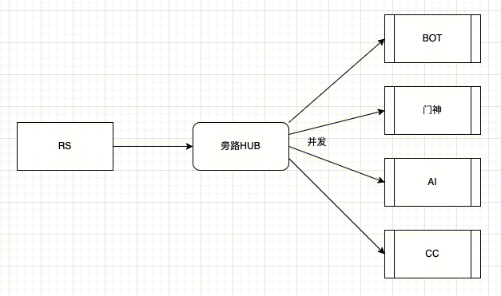
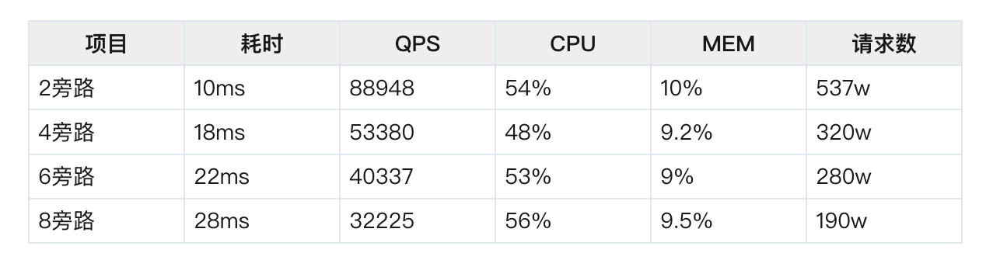
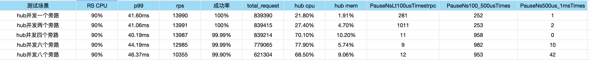
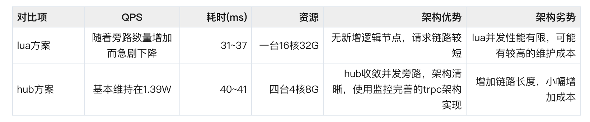
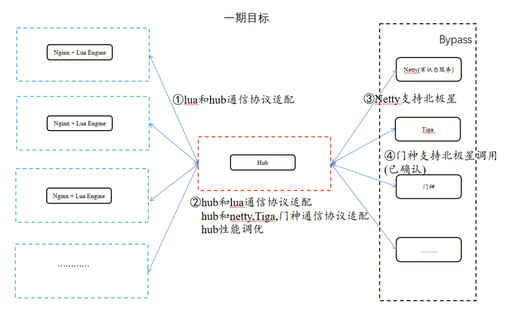
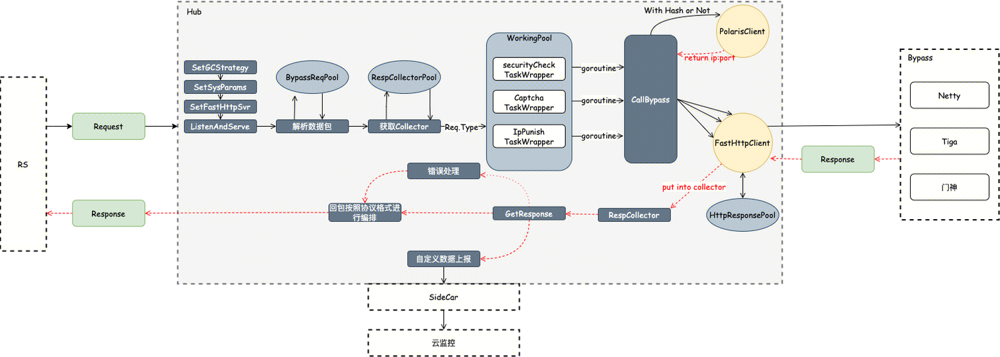
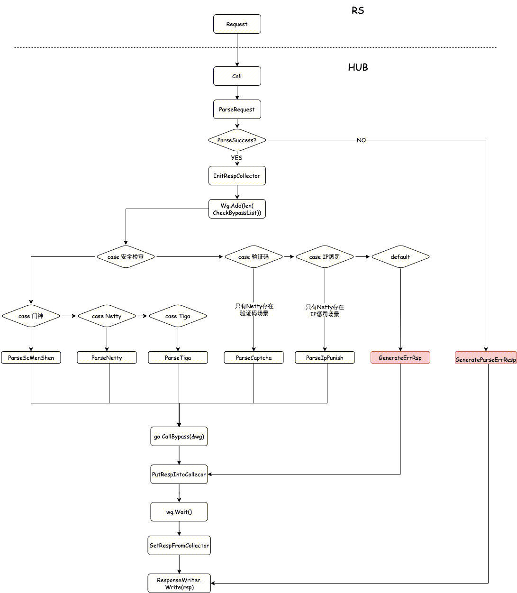
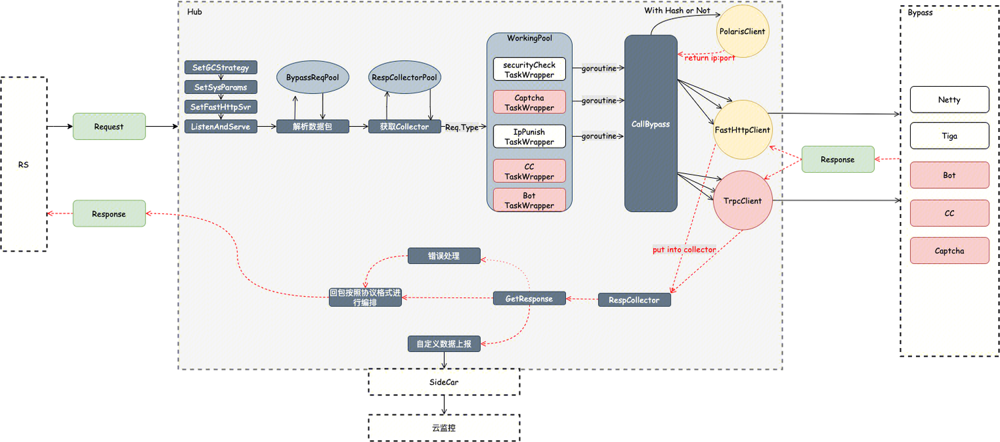

## 目标
优化waf旁路架构，将RS串行调用检测引擎修改为调用HUB，由HUB进行并发调用检测引擎。在保证业务稳定的前提下，提升系统的可观测和性能，减少检测延时，并降低系统成本。


## 预言


RS为业务模块，本次需要实现的旁路HUB，后面的调用方也是业务模块。

- 1.旁路HUB使用TRPC架构实现，可以分别实现两个service，一个接受trpc协议，一个接受http协议。如果时间有限，有限trpc的。
- 2.使用go并发协程调用后端的业务服务，业务服务的耗时使用sleep模拟，具体时间控制，可以放在配置中，配置一个范围。
- 3.后端服务的个数支持可配置。
- 4.使用1核1G压测，需要收集的数据CPU、内存，耗时。这些可以通过007观测到。
- 5.压测数据包大小为1K。

### RS调用HUB Trpc协议下测试

hub部署机器：4台4核8G

测试结果：
模拟下游单个请求耗时：2～3ms


测试结论

- 1.压测服务为TRPC协议。这里需要对比RS支持TRPC请求和直接发起http，性能和开发代价
- 2.随着并发数量的增加，请求的耗时会随之增加，QPS降低
- 3.由于使用协程池，CPU和内存不会有明显的波动


### RS调用HUB http协议测试

hub部署机器：4台4核8G

测试结果：

测试结论：

- 1.在并发旁路数量增加时，整体的耗时和QPS没有明显的变化，CPU消耗会随着旁路数量增加而增加

### 整体结论


- 1.hub如果需要承担500W的QPS，大概需要1428台4核8G，成本17W/月
- 2.可以将两种方案结合起来，在RS实现一些配置用于控制所需发到hub的数据，来减少无意义的传输，hub来实现解耦和并发

## 一期
### 架构

### 本期目标
- 1.接入hub，通过北极星调用旁路
- 2.RS的旁路串行修改为hub调用
- 3.旁路实现北极星调用
- 4.优化旁路调用，根据用户建设旁路调用，节省流量，提高并发性能。
- 5.安全引擎RS本地化

### 可观测
基于云监控提供数据上报和指标监控

### hub
### 逻辑流程图


### 流程图



### 协议

接口
``` 
//定义服务接口
service Hub {
    //查询旁路接口
    rpc QueryBypass (QueryBypassReq) returns (QueryBypassRsp) {}
}
```

请求
``` 
//旁路类型
enum BypassType {
    BYPASS_TYPE_INVALID = 0;
    //netty
    BYPASS_TYPE_NETTY = 1;
    //tiga
    BYPASS_TYPE_TIGA = 2;
    //门神
    BYPASS_TYPE_MENSHEN = 3;
}

//场景类型
enum ScenesType {
    SCENES_TYPE_INVALID = 0;
    //安全检查
    SCENES_TYPE_SECURITY_CHECK = 1;
    //验证码
    SCENES_TYPE_CAPTCHA = 2;
    //IP惩罚
    SCENES_TYPE_IP_PUNISH = 3;
}

//调用状态
enum CallStatus {
    CALL_STATUS_INVALID = 0;
    //成功
    CALL_STATUS_SUCC = 1;
    //超时
    CALL_STATUS_TIMEOUT = 2;
    //失败
    CALL_STATUS_FAIL = 3;
}


message QueryBypassReq{
    //公共头
    trpc.waf_platform.common.CommonHeader common_header = 1;
    //三种场景：安全检查，验证，IP,参考ScenesType
    uint32 type = 2;
    //需要调用旁路
    repeated uint32 check_bypass = 3;
    //header
    map<string,string> headers = 4;
    //请求包首行
    string request = 5;
    //请求体
    string body = 6;
}
```
响应
``` 
message BypassRsp{
    //旁路回包
    string rsp = 1;
    //返回码
    string code = 2;
    //调用结果,参考CallStatus
    uint32 call_status = 3;
} 

message BypassData {
    //key:BypassType value:旁路返回数据
    map<uint32,BypassRsp> bypass_datas = 1;
}

message QueryBypassRsp{
    //公共回包
    trpc.waf_platform.common.CommonRsp common_rsp = 1;
    //旁路 data
    BypassData data = 2;
}
```


## 二期

### 目标
- 1.支持hub使用trpc协议调用cc、bot、验证码等内部引擎，使用http协议调用tiga、menshen等外部引擎。
- 2.性能优化，针对json解析部分（CPU占用耗时比例约为18%）进行优化。

### 与一期的差异
#### hub一期逻辑流程图

#### hub二期逻辑流程图


### json优化
探索了一下json解析方式：

- encoding/json
- fastjson
- 自己的写的json序列化 (基于确定的数据结构来进行优化)
- snoicjson

最终snoicjson表现最好，采用该json解析库。