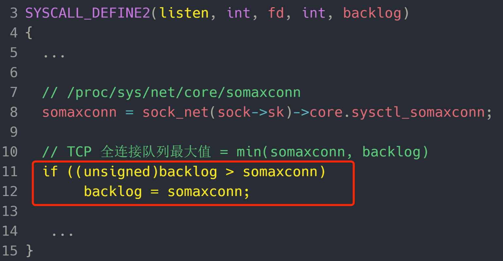
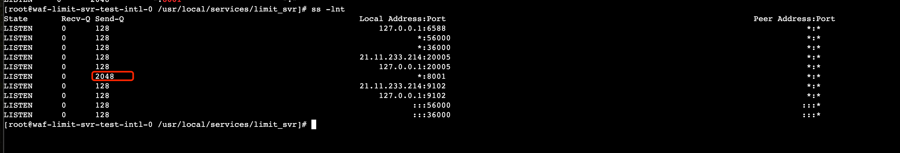

https://www.cnblogs.com/xiaolincoding/p/12995358.html?from_wecom=1

服务端

1.连接队列溢出
观察到服务端在压测期间有大量的listen queue of a socket overflowed的情况，发生 TCP 全连接队溢出的时候，后续的请求就会被丢弃（或者是reset，取决于tcp_abort_on_overflow）。

什么情况下请求会被丢弃掉？
1.如果半连接队列满了，并且没有开启 tcp_syncookies，则会丢弃；
2.若全连接队列满了，且没有重传 SYN+ACK 包的连接请求多于 1 个，则会丢弃；
3.如果没有开启 tcp_syncookies，并且 max_syn_backlog 减去 当前半连接队列长度小于 (max_syn_backlog >> 2)，则会丢弃；1.

由于tcp_syncookies（0:关闭，1:当SYN半连接队列放不下时启用，2:无条件启用）是开启的，因此不会出现因为半连接队列满了而丢弃连接的情况。

如何增大全连接队列？
TCP 全连接队列的最大值取决于 somaxconn 和 backlog 之间的最小值，也就是 min(somaxconn, tcp_max_syn_backlog)，tkex上pod的默认值somaxconn为2048，backlog为8192. 因此全连接队列最大值为2048.

优化方案
1.内核参数调优，增大全连接队列
2.协议替换

