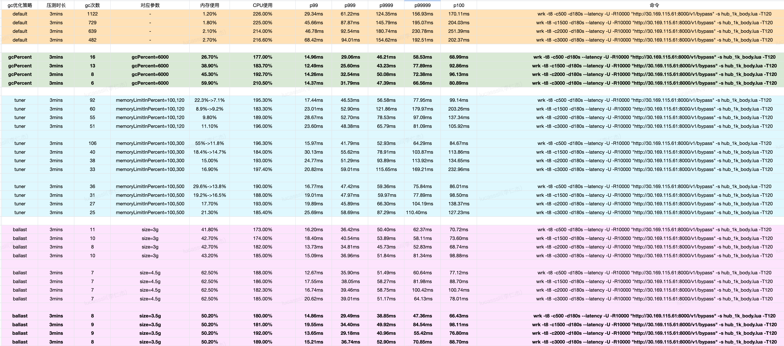

## 引用

- [垃圾回收](../../basic/golang/gc.md)
- [操作系统内存管理](../../basic/os/mem.md)
- [堆内存分配](../../basic/golang/heap.md)
- [栈内存分配](../../basic/golang/stack.md)

## GC对延时的影响
Go的GC会在运行时暂停应用程序的执行，以便回收不再使用的内存。
这些暂停时间可能会导致应用程序的延迟增加，影响性能。

HUB是一个对响应延时要求较高的应用，应当尽量避免GC对程序延时的影响。

使用wrk压测，发现长尾延时较高，不满足最低时延(60ms)要求。
统计gc次数，发现gc较为频繁。

### 调优方案

减少程序运行期间gc花费的时间可以分为两个方面：

- 降低gc花费的时间
- 减少gc次数

主要使用两个优化思路：

- 1.减少堆对象创建（gc三色标记时间和堆对象数量正相关）
- 2.优化gc触发策略（减少gc触发的次数）

### 减少堆对象的创建

#### 1.尽量把对象分配到栈上
堆内存是由程序申请分配，需要gc回收，因此需要尽量避免堆内存的使用，将内存分配到栈上。

- 在调用方函数内部创建的对象通过参数（指针或非指针）的形式传递给被调用方时，该变量都会使用`栈`内存。（通过指针传递参数，可以避免参数拷贝）
- 在被调用函数内部创建的对象通过指针形式返回给调用方时，该变量会使用`堆`内存。（如果调用者访问该地址，栈空间已经被回收，将存在野指针的问题）
- 在被调用函数内部创建的对象通过非指针形式返回给调用方时，该变量会使用`栈`内存。（但是存在对象在栈帧间复制的过程.当前栈帧中为返回值分配空间，并在函数执行完毕后将返回值复制到调用者的栈帧）

详细解释见[逃逸分析](../../basic/golang/stack.md#_13)

> 一方面，我们要避免对象拷贝带来的性能开销。另一方面，我们要避免对象逃逸到堆上。
所以选择在调用方函数内部创建对象，通过指针的形式传递给被调用方。非特殊情况（例如变量太大等），该变量会存在`栈`内存，且避免了函数参数拷贝。

在hub中，参数传递都是基于这样的方式：

在被调函数中去修改变量。

又例如在api中，

#### 2.对象复用
对于需要频繁创建同一类对象，一是每次创建需要申请内存，二是使用完需要gc回收。

可以通过syncPool保存和复用堆上的对象，减少内存分配且减少垃圾对象，降低GC压力。

[syncpool详解](../../basic/golang/syncpool.md)

例如

#### 3.Goroutine复用
新建Goroutine需要为Goroutine分配初始栈空间和数据结构空间，这些内存都是分配在golang进程的堆上。

HUB中，每收到一个请求，都会启动一个协程去处理当前请求。在QPS较高的情况下，会大量频繁的创建协程，处理完一个请求之后又销毁协程，这将带来大量的内存申请和释放，给gc造成压力。

如果通过协程池的方式，申请、释放协程都将从协程池复用，可以减少内存申请操作。

例如，HUB中使用了ants协程库，来复用协程

### 优化gc触发策略
[gc触发策略](../../basic/golang/gc.md#gc)详解
#### GCPercent
GCPercent是通过加大内存增长阈值，来减少gc次数的一种方案。

#### Ballast
ballast通过在堆上分配一个巨大的对象(一般是几个 GB)来欺骗GOGC，极大提高了下一次GC的内存阈值，减少GC触发频率。

需要要求golang用户程序在没有充分利用内存的情况下，才能使用该策略。

ballast分配的是虚拟内存，不会体现在物理内存的使用上。[操作系统内存管理](../../basic/os/mem.md)

#### 整体优化效果对比

最终hub使用了40%虚拟内存的ballast策略
