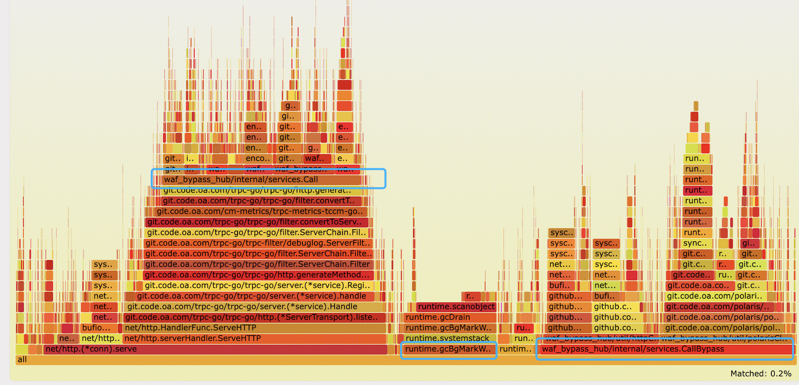

## 1 前言
CPU、内存、磁盘与网络通常是与服务运行不可分割的四种服务器资源类型。对于**计算密集型的程序**，其主要特点是要进行大量的计算，消耗CPU资源，因此优化的主要精力需要放在CPU计算和调度的优化上。对于**io密集型的程序**，其主要消耗在于等待IO操作的执行，因此优化的目标可以放在降低服务的延时、提升系统吞吐量上。

本文涉及优化的系统是一个CPU密集型的任务，主要的优化目标是使系统在具有较高稳定性、较低延时的基础上具有较好的吞吐量，整个程序的主要执行逻辑可以分为：收上游的包--》解包--》组包--》发包给下游--》等待下游回包---》解析回包---》组包返回给上游，主要的CPU消耗在于解包和组包，主要的IO是网络IO。本文将按照性能优化准则、准备工作、分析工具、优化技巧总结的顺序展开。

为了减少goroutine创建和销毁带来的性能损耗，同时保证系统的稳定性，本系统使用了任务池(antsPool)进行了并发控制，然而在测试中发现了一个很有趣的点：当下游回包速度很快时，通过高并发屏蔽了网络IO带来的延时，整个系统偏向于CPU-Bound。当下游处理速度很慢的时候，由于并发的限制，系统看起来又变成了I/O-Bound。

## 2 性能优化总则
#### 优化越靠近应用层效果越好
>Performance tuning is most effective when done closest to where the work is performed. For workloads driven by applications, this means within the application itself.

#### 优化是与业务场景相关的

## 3 优化准备工作

### 3.1 BenchmarkTest
基准测试是测量一个程序在固定工作负载下的性能，Go语言也提供了可以支持基准性能测试的benchmark，为了在本地验证代码优化后的性能提升效果，往往需要针对优化的函数通过基准测试验证优化效果。

下面代码是对string类型转化为byte类型方法的基准测试，通过测试可以看到一定压力下方法耗时和内存分配情况。
``` 
import (
    "testing"
    "unsafe"
)
// 测试中使用的字符串比较大，影响阅读，因此这里随便填一个
var str = "testStr"

func BenchmarkS2BOld(b *testing.B) {
    for j := 0; j < b.N; j++ {
        _ = []byte(str)
    }
}
func BenchmarkS2BNew(b *testing.B) {
    for j := 0; j < b.N; j++ {
        tmp1 := (*[2]uintptr)(unsafe.Pointer(&amp;str))
        tmp2 := [3]uintptr{tmp1[0], tmp1[1], tmp1[1]}
        _ = *(*[]byte)(unsafe.Pointer(&amp;tmp2))
    }
}
```
在代码目录下执行` go test -bench=. -benchmem`,可以看到基准测试结果：

``` 
goos: linux
goarch: amd64
pkg: waf_bypass_hub/util/commonUtil
cpu: AMD EPYC 7K62 48-Core Processor
BenchmarkS2BOld-8 4664612       268.4 ns/op      2304 B/op       1 allocs/op
BenchmarkS2BNew-8 1000000000    0.3080 ns/op     0 B/op          0 allocs/op
BenchmarkB2SOld-8 215582        5674 ns/op       27200 B/op      40 allocs/op
BenchmarkB2SNew-8 408912        3025 ns/op       4160 B/op       30 allocs/op
PASS
ok      waf_bypass_hub/util/commonUtil  4.405s
```
[参考：Golang周边 | Benchmark性能测试](https://juejin.cn/post/6970615934255906830) 

### 3.2 压力测试工具wrk2
[wrk2安装和入门总结](https://blog.csdn.net/ccccsy99/article/details/105958366) 

### 3.3 优化的流程
A(建立评估指标) 

B(wrk压测到无法满足性能要求)--> C(寻找性能瓶颈)--> D(代码优化)--> E(Benchmark测试验证优化效果)-->B(wrk压测到无法满足性能要求)

## 4 性能剖析工具

#### 4.1 pprof
Profiling 是指在程序的执行过程中，收集能反映程序执行状态的数据，例如程序执行所占用内存、特定指令的使用情况或函数调用的频率和持续时间，等等。Profiling 最常见的应用就是帮助应用程序定位和优化性能问题。

pprof 是 Golang 内置的 Profiling 工具，它主要支持以下几个维度的 Profiling：

- cpu：CPU 分析，按照一定的频率采集所监听的应用程序的 CPU 使用情况。
- heap：内存分析，记录内存分配情况。用于监控当前和历史内存使用情况，辅助检查内存泄漏。
- threadcreate：反映系统线程的创建情况。
- goroutine：当前所有 goroutine 的堆栈跟踪。
- block：阻塞分析，记录 goroutine 阻塞等待同步的位置，可以用来分析和查找死锁等性能瓶颈。
- mutex：互斥锁分析，记录互斥锁的竞争情况。

如果服务使用了trpc框架，可以通过在trpc_go.yaml文件中配置admin开启官方火焰图代理服务。
```
server:                               #服务端配置
  admin:
    ip: 0.0.0.0
    port: 6060
    read_timeout: 3000
    write_timeout: 60000
    enable_tls: false
```
在办公网浏览器输入以下地址即可查看自己服务的火焰图，其中ipport参数为你的服务的admin地址
```
http://trpcgo.debug.woa.com/debug/go-torch?ip={$ip}&amp;port=${port}
http://trpcgo.debug.woa.com/debug/proxy/profile?ip={$ip}&amp;port=${port}
http://trpcgo.debug.woa.com/debug/proxy/trace?ip={$ip}&amp;port=${port}
http://trpcgo.debug.woa.com/debug/proxy/heap?ip={$ip}&amp;port=${port}
```
火焰图支持搜索，支持在每个函数上点击缩放，从而方便对 Profiling 结果进行精细分析。


- X 轴表示抽样数，如果一个函数在 X 轴占据的宽度越宽，就表示它被抽到的次数多，即执行的时间长。
- Y 轴表示调用栈，每一层都是一个函数。调用栈越深，火焰就越高，顶部就是正在执行的函数，下方都是它的父函数。

更多关于pprof的细节可以参考[一文搞懂pprof](https://zhuanlan.zhihu.com/p/260450151) 
#### 4.2 strace
...
更多关于strace的指南可以参考[强大的strace命令用法解析](https://www.linuxidc.com/Linux/2018-01/150654.htm)
## 5 性能优化总结

### 5.1 http库
1.`fasthttp`库替换标准http库

### 5.2 json库
1.`fastjson`库替换encoding/json
2.`IteratorJson`库替换标准库

### 5.4 gc调优
对性能有较高要求的系统面对自动垃圾回收型语言中的STW时或多或少会导致性能下降，对于gc调优主要包括以下两个部分：
1. 减少临时堆对象的创建
1. 优化gc触发策略

接下来将对这两部分常见的优化点做介绍～
#### 5.4.1 减少临时堆对象的创建
由于栈内存会随着函数的调用进行分配和回收，而堆内存是由程序申请分配，需要gc回收，因此需要尽量避免堆内存的使用。当然，Go会尽可能的将内存分配到栈上，当分配到栈上可能导致譬如内存非法访问等问题时会使用堆内存，**通常**分配原则包括：
1. Sharing down typically stays on the stack!! 
在调用方函数内部创建的对象通过参数的形式传递给被调用方时，该变量会使用栈内存
1. Sharing up typically escapes to the heap!!
在被调用函数内部创建的对象通过指针形式返回给调用方时，该变量会使用堆内存


{对象复用：对象池｜syncPool}

对于需要频繁创建同一类对象，且创建成本较高时，可以通过syncPool保存和复用堆上的对象，减少内存分配，降低 GC 压力
``` 
goos: linux
goarch: amd64
pkg: waf_bypass_hub/util/jsonParser
cpu: AMD EPYC 7K62 48-Core Processor
BenchmarkJsonMarshalNoPool-8      301642              4529 ns/op            1160 B/op         60 allocs/op
BenchmarkJsonMarshalPool-8        307179              3965 ns/op             200 B/op         40 allocs/op
```
#### 5.4.2 优化gc触发策略
##### Go的gc触发机制
##### 设置GCPercent
##### Tuner
##### Ballast

### 5.3 代码优化小技巧

1.通过`fastjson`将string转为map[string]interface{} 
``` 
BenchmarkUnjsonMapFastJson-8      355209             13342 ns/op            7521 B/op         88 allocs/op
BenchmarkUnJsonmap-8               71284             18549 ns/op           12321 B/op        350 allocs/op
```

2.`fastjson`中通过池化复用解析器
``` 
BenchmarkParseJsonWithPool-16            2680            434854 ns/op
BenchmarkParseJson-16               1273            904369 ns/op
```

3.slice内存预分配、自定义字符串拼接操作

``` 
BenchmarkAppend-16                941808              1286 ns/op
BenchmarkAppend-16                944014              1285 ns/op
BenchmarkAppend-16                918070              1287 ns/op
BenchmarkAppendNew
BenchmarkAppendNew-16            2670049               444.3 ns/op
BenchmarkAppendNew-16            2695192               445.0 ns/op
BenchmarkAppendNew-16            2651419               449.4 ns/op
```

4.结构体转bytes实现
``` 
goos: linux
goarch: amd64
pkg: waf_bypass_hub/util/jsonParser
cpu: AMD EPYC 7K62 48-Core Processor
BenchmarkJsonMarshal-8            106662             15862 ns/op
BenchmarkJsonMarshal2-8           148062              9081 ns/op
```

5.String2Byte & Byte2String,直接修改数据结构，避免拷贝，减少内存分配 
``` 
goos: linux
goarch: amd64
pkg: waf_bypass_hub/util/commonUtil
cpu: AMD EPYC 7K62 48-Core Processor
BenchmarkS2BOld-8        2764716               431.7 ns/op
BenchmarkS2BNew-8       1000000000               0.3137 ns/op
BenchmarkB2SOld-8         166441              7260 ns/op
BenchmarkB2SNew-8         395370              3037 ns/op
PASS
```

## 参考
[技术干货|理解Go内存分配](https://cloud.tencent.com/developer/article/1861429) 