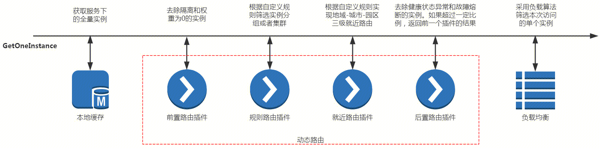
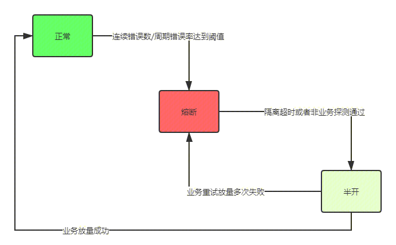

服务调用主要涉及 健康检查、熔断、负载均衡、规则路由。



## 健康检查 

健康检查不由服务端主动探测，而是以来下游服务客户端通过SDK主动上报心跳。
例如在应用程序中引入北极星客户端SDK，每TTL调用一次上报心跳接口。如果服务端超过3*TTL没有收到某个服务实例上报心跳，将其健康状态设置为异常。

下游服务实例的健康状态由服务端下发给调用下游的客户端，如果修改某个下游服务实例的健康状态，调用该服务的所有客户端都会收到状态变更，并缓存到本地。


```golang
for i := 0; i < count; i++ {
    log.Printf("start to heartbeat, index %d", i)
    hbRequest := &api.InstanceHeartbeatRequest{}
    hbRequest.Namespace = namespace
    hbRequest.Service = service
    hbRequest.Host = ip
    hbRequest.Port = port
    hbRequest.ServiceToken = token
    if err = provider.Heartbeat(hbRequest); nil != err {
        log.Printf("fail to heartbeat, error is %v", err)
    } else {
        log.Printf("success to call heartbeat for index %d", i)
    }
    <-time.After(1500 * time.Millisecond)
}
```


## 服务熔断
故障熔断的是北极星提供的一种在主调方侧迅速自动屏蔽错误率高或故障的服务实例，防止故障扩散，提升业务成功率的一种机制。

熔断机制：

如果一个被调连续错误10次 或 最近一分钟请求大于10且错误率大于50%  则触发故障熔断。
`故障熔断机制当前默认是主调SDK内存中进行统计决策`，不同的SDK对象的数据统计和决策结果不会相互影响。相比于健康检查，故障熔断还可以处理主调到被调网络故障、被调高负载等问题。有一下两种熔断原因:

- 熔断原因：errCount，在统计周期内，连续异常数目超过阈值（熔断配置中的continuousErrorThreshold，默认10）之后，节点进入熔断状态，即在接下的时间窗口（熔断配置中的sleepWindow)，该节点不参与调度
- 熔断原因：errRate，当资源的每分钟请求量 >= N（可配置，默认10次），并且每分钟异常总数占通过量的比值超过阈值（熔断配置中的errorRateThreshold）之后，节点进入熔断状态，即在接下的时间窗口（熔断配置中的sleepWindow，默认30s)，该节点不参与调度


熔断恢复机制：

节点熔断后，每30s会进入半开状态释放少量请求进行恢复探测，业务可根据自己需求配置网络探测，网络探测成功以后才进入半开。或者调大进入半开探测恢复的时间间隔。


全死全活机制：

为了防止网络闪断导致集群节点全熔断，从而由于无可用节点导致业务路由失败的情况发生，北极星默认会开启全死全活机制：当某个路由目标集群节点全被熔断了，北极星会默认放通该目标集群的所有实例。




## 负载均衡
北极星提供负载均衡能力，支持从满足本次转发要求的服务实例集中， 通过一定的均衡策略，选取一个实例返回给主调方，供主调方进行服务请求发送。


### 负载均衡策略分类

#### 无状态负载均衡
无状态负载均衡策略，主要特点是每次负载均衡获取到的结果是由具体的负载均衡算法决定。目的是让负载均匀的分发到后端节点。

主要负载均衡策略包括：权重随机，权重轮询等

对于无状态的业务逻辑，为了保证后端节点能够均衡分配请求，此时应该选择权重随机负载均衡策略

#### 有状态负载均衡
有状态负载均衡策略，除了要达到让负载均衡分散到节点的目标以外，还需要实现将同一对象的请求分发到同一个节点。例如业务场景需要将同一个用户的全部请求发送到后端同一个节点处理的情况。

主要负载均衡策略是一致性hash

#### 可选的负载均衡策略

1.权重随机
负载均衡器名称：weightedRandom

权重随机负载均衡策略，利用区间算法，基于伪随机因子取模的方式选择对应服务实例。

对于有状态的业务逻辑（比如通过用户ID或者请求ID进行hash分区的），为了保证同key请求能够持续命中同一个物理节点，此时应该选择一致性hash负载均衡策略

2.权重一致性hash（环算法）
负载均衡器名称：ringHash

该负载均衡策略基于ketama环算法，每一个服务实例会按照权重分裂成若干个虚拟节点。虚拟节点通过取hash值的方式，映射到长度为2^32的hash环中。

发起查询时，北极星会基于用户传入的hashKey，计算出具体的hash值，然后到环中寻找hash值刚刚好大于传入数据hash值的虚拟节点，并返回其对应的服务实例

3.权重一致性hash（Maglev算法）
负载均衡器名称：maglev

该负载均衡策略基于maglev算法（https://static.googleusercontent.com/media/research.google.com/en//pubs/archive/44824.pdf）进行节点分配。

首先为实例集创建一个长度为质数65537的向量表，算法根据节点的权重，将向量表进行填充，直到向量表全部被节点所占满。取节点时则根据用户传值的hashValue取摸的方式，返回对应下标的节点。

算法优点：由于是直接取模寻址，因此算法性能相比ketama环要高（官方数据是在256K个插槽的情况下，性能是5X到10X的差距）。

算法缺点：当节点下线后，导致迁移的节点数量相比ketama环要多（官方数据为迁移节点数量是ketama的两倍）


## 规则路由

北极星的规则路由功能主要通过为实例配置标签，并通过规则匹配标签的方式完成选择特定实例的调用。可完成多环境路由、分SET路由、灰度发布、集群容灾降级、金丝雀测试等功能。规则路由可指定主调和被调规则，并支持正则匹配。


北极星提供规则路由的能力，本质上就是通过规则来动态控制消息的分配转发。

通过该功能，用户基于北极星可以轻松实现多环境路由、分SET路由、灰度发布、集群容灾降级、金丝雀测试等功能。

主调业务请求发送至被调业务实例：针对某个请求，业务会通过北极星SDK拿到某个被调实例的IP:PORT，然后发起调用：

主调业务请求：业务请求具有业务属性（例如来自深圳的用户请求），请求发送自某个主调那同时具体该主调的数据（例如请求来自特性环境test1的主调）

被调服务实例：业务可以对被调实例打上一些标签，例如特性环境、SET、版本等信息

规则路由：通过规则配置具有X属性的请求通过北极星只会拿到具有Y标签的实例

规则路由的规则里可以配置很多条规则，每条规则分成两部分：

请求匹配规则：标示具有某一类型的请求

实例匹配规则：指定该类型的请求在服务发现时去匹配具有哪些标签的相关实例