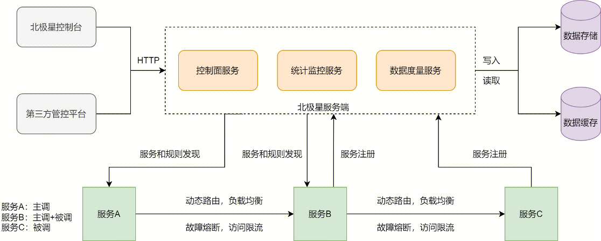

## 运行流程

### 主调方功能

- 服务发现：从服务端获取服务注册信息以及动态路由/故障熔断/负载均衡/访问限流规则
- 动态路由：根据动态路由规则从被调方服务实例中，筛选符合条件的服务实例分组
- 负载均衡：根据负载均衡策略从符合条件的服务实例分组中，筛选单个服务实例
- 故障熔断：根据熔断规则和服务调用结果，判断是否屏蔽或者恢复某些服务实例

### 被调方功能

- 服务注册：被调方节点在启动时注册服务地址
- 上报心跳：被调方节点上报心跳到健康检查服务器
- 访问限流：根据限流规则执行本地或者分布式限流

### 北极星服务端功能

- 控制面服务：远程配置和下发动态路由/故障熔断/负载均衡/访问限流规则，控制数据面执行逻辑
- 统计监控服务：收集数据面上报的运行数据，实现可视化和告警配置，支持数据面状态的可观测

### 部署
以客户端SDK或者sidecar的形式部署使用

