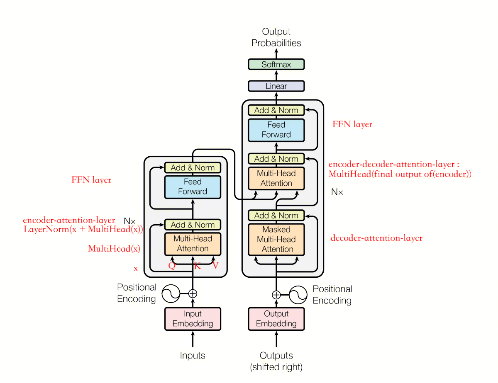
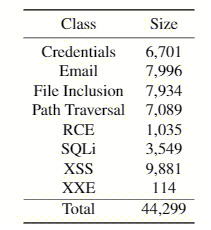
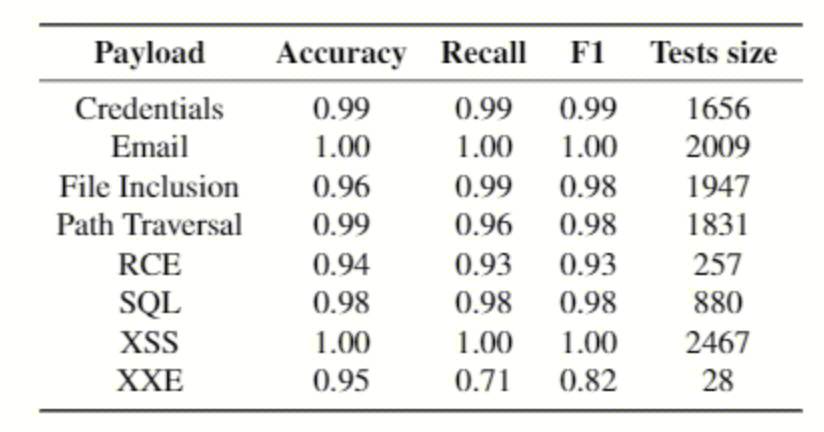

## Main Idea
将PayLoad作为文本序列，利用NLP领域的Transformer模型，对文本序列进行分类。
## 模型
### Transformer

Transformers are better at classifying text and they outperform classical deep learning and machine learning approachs such as LSTM , RNN networks and Support Vector Machines (SVM).
### BERT
For this specific task of classifying payloads, BERT  was chosen. BERT (Bidirectional Encoder Representations from Transformers) is a self-supervised deep transformer encoder , its unsupervised technique learns contextualized representations of sequences of text. Its pre-trained model was trained by Google to perform different NLP tasks . To be able to work with transformers, Tensorflow , hugging faces and Ktrain libraries were used.
## 流程
### 数据集
The total size of the dataset was 44,299 samples from eight distinct classes, being six malicious payload classes and two non malicious classes

- Credentials 和 Email 为正常Web流量
- File Inclusion 、 Path Traversal 、 RCE ： Root Code Execution 、 SQLi 、XSS 、 XEE：XML External Entity 为恶意payload

### 训练
基于BERT预训练模型，使用Payload数据集来fine-tune模型参数，使其更加适合于Payload检测。

## 效果

