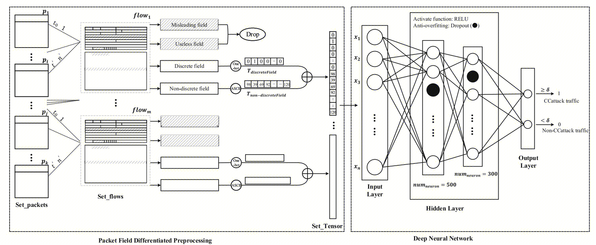

## Challenge Collapsar Attack Traffic Detection Based on Packet Filed Differentiated Preprocessing and DEep Neural Network

## Challenge Collapsar
随着互联网的篷布发展，DDos分布式拒绝服务攻击已经越来越成为棘手的问题。CC(challenge Collapsar)攻击是DDos的一种，它通常向服务器发起需要消耗大量计算或者频繁操作数据库的伪造请求。由于CC攻击的标准的HTTP请求，甚至攻击源IP都是真实的。因此CC攻击比较难以难以防御。

## Flow
如何从大量的网络包中，抽取出HTTP FLow呢？
文中采用的是【sip，sport，dip，dport】四元组来唯一标识一个http flow。
这样就将Set_packets split into Set_flows

## Flow Encode
如何编码一个Flow，使其作为DNN的输入呢？
文章将flow中一些容易造成混淆或者一直不变的部分丢弃掉了
将离散的变量进行了onehot编码
将联系的变量比如body进行了acsII编码
最终形成了可以作为DNN输入的Tensor

## Fix Size Flow
由于DNN的神经元个数是固定的，因此输入的Tensor维也需要固定。
文章通过对比实现，选择了一个Update FLOW的标准。
首先，只从原始的Flow中摘取出0.5s作为新的Flow。理由是，cc攻击主要是要消耗服务器资源，因此请求通常短且高频。
其次，从上一个过滤出来的Flow中，只选取18个packet。因为，根据统计，平均flow的packets量是17.96.
最后，每个packet的length只取64字节。这是根据实验对比选择的。
通过上述过滤，每个Flow都是固定大小的了。
通过这些Update FLow通过FLow Encode之后，将会的到一个1152维的Tensor。

## DNN
输入为1152维， 输出为2维

## 总结
文章思想比较简单，所有的想法都比较adhot。
将flow作为最小的分类单位。