## sample and label 
观测1-n  : x^1 .. n 

和 Groud Truth : 1 , -1
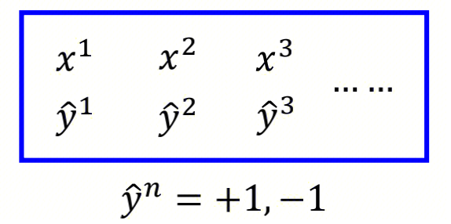

## model
model : g(x)
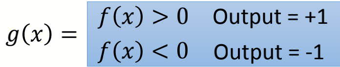

## fancied Loss
g(x)在训练集上分类错误的次数：
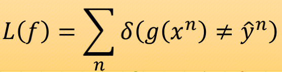
sigma函数：相等取0，不等取1

# Support Vector Machine
支持向量机用来可以解决二分类的问题，
其具有两个特点：

- Hinge Loss
- Kernel Trick
## Model Function
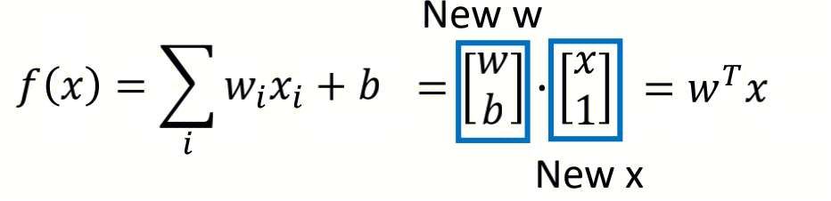
SVM的model function和Logistic Regression的model function是一致的，都是线性函数。
Logistic Regression是回归问题，旨在拟合。
SVM是分类问题，旨在划分。
SVM他的基本模型是的定义在**特征空间**上的**间隔最大**的线性分类器。
### How to find W
SVM的模型给出之后，如何通过training data去求取参数W呢？
这里使用梯度下降的方法去求解。
梯度下降求解，只要求Loss Function是可微分的。
下面就来看看如何选取Loss Function。

## Loss Function
### fancied Loss
上述的fancied loss是不可微分的，难以使用梯度下降的方式求解。
### Square Loss
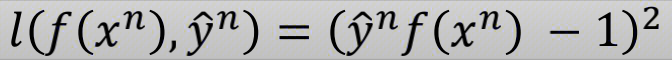
### Sigmoid + Square Loss
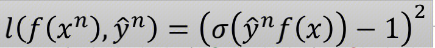
### Sigmoid + Cross Entropy Loss
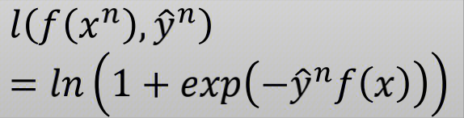
### Hinge Loss
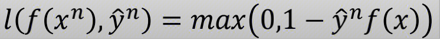
### In All
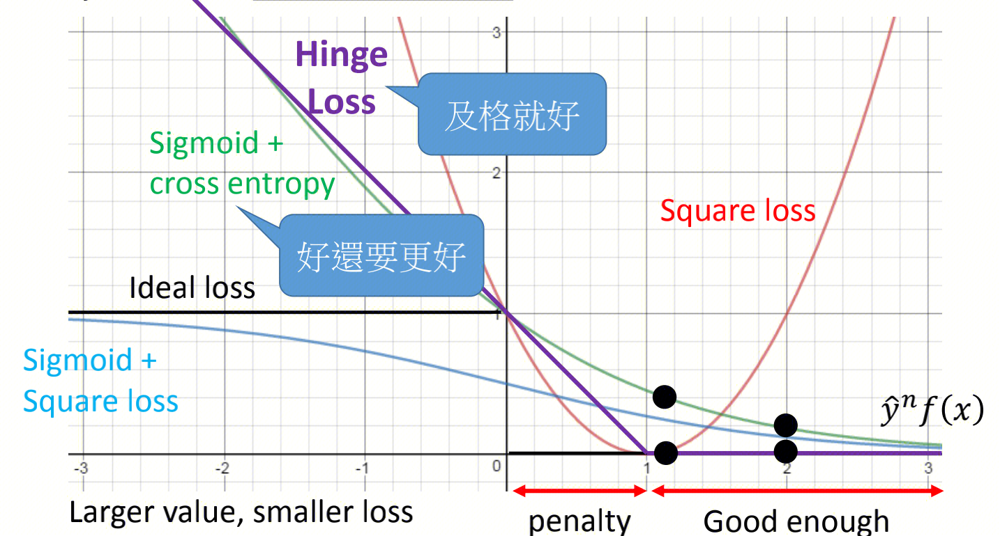
Hinge Loss是最为合理的。
Hinge Loss的解释：
Good enough的地方，是指一些离划分平面较远的点。它们的Loss都是0，这些点对求解W没有意义。并非Support Vector。
转折点的地方，是恰好在划分平面上的点。它们的Loss也是0，但是如果稍微有一些偏差，就会产生Loss了。这些点是真正用于求解W的点。因此成为Support Vector。
## How to minimize Loss Function
### By Gradient Descent
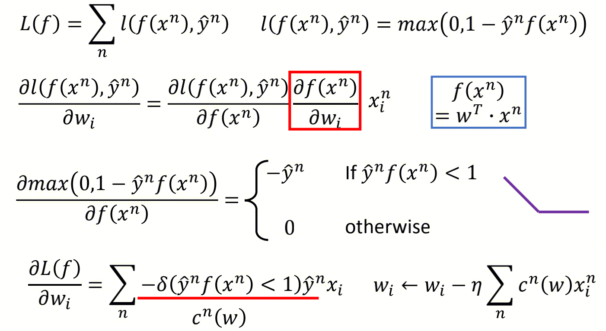
### By Dual Representation and Quadradic Problem

非常建议下来看一下求解过程 **https://zhuanlan.zhihu.com/p/49331510**
在公式中，E为软间隔。
在前面的讨论中，我们一直假定训练数据是严格线性可分的，即存在一个超平面能完全将两类数据分开。但是现实任务这个假设往往不成立。解决该问题的一个办法是允许SVM在少量样本上出错，即将之前的硬间隔最大化条件放宽一点，为此引入“软间隔(soft margin)”的概念。即允许少量样本不满足约束。

## Kernal Trick
上面介绍的都是线性问题，但是我们经常会遇到非线性的问题，此时就需要用到核技巧(kernel trick)将线性支持向量机推广到非线性支持向量机。需要注意的是，不仅仅是SVM，很多线性模型都可以用核技巧推广到非线性模型，例如核线性判别分析(KLDA)。
核技巧的基本思路分为两步:使用一个变换将原空间的数据映射到新空间(例如更高维甚至无穷维的空间)；然后在新空间里用线性方法从训练数据中学习得到模型。
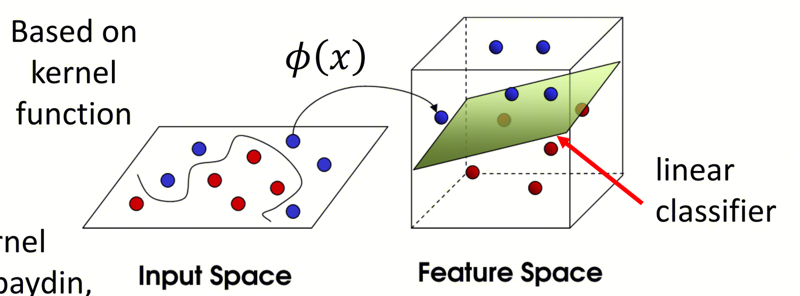
### What is Kernal Function
核函数的定义：
>设X是输入空间(欧式空间Rn的子集或离散集合)，又设H是特征空间(希尔伯特空间)，如果存在一个X到H的映射ϕ(x):X→H使得对所有x,z∈X，函数K(x,z)满足条件K(x,z)=ϕ(x)⋅ϕ(z)则称K(x,z)为核函数，ϕ(x)为映射函数，式中ϕ(x)⋅ϕ(z)为ϕ(x)和ϕ(z)的內积。

通常，直接计算K(x,z)比较容易，而通过ϕ(x)和ϕ(z)计算K(x,z)并不容易。
而幸运的是，在线性支持向量机的对偶问题中，无论是目标函数还是决策函数都只涉及到输入样本与样本之间的內积，因此我们不需要显式地定义映射ϕ(x)是什么而只需事先定义核函数K(x,z)即可。也就是说，在核函数K(x,z)给定的情况下，可以利用解线性问题的方法求解非线性问题的支持向量机，此过程是隐式地在特征空间中进行的。
### How to perform Kernal Trick
上面一段话是比较难以理解的，这里进行每一句话拆分解释。顺带讲解Kernal Trick是如何应用到SVM中的：
>1. 通常，直接计算K(x,z)比较容易，而通过ϕ(x)和ϕ(z)计算K(x,z)并不容易。

这是因为，假设ϕ(x)是无穷维度，那么计算无穷或者巨大维度的ϕ(x)和ϕ(z)的内积是需要大量计算的。
相反，我们可以先计算x和z的内积，然后在用ϕ()进行特征映射。因此K(x,z)是比较好计算的。
例如： 
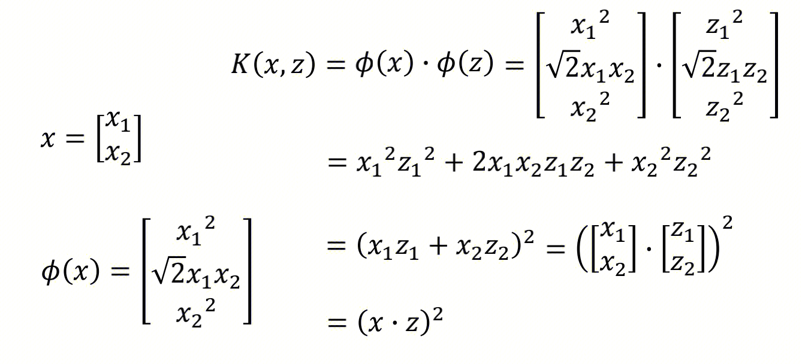
x是二维向量，我们使用平方核函数，将x映射为三维向量ϕ(x)。
右边的等式证明，先继续映射后内积 和 先内积再映射是一样的结果。这里二维向量节省的计算量可以能较少，但是如果x是较高纬的，节省的计算量就会非常明显：
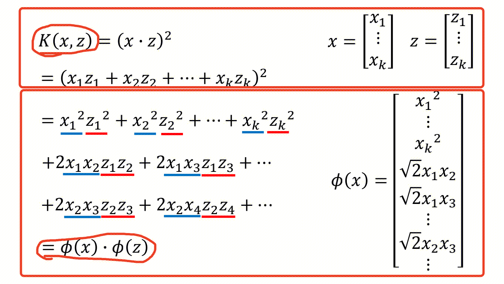

>2. 而幸运的是，在线性支持向量机中，目标函数只涉及到输入样本与样本之间的內积，因此我们不需要显式地定义映射ϕ(x)是什么而只需事先定义核函数K(x,z)即可。

这里为什么说目标函数只涉及到输入样本与样本之间的內积呢？
**首先**，我们看参数W的求解过程：下一次迭代的w是当前w减去学习率乘以梯度。
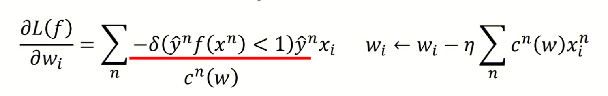
可以整理出：
第一，我们可以认为W是X（所有观测或者所有点）的线性组合：
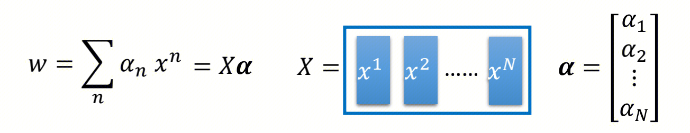
第二，an是一个非常稀的疏矩阵。因为梯度中c(w)是经常为0的（远离分割面的点，计算出来的梯度都是0），即矩阵an中很多值都为0。这些ai为0的点xi对w的求解是没有意义的，他们不能称为支持向量。只有ai不为0的点xi为w的求解是有意义的，他们才是支持向量。
**然后**，我们看核函数如何应用。
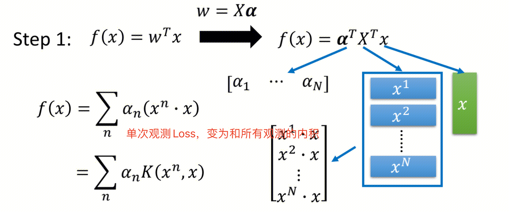
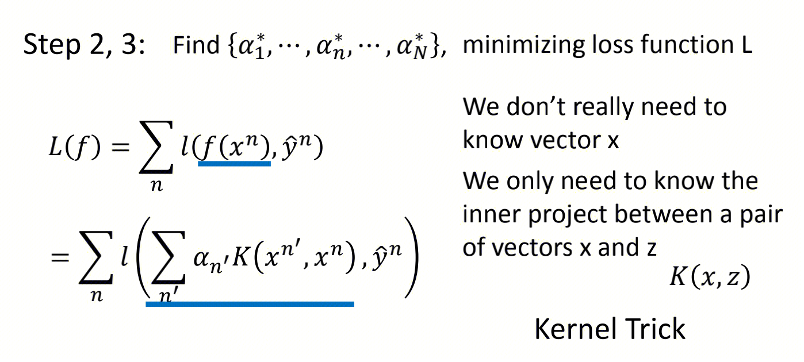

- 第一，把SVM的model进行简单的变化，转化为求解参数a
- 第二，把SVM的Loss Function进行变化，引入了输入样本与样本之间的內积
通过该内积我们可以应用kernal trick。

> 3.也就是说，在核函数K(x,z)给定的情况下，可以利用解线性问题的方法求解非线性问题的支持向量机，此过程是隐式地在特征空间中进行的。

- 什么是利用解线性问题的方法求解非线性问题的支持向量机呢？
假如当训练数据线性不可分时，使用一个变换将原空间的数据映射到新空间(例如更高维甚至无穷维的空间)；然后在新空间里用线性方法从训练数据中学习得到模型。
- 为什么此过程是隐式地在特征空间中进行的？
因为我们不是先显示的提升特征维度得到ϕ(x)和ϕ(z)再计算内积，而是将特征空间提升的过程隐示的包含在了计算了核函数K(x,z)中。这也解释了，为什么我们不需要知道ϕ(x)长什么样，只需要知道核函数公式就可以了。

### common Kernal Function
这里我们介绍一些常见的kernal function。
需要满足什么条件才是一个核函数。
通常所说的核函数就是正定核函数，下面不加证明的给出正定核的充要条件

>设X⊂Rn,K(x,z)是定义在X×X上的对称函数，如果对任意的xi∈X,i=1,2,...,m，K(x,z)对应的Gram矩阵K=[K(xi,xj)]m×m是半正定矩阵，则K(x,z)是正定核。

虽然有了上述定义，但是实际应用时验证K(x,z)是否是正定核依然不容易，因此在实际问题中一般使用已有的核函数，下面给出一些常用的核函数。
- 平方核
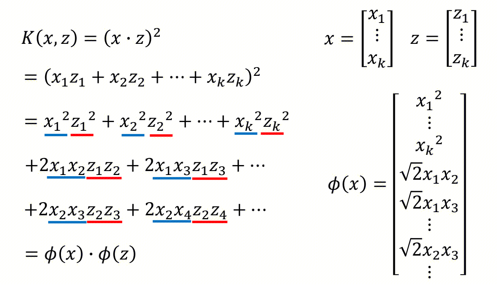
公式中，蓝色拼起来的向量是ϕ(x)，红色拼起来的向量是ϕ(z)，不过我们不用显示的计算ϕ后做内积。而是直接计算Kernal function（先基于公式内积，后做映射ϕ）
- RBF核，也称之为高斯核
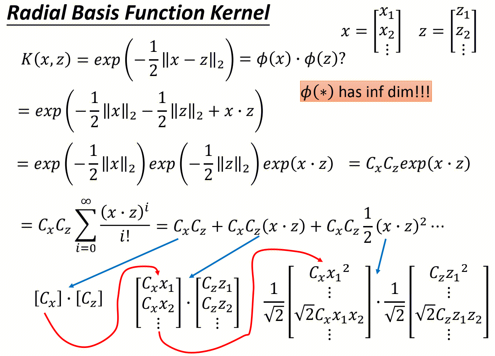
公式中，红色拼起来的向量是ϕ(x)，公式中就可以看出该ϕ(x)是非常难计算的。通过直接计算核函数可以简化计算过程。

## Linear SVM & NonLinear SVM
- 线性可分SVM
>当训练数据线性可分时，通过硬间隔(hard margin，什么是硬、软间隔下面会讲)最大化可以学习得到一个线性分类器，即硬间隔SVM，如上图的的H3。

- 线性SVM
>当训练数据不能线性可分但是可以近似线性可分时，通过软间隔(soft margin)最大化也可以学习到一个线性分类器，即软间隔SVM。

- 非线性SVM
>当训练数据线性不可分时，通过使用核技巧(kernel trick)和软间隔最大化，可以学习到一个非线性SVM。